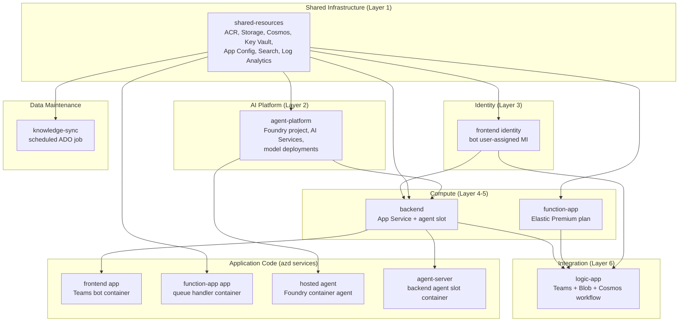

# Component Dependency Graph

## Deploy order

Encoded by `dependsOn` in `infra/main.bicep` and by `INFRA_LAYERS` in
`hooks/lib/layers.ts`:

1. `shared-resources` — every other layer references its outputs.
2. `agent-platform` — depends on managed identity + storage from layer 1.
3. `frontend identity` — `backend` slot configuration references this MI.
4. `backend` — needs `agent.outputs.aiResourceName`, `aiProjectName`, and
   the frontend MI.
5. `function-app` — independent of backend; shares shared-resources.
6. `logic-app` — last; references both backend and function-app outputs.

After provisioning, `azd deploy` runs application-code services in this
order (driven by the `services:` block in `azure.yaml`):

1. `function-app` (no dependents)
2. `agent` (hosted agent) — depends on agent-platform layer
3. `frontend` (Teams bot) — must come last so a deploy-time channel rebind
   does not race with the others

`knowledge-sync` runs on a cron schedule independent of any deploy.
