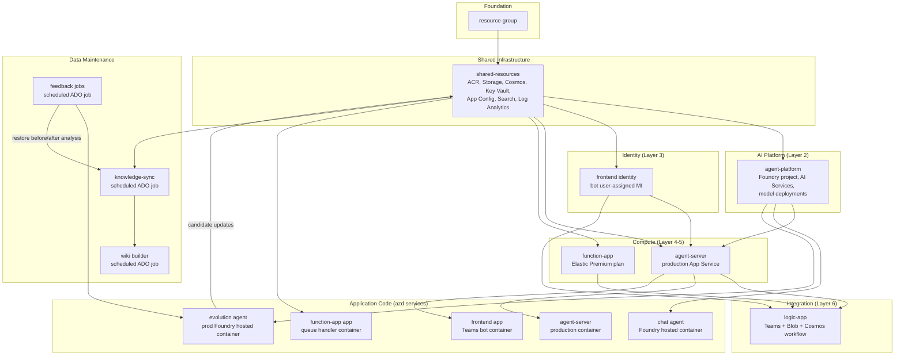

# Component Dependency Graph

```mermaid
graph TD
    subgraph "Foundation"
        RG[resource-group]
    end

    subgraph "Shared Infrastructure"
        SR[shared-resources<br/>ACR, Storage, Cosmos, Key Vault,<br/>App Config, Search, Log Analytics]
    end

    subgraph "AI Platform (Layer 2)"
        AGP[agent-platform<br/>Foundry project, AI Services,<br/>model deployments]
    end

    subgraph "Identity (Layer 3)"
        FE_ID[frontend identity<br/>bot user-assigned MI]
    end

    subgraph "Compute (Layer 4-5)"
        BE[agent-server<br/>production App Service]
        FN[function-app<br/>Elastic Premium plan]
    end

    subgraph "Integration (Layer 6)"
        LA[logic-app<br/>Teams + Blob + Cosmos workflow]
    end

    subgraph "Application Code (azd services)"
        FE_APP[frontend app<br/>Teams bot container]
        FN_APP[function-app app<br/>queue handler container]
        AG_APP[chat agent<br/>Foundry hosted container]
        EV_APP[evolution agent<br/>prod Foundry hosted container]
        AG_SRV[agent-server<br/>production container]
    end

    subgraph "Data Maintenance"
        KS[knowledge-sync<br/>scheduled ADO job]
        WI[wiki builder<br/>scheduled ADO job]
        FB[feedback jobs<br/>scheduled ADO job]
    end

    RG --> SR
    SR --> AGP
    SR --> FE_ID
    FE_ID --> BE
    SR --> BE
    AGP --> BE
    SR --> FN
    BE --> LA
    FN --> LA
    FE_ID --> LA

    BE --> AG_SRV
    AGP --> AG_APP
    AGP --> EV_APP
    BE --> FE_APP
    SR --> FN_APP
    SR --> KS
    KS --> WI
    FB --> EV_APP
    EV_APP -->|candidate updates| SR
    FB -->|restore before/after analysis| KS
```

## Deploy order

Encoded by `infra.layers[].dependsOn` in `azure.yaml`:

1. `resource-group` — creates the deployment scope.
2. `shared-resources` — every workload layer references its outputs.
3. `agent` — depends on managed identity + storage from shared resources.
4. `frontend` — the agent-server site attaches this MI.
5. `agent-server` — needs the agent and frontend outputs.
    the frontend MI.
6. `function-app` — independent of agent-server; shares shared-resources.
7. `logic-app` — last; references both agent-server and function-app outputs.

After provisioning, `azd deploy` runs application-code services in this
order (driven by the `services:` block in `azure.yaml`):

1. `agent-server` — deploys directly to its production App Service
2. `function-app` (no dependents)
3. `agent` (hosted agent) — depends on agent-platform layer
4. `chatbot_evolution_agent` for prod — receives prod and candidate-dev access
5. `frontend` (Teams bot) — must come last so a deploy-time channel rebind
   does not race with the others

`knowledge-sync`, wiki generation, and feedback processing run as scheduled data
jobs. Knowledge sync and wiki generation immediately start their Search
indexers. Feedback processing queues sync-only dev restoration before candidate
analysis and again before production validation.
