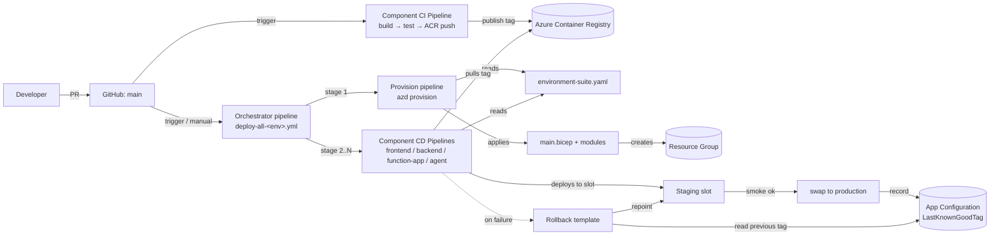

# Deployment Architecture

## Layers

| #   | Layer             | Bicep module                                         | Provision via                                                   |
| --- | ----------------- | ---------------------------------------------------- | --------------------------------------------------------------- |
| 1   | shared-resources  | `modules/qaBotSharedResources/sharedResources.bicep` | `azd provision` (full graph) or `DEPLOY_LAYER=shared-resources` |
| 2   | agent-platform    | `modules/qaBotAgent/component.bicep`                 | `DEPLOY_LAYER=agent-platform`                                   |
| 3   | frontend identity | `modules/qaBotFrontend/userAssignedIdentity.bicep`   | always in full graph                                            |
| 4   | backend           | `modules/qaBotBackend/serverfarm.bicep`              | `DEPLOY_LAYER=backend`                                          |
| 5   | function-app      | `modules/qaBotFunctionApp/serverfarm.bicep`          | full graph                                                      |
| 6   | logic-app         | `modules/qaBotLogicApp/logicAppResources.bicep`      | `DEPLOY_LAYER=logic-app`                                        |

`azd provision` always runs the full Bicep graph via `main.bicep`. The
`DEPLOY_LAYER` env var only affects which layers `hooks/postprovision.ts`
re-applies via `az deployment group create` for partial-update workflows
(useful when only one Bicep module changed and a full `what-if` isn't
needed).

## Rollout pattern matrix

| Component      | Strategy                    | Slot(s)                    | Health gate                      |
| -------------- | --------------------------- | -------------------------- | -------------------------------- |
| frontend       | slot swap                   | `staging` → `production`   | `GET /health` 200                |
| backend        | slot swap                   | `authoring` → `production` | `GET /ping` 200                  |
| function-app   | slot swap                   | `staging` → `production`   | `GET /api/health` 200            |
| agent-server   | direct (slot IS production) | `agent` slot               | `GET /ping` with EasyAuth bearer |
| hosted agent   | revision swap (Foundry)     | n/a                        | Responses `/ping`                |
| logic-app      | re-apply ARM                | n/a                        | trigger probe                    |
| knowledge-sync | scheduled job               | n/a                        | Search doc-count regression      |
