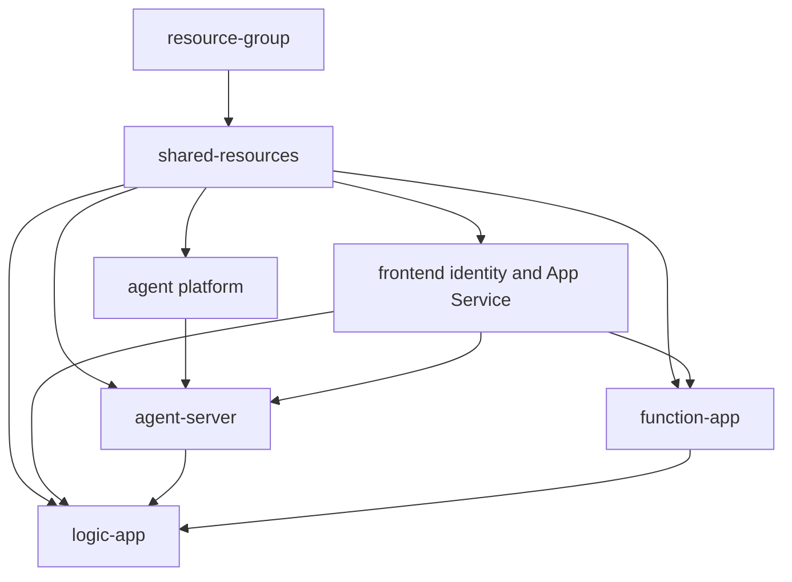
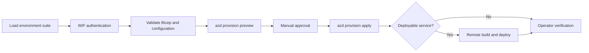
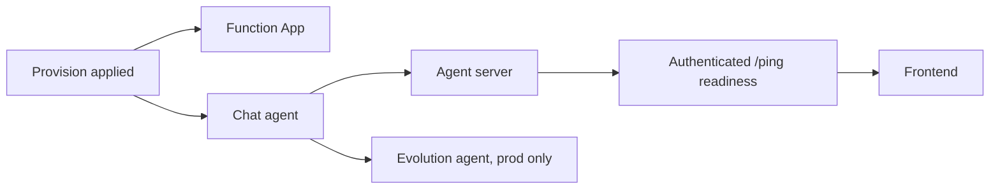
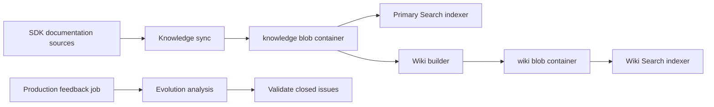

<!-- cspell:words postdeploy postprovision preprovision WIKIBLOB WIKIINDEX -->

# Deployment Architecture

This document explains the current executable deployment. The source of truth
is `tools/sdk-ai-bots/azure.yaml`, the Bicep entry points under
`deployment/infra/layers`, and the Azure DevOps orchestrators under
`deployment/pipelines`.

## System Components

- **`frontend`:** Teams bot on App Service. A user-assigned managed identity
  provides Azure Bot authentication.
- **`agent-server`:** Python API on App Service protected by Easy Auth. It
  resolves and caches channel configuration for the Logic App.
- **`function-app`:** Containerized Azure Functions workload used by the Logic
  App integration.
- **`agent`:** Microsoft Foundry hosted chat agent built remotely in ACR.
- **`logic-app`:** Teams, agent-server, Cosmos DB, and Function App workflow.
  Bicep creates the workflow shell, and the Function App postdeploy hook
  installs its definition.
- **Evolution agent:** Production-only Foundry hosted agent with scoped access
  to production and candidate-dev resources.
- **Data jobs:** Scheduled knowledge sync, generated-wiki build, and
  feedback/evolution pipelines operating independently of the azd services.

Shared infrastructure includes ACR, Storage, Cosmos DB, Key Vault, App
Configuration, Azure AI Search, AI Services, Log Analytics, Application
Insights, alerts, and managed identities.

## Infrastructure Graph

```mermaid
graph TD
    RG[resource-group] --> SHARED[shared-resources]
    SHARED --> AGENT[agent platform]
    SHARED --> FRONTEND[frontend identity and App Service]
    SHARED --> FUNCTION[function-app]
    FRONTEND --> FUNCTION
    SHARED --> SERVER[agent-server]
    AGENT --> SERVER
    FRONTEND --> SERVER
    SHARED --> LOGIC[logic-app]
    FRONTEND --> LOGIC
    SERVER --> LOGIC
    FUNCTION --> LOGIC
```

The seven Bicep layers are listed in `azure.yaml` in this order:

1. `resource-group`
2. `shared-resources`
3. `agent`
4. `frontend`
5. `agent-server`
6. `function-app`
7. `logic-app`

`dependsOn` is authoritative. `agent` and `frontend` can be provisioned after
shared resources; `agent-server` waits for both; `function-app` waits for the
frontend identity; and `logic-app` is last because it consumes the deployed
resource outputs.

## Pipeline Flow

The consolidated deployment pipeline follows the same control flow for
full-stack and component-scoped runs:

```mermaid
flowchart LR
    LOAD[Load environment suite] --> AUTH[WIF authentication]
    AUTH --> VALIDATE[Validate Bicep and configuration]
    VALIDATE --> PREVIEW[azd provision preview]
    PREVIEW --> APPROVE[Manual approval]
    APPROVE --> APPLY[azd provision apply]
    APPLY --> SCOPE{Deployable service?}
    SCOPE -->|Yes| DEPLOY[Remote build and deploy]
    SCOPE -->|No| VERIFY
    DEPLOY --> VERIFY[Operator verification]
```

Application deployment follows a separate runtime dependency graph after the
infrastructure apply:

```mermaid
flowchart LR
  APPLY[Provision applied] --> FUNCTION[Function App]
  APPLY --> AGENT[Chat agent]
  AGENT --> SERVER[Agent server]
  AGENT --> EVOLUTION[Evolution agent, prod only]
  SERVER --> READY[Authenticated /ping readiness]
  READY --> FRONTEND[Frontend]
```

Function App and chat-agent deployment can run in parallel. Agent-server waits
for the chat agent it invokes, while frontend waits for agent-server readiness.
The readiness gate retries the Easy Auth-protected `/ping` endpoint before the
frontend rollout proceeds. The production-only evolution branch does not gate
frontend deployment.

`qa-bot-deploy.yml` defaults to `component=all`. Selecting `agent-server`,
`function-app`, `agent`, or `frontend` provisions that layer and its
dependencies, then deploys only that component. Selecting `shared-resources` or
`logic-app` provisions that infrastructure scope without an application deploy.
Component CI remains separate from provisioning and deployment.

The Logic App calls the authenticated agent-server `/config/channel` endpoint
to resolve each channel's tenant. The backend reads
`bot-configs/channel.yaml` with the shared managed identity and caches the
parsed configuration. The shared managed identity authenticates the Logic App's
backend request and the backend's Blob read.

## Reconciled State

Some required state is not safely representable in Bicep and is reconciled by
lifecycle hooks:

- preprovision validates the environment contract, checks quota, detects local
  drift, and records the deployment principal;
- postprovision uploads per-environment bot routing, seeds the Search API key,
  reconciles Search objects, and seeds App Configuration;
- agent hooks reconcile Foundry settings, hosted identity, RBAC, and Entra
  authorization;
- frontend postdeploy synchronizes Teams environment values, installs or
  updates the approved Teams app, and probes `/health`;
- Function App postdeploy verifies host readiness and installs the complete
  Logic App workflow.

Application images use azd native remote Docker builds. After infrastructure
apply, the selected application deployment stage establishes runtime state and
postdeploy reconciliation as described in the [deploy runbook](runbook-deploy.md).

## Data Flows

```mermaid
flowchart LR
    SOURCES[SDK documentation sources] --> SYNC[Knowledge sync]
    SYNC --> KNOWLEDGE[knowledge blob container]
    KNOWLEDGE --> PRIMARY[Primary Search indexer]
    KNOWLEDGE --> WIKI[Wiki builder]
    WIKI --> WIKIBLOB[wiki blob container]
    WIKIBLOB --> WIKIINDEX[Wiki Search indexer]
    FEEDBACK[Production feedback job] --> EVOLVE[Evolution analysis]
    EVOLVE --> VALIDATE[Validate closed issues]
```

Knowledge sync and wiki generation run as scheduled data pipelines outside the
azd service graph and start their Search indexers after writing blobs. The
feedback pipeline operates independently of knowledge sync.

## Security Boundaries

- Azure DevOps uses workload identity federation; deployment secrets are not
  stored in pipeline YAML.
- Runtime workloads use managed identities and scoped data-plane roles.
- Deployment and developer principals are separate.
- The backend Entra application is bootstrapped outside unattended deployment;
  no client secret is created.
- Teams managed-API consent and first tenant catalog publication remain
  interactive operator actions.
- Dev permits local operations; preview and production use their mapped
  pipelines and service connections.

## Release and Recovery Model

- Normal layered preview operates on environments with existing layer state.
  Dev has a documented workstation bootstrap; a new preview or production
  environment requires an approved first-state bootstrap pipeline before its
  first normal deployment.
- Application rollout targets the production service resources directly.
  Release completion requires the endpoint, workflow, Teams, and telemetry
  checks in the [deploy runbook](runbook-deploy.md).
- Code recovery redeploys the affected component from a known-good source
  revision. Data recovery follows the [rollback runbook](runbook-rollback.md).

Continue with the [manual setup guide](manual-setup.md).
