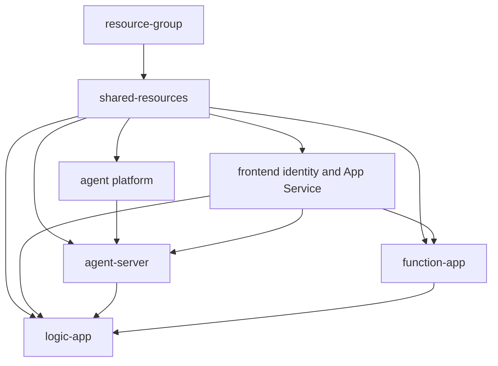
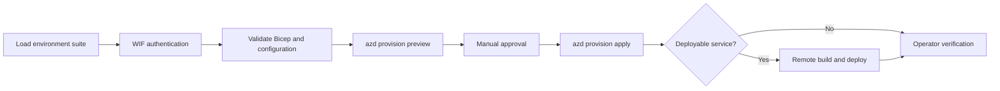
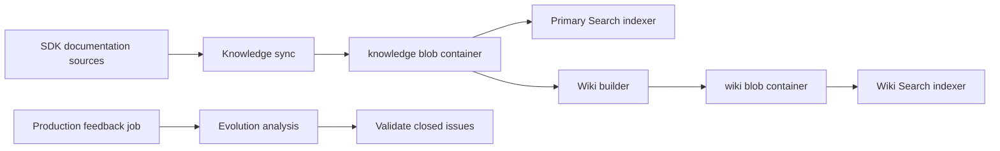

# Deployment Architecture

This document explains the current executable deployment. The source of truth
is `tools/sdk-ai-bots/azure.yaml`, the Bicep entry points under
`deployment/infra/layers`, and the Azure DevOps orchestrators under
`deployment/pipelines`.

## System Components

| Component | Hosting and responsibility |
| --- | --- |
| `frontend` | Teams bot on App Service. Uses a user-assigned managed identity for Azure Bot authentication. |
| `agent-server` | Python API on App Service. Deploys directly to its production site and is protected by Easy Auth. |
| `function-app` | Containerized Azure Functions workload used by the Logic App integration. |
| `agent` | Microsoft Foundry hosted chat agent built remotely in ACR. |
| `logic-app` | Teams, Blob Storage, Cosmos DB, and Function App workflow. Bicep creates a shell; the Function App postdeploy hook installs the final definition. |
| Evolution agent | Production-only Foundry hosted agent with scoped access to production and candidate-dev resources. |
| Data jobs | Scheduled knowledge sync, generated-wiki build, and feedback/evolution pipelines. They are not long-running `azd` services. |

Shared infrastructure includes ACR, Storage, Cosmos DB, Key Vault, App
Configuration, Azure AI Search, AI Services, Log Analytics, Application
Insights, alerts, and managed identities.

## Infrastructure Graph

```mermaid
graph TD
    RG[resource-group] --> SHARED[shared-resources]
    SHARED --> AGENT[agent platform]
    SHARED --> FRONTEND[frontend identity and App Service]
    SHARED --> FUNCTION[function-app]
    FRONTEND --> FUNCTION
    SHARED --> SERVER[agent-server]
    AGENT --> SERVER
    FRONTEND --> SERVER
    SHARED --> LOGIC[logic-app]
    FRONTEND --> LOGIC
    SERVER --> LOGIC
    FUNCTION --> LOGIC
```

The seven Bicep layers are listed in `azure.yaml` in this order:

1. `resource-group`
2. `shared-resources`
3. `agent`
4. `frontend`
5. `agent-server`
6. `function-app`
7. `logic-app`

`dependsOn` is authoritative. `agent` and `frontend` can be provisioned after
shared resources; `agent-server` waits for both; `function-app` waits for the
frontend identity; and `logic-app` is last because it consumes the deployed
resource outputs.

## Pipeline Flow

The consolidated deployment pipeline follows the same control flow for
full-stack and component-scoped runs:

```mermaid
flowchart LR
    LOAD[Load environment suite] --> AUTH[WIF authentication]
    AUTH --> VALIDATE[Validate Bicep and configuration]
    VALIDATE --> PREVIEW[azd provision preview]
    PREVIEW --> APPROVE[Manual approval]
    APPROVE --> APPLY[azd provision apply]
    APPLY --> SCOPE{Deployable service?}
    SCOPE -->|Yes| DEPLOY[Remote build and deploy]
    SCOPE -->|No| VERIFY
    DEPLOY --> VERIFY[Operator verification]
```

The full-stack deployment stage runs application code in this order:

1. `agent-server`
2. production stabilization wait when `environment=prod`
3. `function-app`
4. `agent`
5. evolution agent when `environment=prod`
6. `frontend`

`qa-bot-deploy.yml` defaults to `component=all`. Selecting `agent-server`,
`function-app`, `agent`, or `frontend` provisions that layer and its
dependencies, then deploys only that component. Selecting `shared-resources` or
`logic-app` provisions that infrastructure scope without an application deploy.
Component CI remains separate from provisioning and deployment.

## Reconciled State

Some required state is not safely representable in Bicep and is reconciled by
lifecycle hooks:

- preprovision validates the environment contract, checks quota, detects local
  drift, and records the deployment principal;
- postprovision uploads per-environment bot routing, seeds the Search API key,
  reconciles Search objects, and seeds App Configuration;
- agent hooks reconcile Foundry settings, hosted identity, RBAC, and Entra
  authorization;
- frontend hooks resolve the image, synchronize Teams environment values, and
  install or update an approved Teams app;
- Function App hooks resolve the image and install the complete Logic App
  workflow after the function exists.

Re-running provision can restore Bicep's placeholder images or empty Logic App
shell. Always run the corresponding deploy stages after provisioning.

## Data Flows

```mermaid
flowchart LR
    SOURCES[SDK documentation sources] --> SYNC[Knowledge sync]
    SYNC --> KNOWLEDGE[knowledge blob container]
    KNOWLEDGE --> PRIMARY[Primary Search indexer]
    KNOWLEDGE --> WIKI[Wiki builder]
    WIKI --> WIKIBLOB[wiki blob container]
    WIKIBLOB --> WIKIINDEX[Wiki Search indexer]
    FEEDBACK[Production feedback job] --> EVOLVE[Evolution analysis]
    EVOLVE --> VALIDATE[Validate closed issues]
```

  The existing knowledge-sync and wiki-generation pipelines remain outside the
  deployment orchestrator set and start their Search indexers after writing blobs.
  The feedback pipeline does not queue a knowledge-sync pipeline.

## Security Boundaries

- Azure DevOps uses workload identity federation; deployment secrets are not
  stored in pipeline YAML.
- Runtime workloads use managed identities and scoped data-plane roles.
- Deployment and developer principals are separate.
- The backend Entra application is bootstrapped outside unattended deployment;
  no client secret is created.
- Teams managed-API consent and first tenant catalog publication remain
  interactive operator actions.
- Production provisioning and deployment are pipeline-only.

## Current Limitations

- A complete layered preview requires prior layer state. Bootstrap a brand-new
  dev environment before using the normal preview/approval pipeline. A
  first-state bootstrap path for local-disabled preview and production
  environments is not implemented and must be added before creating either from
  scratch.
- The active orchestrators do not execute slot swaps or a blocking
  multi-service smoke stage. Frontend postdeploy performs a non-fatal `/health`
  probe; verify all endpoints after deployment as described in the runbook.
- Automated rollback is not implemented. The supported code rollback is to run
  the matching orchestrator from a known-good source revision.

Continue with the [manual setup guide](https://github.com/Azure/azure-sdk-tools/blob/main/tools/sdk-ai-bots/deployment/docs/manual-setup.md).
