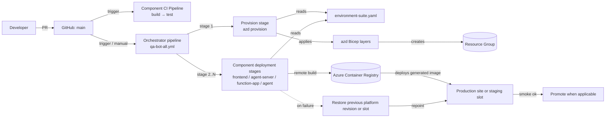

# Deployment Architecture

```mermaid
graph LR
    DEV[Developer] -->|PR| GH[GitHub: main]
    GH -->|trigger| CI[Component CI Pipeline<br/>build → test]

    GH -->|trigger / manual| ORCH[Orchestrator pipeline<br/>qa-bot-all.yml]
    ORCH -->|stage 1| PROV[Provision stage<br/>azd provision]
    PROV -->|reads| ES[environment-suite.yaml]
    PROV -->|applies| INFRA[azd Bicep layers]
    INFRA -->|creates| RG[(Resource Group)]

    ORCH -->|stage 2..N| CD[Component deployment stages<br/>frontend / agent-server / function-app / agent]
    CD -->|reads| ES
    CD -->|remote build| ACR[(Azure Container Registry)]
    ACR -->|deploys generated image| TARGET[Production site or staging slot]
    TARGET -->|smoke ok| PROMOTE[Promote when applicable]
    CD -.->|on failure| RB[Restore previous platform revision or slot]
    RB -->|repoint| TARGET
```

## Layers

`azure.yaml` composes the infrastructure from these Bicep layers, wired
together by `dependsOn`. `azd provision` applies the full graph, while
`azd provision <layer>` targets one layer. The full-stack orchestrator uses the
former; component orchestrators refresh the selected layer's dependencies and
use the latter for both preview and apply.

| #   | Layer             | Bicep entry point                    |
| --- | ----------------- | ------------------------------------ |
| 1   | resource-group    | `layers/resource-group/main.bicep`   |
| 2   | shared-resources  | `layers/shared-resources/main.bicep` |
| 3   | agent             | `layers/agent/main.bicep`            |
| 4   | frontend          | `layers/frontend/main.bicep`         |
| 5   | agent-server      | `layers/agent-server/main.bicep`     |
| 6   | function-app      | `layers/function-app/main.bicep`     |
| 7   | logic-app         | `layers/logic-app/main.bicep`        |

## Rollout pattern matrix

| Component      | Strategy                | Slot(s)                  | Health gate                      |
| -------------- | ----------------------- | ------------------------ | -------------------------------- |
| frontend       | slot swap               | `staging` → `production` | `GET /health` 200                |
| function-app   | slot swap               | `staging` → `production` | `GET /api/health` 200            |
| agent-server   | direct production deploy| n/a                      | `GET /ping` with EasyAuth bearer |
| hosted agent   | revision swap (Foundry) | n/a                      | Responses `/ping`                |
| logic-app      | re-apply ARM            | n/a                      | trigger probe                    |
| knowledge-sync | scheduled job           | n/a                      | Search doc-count regression      |
