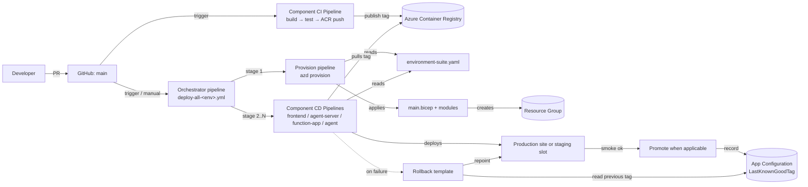

# Deployment Architecture

```mermaid
graph LR
    DEV[Developer] -->|PR| GH[GitHub: main]
    GH -->|trigger| CI[Component CI Pipeline<br/>build → test → ACR push]
    CI -->|publish tag| ACR[(Azure Container Registry)]

    GH -->|trigger / manual| ORCH[Orchestrator pipeline<br/>deploy-all-&lt;env&gt;.yml]
    ORCH -->|stage 1| PROV[Provision pipeline<br/>azd provision]
    PROV -->|reads| ES[environment-suite.yaml]
    PROV -->|applies| INFRA[main.bicep + modules]
    INFRA -->|creates| RG[(Resource Group)]

    ORCH -->|stage 2..N| CD[Component CD Pipelines<br/>frontend / agent-server / function-app / agent]
    CD -->|reads| ES
    CD -->|pulls tag| ACR
    CD -->|deploys| TARGET[Production site or staging slot]
    TARGET -->|smoke ok| PROMOTE[Promote when applicable]
    PROMOTE -->|record| APPCFG[(App Configuration<br/>LastKnownGoodTag)]

    CD -.->|on failure| RB[Rollback template]
    RB -->|read previous tag| APPCFG
    RB -->|repoint| TARGET
```

## Layers

`main.bicep` composes the infrastructure from these Bicep modules, wired
together by `dependsOn`. `azd provision` always applies the full graph.

| #   | Layer             | Bicep module                                         |
| --- | ----------------- | ---------------------------------------------------- |
| 1   | shared-resources  | `modules/qaBotSharedResources/sharedResources.bicep` |
| 2   | agent-platform    | `modules/qaBotAgent/component.bicep`                 |
| 3   | frontend identity | `modules/qaBotFrontend/userAssignedIdentity.bicep`   |
| 4   | agent-server      | `modules/qaBotAgentServer/serverfarm.bicep`          |
| 5   | function-app      | `modules/qaBotFunctionApp/serverfarm.bicep`          |
| 6   | logic-app         | `modules/qaBotLogicApp/logicAppResources.bicep`      |

## Rollout pattern matrix

| Component      | Strategy                | Slot(s)                  | Health gate                      |
| -------------- | ----------------------- | ------------------------ | -------------------------------- |
| frontend       | slot swap               | `staging` → `production` | `GET /health` 200                |
| function-app   | slot swap               | `staging` → `production` | `GET /api/health` 200            |
| agent-server   | direct production deploy| n/a                      | `GET /ping` with EasyAuth bearer |
| hosted agent   | revision swap (Foundry) | n/a                      | Responses `/ping`                |
| logic-app      | re-apply ARM            | n/a                      | trigger probe                    |
| knowledge-sync | scheduled job           | n/a                      | Search doc-count regression      |
