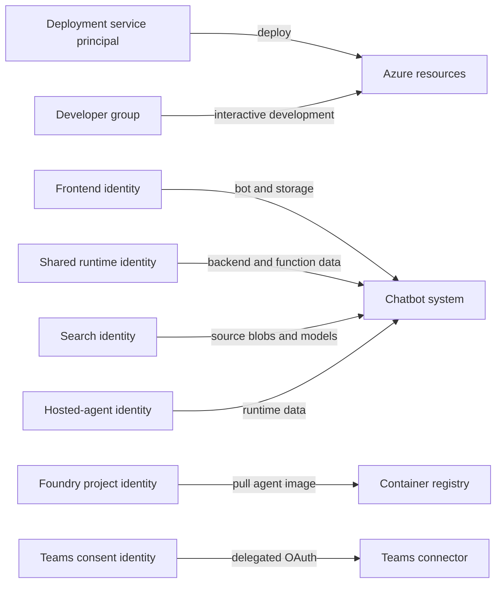

<!-- cspell:words appconfig appservice bicepparam qabot -->
<!-- cspell:words azuresdkqabot postdeploy postdeployment postprovision -->
<!-- cspell:words preauthorization preprovision -->

# Identity and Access Reference

This document describes authentication and authorization for the SDK AI chatbot
and its deployment system. It covers permissions declared in this repository.
Effective Azure access can also include assignments inherited from a
subscription, management group, resource group, or external tenant policy.

The executable sources of truth are:

- [`azure.yaml`](../../azure.yaml) for service, infrastructure, and hook wiring;
- [`environment-suite.yaml`](../infra/environments/environment-suite.yaml) for
  environment-specific identity inputs;
- Bicep files under [`infra/layers`](../infra/layers/) for persistent resource
  and role assignments;
- [`hooks`](../hooks/) and [`scripts`](../scripts/) for dynamic grants and
  data-plane operations;
- [`service-connection.yml`](../pipelines/templates/service-connection.yml) for
  environment-to-service-connection mapping.

## Permission Planes

The system uses three authorization planes:

1. **Azure control plane:** create, configure, or delete Azure resources and
   Azure RBAC assignments. Bicep and `azd provision` operate primarily here.
2. **Service data plane:** read or write Blob, Table, Queue, Key Vault, App
   Configuration, Search, Cosmos DB, OpenAI, and Foundry data.
3. **Entra and delegated authorization:** validate application tokens, assign
   application roles, install the Teams app, and authorize the Teams managed
   connector.

A control-plane `Contributor` role does not automatically grant service
`dataActions` or permission to create Azure RBAC assignments. Do not infer data
access from resource-management access.



## Identity Catalog

### Deployment principal

Azure DevOps uses one Azure Resource Manager service connection per
environment:

- dev: `azure-sdk-tests-playground`;
- preview: `azuresdkqabot-preview`;
- prod: `Azure SDK Engineering System`.

[`azd-auth.yml`](../pipelines/templates/azd-auth.yml) authenticates `az` and
`azd` through workload identity federation. It reads the object ID from the ARM
token and exports:

- `DEPLOYMENT_PRINCIPAL_ID`;
- `DEPLOYMENT_PRINCIPAL_TYPE=ServicePrincipal`.

The deployment principal creates resources, publishes images, deploys services,
runs hooks, seeds configuration, and creates role assignments. Its base
permission to manage resources and role assignments is configured on the Azure
DevOps service connection outside this repository. `Contributor` alone cannot
create role assignments; bootstrap normally also requires User Access
Administrator, Role Based Access Control Administrator, or Owner at an
appropriate parent scope.

The pipeline identity must never be copied into `DEVELOPER_PRINCIPAL_ID`.

### Developer principal

`DEVELOPER_PRINCIPAL_ID` and `DEVELOPER_PRINCIPAL_TYPE` identify the principal
for interactive development. Dev and prod currently use the security group:

- name: `AzureSDKChatBot_Developer`;
- object ID: `2efb50ed-0ca9-4cf1-b43b-9b31a87e08f5`;
- principal type: `Group`.

The environment suite owns this mapping. If no developer principal is
configured, developer role assignments are skipped. The preprovision hook does
not substitute the active deployment principal.

### Shared runtime identity

The shared-resources layer creates the `qabot-identity` user-assigned managed
identity and exports its client, object, and resource IDs. It is used by:

- the agent-server App Service through `AZURE_CLIENT_ID`;
- the Function App through `AZURE_CLIENT_ID`;
- the Logic App's authenticated agent-server calls and Cosmos DB managed API
  connection.

It is attached to the agent-server together with the frontend identity, but the
agent-server explicitly selects the shared identity for Azure SDK credentials.

### Frontend and bot identity

The frontend layer creates a separate user-assigned managed identity. The same
identity is used as:

- the frontend App Service runtime identity;
- the App Service container-pull identity;
- the Azure Bot Service `UserAssignedMSI` identity and bot client ID;
- an allowed Easy Auth caller for the agent-server;
- the frontend Blob and Table Storage identity.

Keeping this identity separate from `qabot-identity` prevents Bot Framework and
backend workload authorization from being conflated.

### Search service identity

Azure AI Search has a system-assigned identity. It reads source blobs and calls
AI Services for integrated vectorization and knowledge-base model operations.

### Foundry project identity

The Foundry project has a system-assigned identity. It receives `AcrPull` on the
shared registry so the Foundry platform can pull hosted-agent images.

### Hosted-agent runtime identity

Foundry creates an `instance_identity` for a hosted-agent version. This identity
is not known during Bicep provisioning. Postdeployment code resolves its object
ID from the deployed version and grants the runtime roles described below.

A new hosted-agent version can have a different identity. Dynamic role grants
must therefore run after each hosted-agent deployment.

### Teams consent identity

The Teams Logic Apps connector uses delegated OAuth from the person or service
account that completes consent. Its token is stored in the managed connection's
ARM state. It is not one of the managed identities above.

The frontend Teams installation flow separately uses a Microsoft Graph token
for the signed-in account.

## Persistent Azure Roles

All listed scopes are resource scope unless noted otherwise.

### Shared runtime identity roles

Declared in
[`shared-resources/main.bicep`](../infra/layers/shared-resources/main.bicep):

- **Storage Blob Data Owner**
  (`b7e6dc6d-f1e8-4753-8033-0f276bb0955b`) on Storage for Blob read, write, and
  delete operations.
- **Storage Queue Data Contributor**
  (`974c5e8b-45b9-4653-ba55-5f855dd0fb88`) on Storage for queue operations.
- **Storage Table Data Contributor**
  (`0a9a7e1f-b9d0-4cc4-a60d-0319b160aaa3`) on Storage for table and conversation
  state operations.
- **Key Vault Secrets User**
  (`4633458b-17de-408a-b874-0445c86b69e6`) on the application vault for runtime
  secret reads.
- **Key Vault Secrets Officer**
  (`b86a8fe4-44ce-4948-aee5-eccb2c155cd7`) on the application vault. The
  Function timer writes the `ado-token` secret, so read-only access is not
  sufficient.
- **App Configuration Data Reader**
  (`516239f1-63e1-4d78-a4de-a74fb236a071`) on App Configuration.
- **Search Index Data Contributor**
  (`8ebe5a00-799e-43f5-93ac-243d3dce84a7`) on Search.
- **Contributor** (`b24988ac-6180-42a0-ab88-20f7382dd24c`) and **AcrPull**
  (`7f951dda-4ed3-4680-a7ca-43fe172d538d`) on ACR.
- **Cosmos DB Built-in Data Contributor**
  (`00000000-0000-0000-0000-000000000002`) at the Cosmos account root. This is
  Cosmos SQL data-plane RBAC, not Azure RBAC.

The agent layer also grants **Cognitive Services OpenAI User**
(`5e0bd9bd-7b93-4f28-af87-19fc36ad61bd`) on the AI Services account. The agent
postprovision hook creates or adopts **Foundry User**
(`53ca6127-db72-4b80-b1b0-d745d6d5456d`) because an existing assignment with a
different GUID cannot always be represented safely by Bicep.

### Frontend identity roles

Declared in [`frontend/main.bicep`](../infra/layers/frontend/main.bicep):

- **Monitoring Metrics Publisher**
  (`3913510d-42f4-4e42-8a64-420c390055eb`) on frontend Application Insights;
- **AcrPull** on the shared registry;
- **Storage Account Contributor**
  (`17d1049b-9a84-46fb-8f53-869881c3d3ab`) on Storage;
- **Storage Blob Data Contributor** on Storage;
- **Storage Table Data Contributor** on Storage.

`Storage Account Contributor` can retrieve storage account keys and is broader
than Blob/Table data access. Treat changes to this role as a security-sensitive
review item.

### Search identity roles

- **Storage Blob Data Reader**
  (`2a2b9908-6ea1-4ae2-8e65-a410df84e7d1`) on the shared storage account;
- **Cognitive Services User**
  (`a97b65f3-24c7-4388-baec-2e87135dc908`) on the AI Services account.

### Foundry project identity role

- **AcrPull** on the shared registry.

### Developer roles

When `DEVELOPER_PRINCIPAL_ID` is non-empty, Bicep grants:

- Storage Blob Data Contributor;
- App Configuration Data Reader;
- Key Vault Secrets Officer;
- Contributor on ACR;
- Cosmos DB Built-in Data Contributor;
- Search Service Contributor
  (`7ca78c08-252a-4471-8644-bb5ff32d4ba0`);
- Cognitive Services OpenAI User;
- Foundry Project Manager
  (`eadc314b-1a2d-4efa-be10-5d325db5065e`).

These roles support local deployment, data inspection, secret management,
Search administration, and hosted-agent management.

### Deployment roles

When the deployment principal differs from the developer principal, Bicep
grants it the roles required by unattended deployment:

- Storage Blob Data Contributor for bot configuration upload;
- App Configuration Data Reader for configuration access;
- Key Vault Secrets User for secret reads;
- Contributor on ACR for remote builds and registry management;
- Search Service Contributor for Search control-plane operations;
- Cosmos DB Built-in Data Contributor for deployment and scheduled jobs;
- Cognitive Services OpenAI User;
- Foundry Project Manager for `azd deploy agent`.

Postprovision seeding requires write permissions beyond the persistent reader
roles. The seeding helpers grant only `DEPLOYMENT_PRINCIPAL_ID` these roles
idempotently:

- **App Configuration Data Owner**
  (`5ae67dd6-50cb-40e7-96ff-dc2bfa4b606b`);
- **Key Vault Secrets Officer**.

They never fall back to `DEVELOPER_PRINCIPAL_ID`. App Configuration seeding,
Key Vault seeding, bot configuration upload, and Search reconciliation are
explained in the [maintainer guide](maintainer-guide.md#azd-hook-workflow).

## Dynamic Hosted-Agent Roles

### Chat agent

[`agent-postdeploy.ts`](../hooks/agent-postdeploy.ts) grants the deployed chat
agent identity:

- App Configuration Data Reader, which is startup-critical;
- Cognitive Services OpenAI User;
- Foundry User;
- Storage Blob Data Owner;
- Storage Table Data Contributor;
- Storage Queue Data Contributor;
- Search Index Data Contributor;
- Key Vault Secrets User.

Failure to grant App Configuration Data Reader fails the hook because the agent
cannot initialize. Other grant failures are logged and should be investigated
before considering the deployment healthy.

### Evolution agent

[`grant-agent-data-access.sh`](../scripts/grant-agent-data-access.sh) defines two
profiles.

The **candidate** profile grants:

- App Configuration Data Reader;
- Storage Blob Data Contributor;
- Search Service Contributor;
- Search Index Data Contributor;
- Cognitive Services OpenAI User;
- Foundry User.

The **primary** profile adds:

- Key Vault Secrets User on the application vault;
- Monitoring Reader (`43d0d8ad-25c7-4714-9337-8ba259a9fe05`) on agent
  Application Insights;
- Key Vault Crypto User (`12338af0-0e69-4776-bea7-57ae8d297424`) on the GitHub
  signing vault;
- Cosmos DB Built-in Data Contributor.

The production evolution agent receives the primary profile in prod and the
candidate profile in the configured candidate environment, currently dev.
These grants are persistent for that hosted-agent identity.

## Application Authentication

### Teams to frontend

Azure Bot Service is configured with the frontend user-assigned identity. The
Teams manifest declares bot scope `team` and permissions `identity` and
`messageTeamMembers`.

The Teams Toolkit installation hook requires the signed-in account to have
Microsoft Graph `TeamsAppInstallation.ReadWriteForTeam`. Catalog policy,
tenant consent, and team membership are external to this repository.

### Frontend to agent-server

The agent-server is protected by App Service Easy Auth. Its Entra registration
is managed by [`create-entra-app.ts`](../scripts/create-entra-app.ts), which
defines:

- delegated scope `access_as_user`;
- application role `access_as_application`;
- access-token version 2;
- Azure CLI preauthorization for interactive testing;
- optional caller application-role assignments.

Easy Auth permits tokens from the shared identity, frontend identity, and Azure
CLI application. The frontend requests the backend application's `.default`
scope and calls the server with that token.

### Runtime access

The agent-server and Function App explicitly select `qabot-identity` through
`AZURE_CLIENT_ID`. The agent-server uses it to read channel configuration from
Blob Storage. The Logic App uses it for authenticated agent-server calls and
the Cosmos managed API connection, and attaches the frontend identity for bot
calls.

The Teams managed connector is different: it uses delegated OAuth. The
repository creates the connection shell and preserves a connected token, but
the connector and consenting account determine the exact delegated permission
set.

## Grant Lifecycle

| Grant class | Created by | Lifetime |
| --- | --- | --- |
| Runtime managed-identity roles | Bicep | Persistent |
| Developer roles | Bicep | Persistent |
| Deployment roles | Bicep and seeding hooks | Persistent |
| Chat-agent runtime roles | Agent postdeploy hook | Agent identity lifetime |
| Evolution-agent roles | Agent deployment pipeline | Agent identity lifetime |
| Teams connector consent | Interactive operator | Until revoked or reset |
| Backend app roles | Entra setup script | Until explicitly removed |

Role assignments use resource scopes wherever the code controls the scope.
Subscription- or management-group-level assignments belong to service
connection bootstrap and organizational governance, not these Bicep layers.

## Security Invariants

- Keep deployment and developer principal inputs separate.
- Never default `DEVELOPER_PRINCIPAL_ID` to the authenticated pipeline identity.
- Use workload identity federation; do not add service-connection secrets.
- Scope role assignments to the smallest resource that supports the operation.
- Do not replace managed identity with storage keys or service API keys unless a
  service integration explicitly requires one.
- Do not commit `.azure/<environment>/.env`; it is local azd state.
- Treat Storage Account Contributor, Secrets Officer, Search Service
  Contributor, Foundry Project Manager, and role-assignment permissions as
  privileged grants.
- Preserve the Teams managed connection after consent; replacing it can discard
  delegated OAuth state.
- Reapply hosted-agent roles after creating a new hosted-agent identity.

## Reviewing Permission Changes

For every permission change, answer these questions in the PR:

1. Which principal performs the operation?
2. Is the operation control-plane, data-plane, or delegated OAuth?
3. Why is the existing role insufficient?
4. What is the narrowest valid scope?
5. Is the identity known during Bicep provisioning, or only after deployment?
6. Does the change affect dev, preview, prod, or the candidate environment?
7. Is the assignment persistent, dynamic, or external to this repository?

Validate Bicep and deployment contracts after changing roles:

```bash
cd tools/sdk-ai-bots/deployment
npm ci
./node_modules/.bin/tsc --noEmit -p tsconfig.json
./node_modules/.bin/tsx --test test/*.test.ts
pwsh ./scripts/validate-env-suite.ps1
```

Use `az role assignment list` and `az cosmosdb sql role assignment list` for
read-only verification against a deployed environment. Include
`--include-inherited` when evaluating effective Azure RBAC. Do not infer the
state of production solely from Bicep because adopted resources can have
pre-existing or out-of-band assignments.
