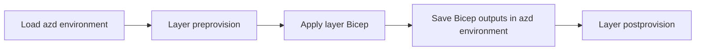
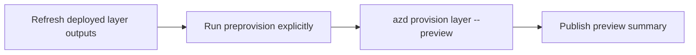
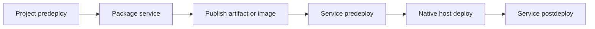

<!-- cspell:words appconfig bicepparam postdeploy postprovision -->
<!-- cspell:words predeploy preprovision -->

# Deployment Maintainer Guide

This guide is for developers changing the SDK AI bot deployment implementation.
For routine deployment or incident recovery, use the
[deploy runbook](runbook-deploy.md) or [rollback runbook](runbook-rollback.md).
For the deployed topology, start with the
[deployment architecture](deployment-architecture.md).

## Azure Developer CLI Background

The [Azure Developer CLI (`azd`)](https://learn.microsoft.com/azure/developer/azure-developer-cli/overview)
is the deployment engine for this project. It connects application source,
infrastructure as code, named environments, and lifecycle hooks through
`tools/sdk-ai-bots/azure.yaml`.

The important azd concepts in this repository are:

- **Project:** `tools/sdk-ai-bots/azure.yaml` defines the complete SDK AI bot
  project.
- **Service:** each entry under `services` tells azd how to build and deploy one
  application workload.
- **Infrastructure layer:** each entry under `infra.layers` points to one Bicep
  entry point and declares its dependencies.
- **Environment:** azd stores local values and captured Bicep outputs under
  `.azure/<environment>`. This generated state is not a source of truth and must
  not be committed.
- **Hook:** commands declared in `azure.yaml` run before or after azd lifecycle
  events to reconcile state that Bicep or the service deployer does not own.

The common commands map to different responsibilities:

- `azd provision [<layer>]` previews or applies Bicep infrastructure and
   captures layer outputs.
- `azd deploy <service>` builds, publishes, and deploys one application
   service, including its hooks.
- `azd env refresh <environment> --layer <layer>` rehydrates outputs on a fresh
   pipeline agent.
- `azd env set <key> <value>` persists an input consumed by Bicep, azd, or a
   hook.
- `azd up` provisions and deploys the whole project. It is useful for standard
   azd projects, but this pipeline does not use it because it cannot preserve
   the required preview and approval boundary or select one service.

The project currently requires azd `>=1.32.0` and pins the
`azure.ai.agents` extension in `azure.yaml`. Keep the pin intentional: an
extension update can change hosted-agent packaging, publication, environment
outputs, or deployment behavior.

## Sources of Truth

Change the file that owns the state. Do not duplicate a value in a hook or
pipeline when an owning contract already exists.

- **Services, layer graph, hooks, and tool versions:**
   `tools/sdk-ai-bots/azure.yaml`
- **Subscription, region, names, routing, and component images:**
   `deployment/infra/environments/environment-suite.yaml`
- **Azure resource shape and base configuration:**
   `deployment/infra/layers/<layer>/main.bicep`
- **Mapping azd values into Bicep parameters:**
   `deployment/infra/layers/<layer>/main.bicepparam`
- **Data-plane and post-deployment reconciliation:** `deployment/hooks/`
- **Preview, approval, apply, deployment order, and authentication:**
   `deployment/pipelines/`
- **Local validation and operator utilities:** `deployment/scripts/`
- **Executable deployment contracts:** `deployment/test/`

`environment-suite.yaml` is canonical configuration. Local azd state is derived
from it by `scripts/sync-env-suite.ps1`; pipeline variables are derived from it
by `pipelines/templates/load-environment-suite.yml`. When adding a value, update
both mappings if both local and pipeline execution need it.

## Execution Model

The unified entry point is
`deployment/pipelines/orchestrators/qa-bot-deploy.yml`. It accepts an
environment, a deployment component, and an optional image tag.

Infrastructure execution follows this path:

```text
qa-bot-deploy.yml
  -> provision-with-approval.yml
     -> provision-stage.yml (preview)
     -> approval-stage.yml
     -> provision-stage.yml (apply)
        -> azd-provision.yml
           -> azd provision [<layer>]
```

Application execution follows this path:

```text
qa-bot-deploy.yml
  -> deploy-stage.yml or provision-and-deploy-component.yml
     -> component-deploy-stage.yml
        -> azd-deploy.yml
           -> azd deploy <service>
```

A pipeline job starts without local azd state. The templates therefore load the
environment suite, authenticate with workload identity federation, select or
create the azd environment, and refresh required layer outputs before invoking
azd. Removing an `azd env refresh` call can break resource discovery even when
the resource exists in Azure.

Full-stack application order is `agent-server`, `function-app`, `agent`, the
production-only evolution agent, then `frontend`. The dependency and
stabilization ordering is deliberate; preserve it unless the resource or
runtime contract changes.

## azd Hook Workflow

An azd hook is a script registered at a lifecycle point in `azure.yaml`. A file
under `deployment/hooks/` does nothing by itself; its registration determines
when it runs, its scope, and its working directory. See the official
[azd hooks documentation](https://learn.microsoft.com/azure/developer/azure-developer-cli/azd-extensibility)
for the complete extension model.

This project uses three hook scopes:

- **Project hooks** under the root `hooks` block wrap an azd command. The only
   provision/deploy hook at this scope is `predeploy`.
- **Layer hooks** under `infra.layers[].hooks` wrap the Bicep apply for one
   infrastructure layer.
- **Service hooks** under `services.<name>.hooks` wrap the final deployment
   operation for one application service.

All current hooks declare `interactive: true` and do not set
`continueOnError`. An unhandled hook failure therefore fails the azd command
and prevents later lifecycle steps. A few hooks deliberately catch selected
errors and log warnings when the underlying deployment is still usable.

### `azd provision`

For an apply, azd resolves the selected layer graph from `dependsOn`. Each
layer then follows this lifecycle:



The dependency graph is authoritative. Independent layers can be scheduled
without relying on their textual order in `azure.yaml`, so hooks must consume
only declared dependency outputs.

The pipeline preview path is intentionally different:



Native `azd provision --preview` skips hooks and does not update environment
outputs. `azd-provision.yml` explicitly runs the selected layer's
`preprovision` hook before each preview because guards and preservation flags
must still be evaluated. It never runs `postprovision` during preview because
those hooks mutate Azure data-plane state.

The registered provision hooks are:

- **`resource-group` preprovision: `preprovision.ts`.** Checks required tools,
   validates the environment-suite name, detects local azd environment drift,
   blocks local production provisioning, checks quota, and records the active
   deployment principal. Bicep cannot inspect local tools, compare local azd
   state with repository configuration, query quota safely, or derive the
   caller identity from the current Azure CLI token.
- **Shared, agent, frontend, agent-server, and Function App preprovision:
   `layer-preprovision.ts`.** Enforces the production pipeline guard immediately
   before each layer apply. The repeated layer registration also protects a
   targeted `azd provision <layer>` that does not execute `resource-group`.
- **Agent postprovision: `agent-postprovision.ts`.** Creates or adopts the
   Foundry User role assignment for the shared managed identity. This uses an
   idempotent Azure CLI operation because an equivalent assignment may already
   exist under a different role-assignment GUID, which a fixed Bicep resource
   cannot safely adopt.
- **Frontend postprovision: `frontend-postprovision.ts`.** Generates the Teams
   Toolkit `env/.env.azd` file from committed Teams settings and the newly
   captured Bicep outputs. Teams Toolkit configuration is not an ARM resource,
   and the required values do not all exist until this layer completes.
- **Logic App preprovision: `logic-app-preprovision.ts`.** Discovers and
   preserves an existing Teams managed API connection, checks its OAuth status,
   and detects whether the Logic App already has a real workflow definition.
   It writes flags that tell Bicep to create or repair a connection, preserve a
   connected one, retain an existing workflow, or deploy only an empty shell.
   This probe is required to avoid replacing delegated OAuth state or erasing a
   workflow installed by the Function App deploy hook.
- **Logic App postprovision: `postprovision.ts`.** Uploads per-environment bot
   routing, seeds Key Vault and App Configuration, and reconciles Azure AI
   Search data-plane objects after the final layer outputs exist. These are
   data-plane and content operations rather than ARM resource declarations.
   Despite its generic filename, this is a Logic App layer hook, not a root
   project hook; it does not run when another layer is provisioned by itself.

### `azd deploy <service>`

For a standalone service deployment, azd uses this high-level sequence:



The project hook wraps the whole command. Service hooks wrap the final deploy
phase, so package or publish work may already have happened before a service
`predeploy` hook starts. This distinction matters when changing image logic.
The Azure DevOps orchestrator invokes one service per `azd deploy` command and
owns the cross-service order; do not rely on an unscoped local `azd deploy` to
match that pipeline sequence.

The registered deploy hooks are:

- **Project predeploy: `predeploy.ts`.** Runs for every service and rejects a
   production deploy outside Azure DevOps or GitHub Actions. Native azd knows
   how to deploy a service but does not own this release policy.
- **Frontend predeploy: `frontend-predeploy.ts`.** Optionally refreshes the
   Teams environment, compiles the TypeScript output included in the image,
   builds the immutable image with ACR Tasks, and points App Service at that
   exact image. The custom step is needed because this image contains generated
   `lib` output and provisioning otherwise leaves the site on its placeholder
   tag.
- **Frontend postdeploy: `frontend-postdeploy.ts`.** Runs Teams Toolkit
   provisioning, publishes when requested or when installation drift exists,
   installs or upgrades the app in the configured team through Microsoft Graph,
   and probes `/health`. Teams catalog and Graph operations are outside ARM and
   native azd. The pipeline normally sets `AZD_SKIP_TEAMS_PROVISION=1`; local
   interactive runs can perform the Teams work. Teams failures and health
   timeout are warnings unless strict Teams mode is enabled.
- **Function App predeploy: `function-predeploy.ts`.** Builds the immutable
   function image with ACR Tasks, records the exact service image for azd, and
   points the Function App at it. This prevents azd from selecting a second tag
   and restores the runtime image after Bicep provisioning sets its placeholder.
- **Function App postdeploy: `function-postdeploy.ts`.** Verifies that the
   Function App is running, waits for host readiness, and installs the complete
   Logic App workflow. The workflow calls the Function App, so applying it in
   Bicep before the container is live would create an unusable definition.
- **Agent postdeploy: `agent-postdeploy.ts`.** Grants the newly created hosted
   agent identity its data-plane roles, ensures the latest Foundry agent version
   contains `AZURE_APPCONFIG_ENDPOINT`, and probes `/ping`. The hosted identity
   and version are created during deployment, so their principal ID and version
   definition are unavailable to Bicep beforehand. The environment injection
   also compensates for behavior not handled by the pinned azd agent extension.

`agent-server` has no custom service hook. It uses azd's native package,
publish, and App Service container deployment. `agent` has no predeploy hook;
azd and the `azure.ai.agents` extension own its image build and initial Foundry
deployment before `agent-postdeploy.ts` reconciles runtime state.

### When to Add a Hook

Prefer Bicep for declarative ARM resources and native azd service deployment
for supported hosts. Add a hook only when the operation requires one of these
boundaries:

- execution immediately before or after one layer or service;
- Azure, Foundry, Search, Teams, or Graph data-plane operations;
- inspection and preservation of state that an ARM deployment could replace;
- local or pipeline context that Bicep cannot observe;
- generated artifacts or configuration needed by another deployment tool.

Keep hooks idempotent because pipeline retries and manual reruns are expected.
Document which failures are fatal, wait for eventual consistency where needed,
and never store secrets in azd environment files. To debug one registration,
use `azd hooks run <hook> --layer <layer> -e dev` or
`azd hooks run <hook> --service <service> -e dev`. This executes the hook's
real side effects without running the wrapped Bicep or service action, so use
it only against an intended environment.

## Image Version Flow

`qa-bot-deploy.yml` exposes `imageTag`. An empty value keeps automatic tagging;
a non-empty value is validated and used by every selected application image.
The `Show image version` step runs before the build or deployment.

The handoff is:

1. `azd-deploy.yml` resolves or accepts the tag and sets `AZD_IMAGE_TAG`.
2. `azure.yaml` uses `AZD_IMAGE_TAG` as `docker.tag` for azd-managed container
   builds.
3. Frontend and Function App predeploy hooks consume the same value for their
   custom ACR builds.
4. The evolution-agent deployment passes the same value to
   `deploy_hosted_agent.py`.

Do not compute a second tag after the display step. The value shown to an
operator must be the value consumed by the real deployment. Frontend and
Function App automatic tags are computed from existing ACR tags by
`scripts/resolve-image-version.ts`; the azd-managed agent and agent-server use a
build-based tag when no override is supplied.

## Safe Change Recipes

### Add or change an Azure resource

1. Change the owning layer's `main.bicep`.
2. Add or change the corresponding `main.bicepparam` adapter.
3. Export any value needed by downstream layers, services, or hooks.
4. Update dependent layer declarations in `azure.yaml` when the graph changes.
5. Update the environment suite and both environment loaders for new fixed
   inputs.
6. Run preview before apply and inspect deletes, replacements, role assignments,
   and resource moves.

### Add an azd service

1. Add the service to `azure.yaml` with its source path, host, language, and
   build settings.
2. Add or identify its infrastructure layer and expose the standard azd target
   outputs, including service resource name and endpoint where applicable.
3. Add its component metadata to `environment-suite.yaml`.
4. Extend the orchestrator's `component` values and thread the value through
   the reusable templates.
5. Add service hooks only for behavior that the host deployer or Bicep cannot
   own.
6. Add focused contract tests and update architecture, pipeline, setup, deploy,
   and rollback documentation as applicable.

### Change a hook

1. Identify whether it is project-, layer-, or service-scoped in `azure.yaml`.
2. Keep it idempotent because provision and deploy are routinely retried.
3. Treat missing outputs on first deployment separately from transient Azure
   failures.
4. Avoid persisting secrets in azd environment files or logs.
5. Add a unit test for extracted logic or a deployment contract test for hook
   registration and ordering.

### Change pipeline behavior

1. Keep `qa-bot-deploy.yml` as the single deployment entry point.
2. Put reusable behavior in `pipelines/templates`; keep the orchestrator focused
   on scope and ordering.
3. Thread new parameters through both full-stack and component-scoped paths.
4. Preserve preview and manual approval before every normal apply.
5. Use the environment-specific federated service connection and do not add
   credentials to YAML.
6. Validate both an empty optional value and an explicit queue-time value.

## Invariants and Common Failure Modes

- Never hard-code an environment-specific subscription, resource name, endpoint,
  or image tag in `azure.yaml`, Bicep, hooks, or pipeline templates.
- Bicep outputs are contracts. Renaming one requires updating downstream
  `main.bicepparam` files, hooks, environment refreshes, and tests.
- Preview and apply must use the same Bicep entry point and parameter adapter.
- Re-provisioning can restore placeholder container images or the empty Logic
  App shell. The matching application deploy must run afterward.
- The Function App postdeploy hook installs the final Logic App definition only
  after the container runtime is available.
- Production is pipeline-only. Do not weaken the provision guard to debug a
  production issue locally.
- `.azure/` contains machine-local state. Never use it as review evidence or
  commit it.
- Keep data jobs such as knowledge sync and wiki generation outside the azd
  service graph; they are scheduled pipelines, not hosted application services.

## Validation Before Review

From `tools/sdk-ai-bots/deployment`:

```bash
npm ci
./node_modules/.bin/tsc --noEmit -p tsconfig.json
./node_modules/.bin/tsx --test test/*.test.ts
yq eval '.' pipelines/orchestrators/qa-bot-deploy.yml \
   pipelines/templates/*.yml >/dev/null
pwsh ./scripts/validate-env-suite.ps1
```

Also run the build and tests for any changed application package. For an
infrastructure change, run the appropriate azd preview against dev and review
its complete output. Do not apply merely to test whether a template compiles.

Before requesting review, verify:

- full-stack and component-scoped paths both receive new parameters;
- local dev and pipeline execution derive equivalent environment values;
- hooks are idempotent and do not expose secrets;
- image versions shown before deployment are exactly those deployed;
- documentation links and deployment contract tests pass;
- no generated `.azure/` files are staged.

## azd References

- [Azure Developer CLI overview](https://learn.microsoft.com/azure/developer/azure-developer-cli/overview)
- [Azure Developer CLI command reference](https://learn.microsoft.com/azure/developer/azure-developer-cli/reference)
- [Azure Developer CLI template structure](https://learn.microsoft.com/azure/developer/azure-developer-cli/azd-templates)
- [Work with azd environment variables](https://learn.microsoft.com/azure/developer/azure-developer-cli/manage-environment-variables)
- [Customize azd workflows with hooks](https://learn.microsoft.com/azure/developer/azure-developer-cli/azd-extensibility)
- [`azure.yaml` schema reference](https://github.com/Azure/azure-dev/blob/main/docs/reference/azure-yaml-schema.md)
- [Azure Developer CLI source and issues](https://github.com/Azure/azure-dev)
