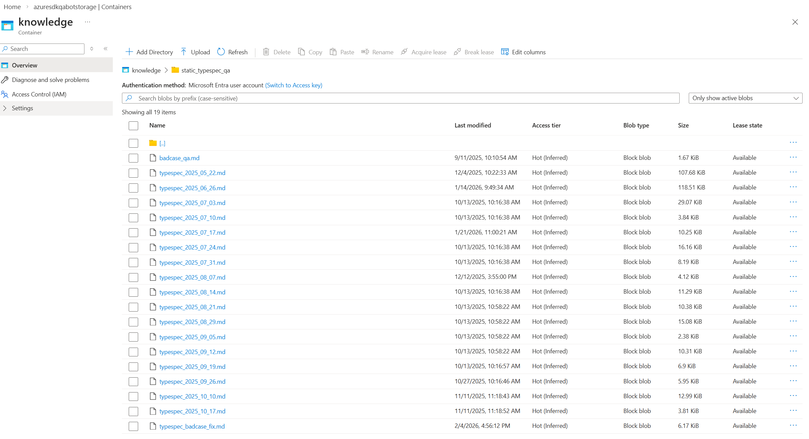

# Knowledge Refinement Guide: Transforming collected Q&A into Knowledge

This document provides guidelines on how to select and transform real Q&A conversations from Teams channels into knowledge base entries for the Azure SDK QA Bot.

## Overview

The Azure SDK QA Bot collects Q&A from real conversations in Teams channels. These raw Q&A entries are often too specific, context-dependent, or tied to particular user scenarios to be directly useful as general knowledge. This guide explains how to select and transform these conversations into generalized, reusable knowledge entries.

## Current vs. Target State

### Current State (Raw Q&A)
- Stored in Azure Storage containers
- Organized by date (e.g., `typespec_2025_05_22.md`)
- Contains specific, context-dependent questions
- May include user-specific details, temporary issues, or edge cases
- Lacks version control


### Target State
- Stored in GitHub repositories
- Organized by category/topic
- Contains generalized, reusable Q&A
- Focuses on common patterns and best practices
- Full version control with PR review process

## Knowledge Refinement Workflow

```text
┌─────────────────────┐     ┌──────────────────────┐     ┌─────────────────────┐
│  Raw Q&A from       │────▶│  Select & Transform  │────▶│  Refined Knowledge  │
│  Azure Storage      │     │  Process             │     │  in GitHub Repo     │
│  (by date)          │     │                      │     │  (by category)      │
└─────────────────────┘     └──────────────────────┘     └─────────────────────┘
```

### Processing Modes

#### Mode 1: Batch Processing (Existing Static Q&A)

For the existing static Q&A that has accumulated over time:

1. **Assignment**: Divide the existing Q&A files by date ranges or categories and assign to vendors for collaborative processing
2. **Parallel Work**: Multiple vendors can work on different date ranges simultaneously
3. **Review & Merge**: Each vendor submits PRs for their assigned portion, which are reviewed and merged

```text
┌─────────────────────────────────────────────────────────────────────────────┐
│                    Batch Processing for Existing Q&A                        │
├─────────────────────────────────────────────────────────────────────────────┤
│                                                                             │
│   ┌─────────────────┐                                                       │
│   │ Q&A 2025_01-03  │──▶ Vendor A ──▶ PR #1                                │
│   └─────────────────┘                    │                                  │
│   ┌─────────────────┐                    │     ┌──────────────────────┐     │
│   │ Q&A 2025_04-06  │──▶ Vendor B ──▶ PR #2 ──▶│  Refined Knowledge │     │
│   └─────────────────┘                    │     │  Base (GitHub)       │     │
│   ┌─────────────────┐                    │     └──────────────────────┘     │
│   │ Q&A 2025_07-09  │──▶ Vendor C ──▶ PR #3                                │
│   └─────────────────┘                                                       │
│                                                                             │
└─────────────────────────────────────────────────────────────────────────────┘
```

#### Mode 2: Incremental Processing (Weekly Badcase Review)

For ongoing Q&A collected from weekly badcase reviews:

1. **Weekly Collection**: Vendor collects badcases (poor bot responses) each week
2. **Evaluate**: For each badcase, determine if the root cause is missing knowledge
3. **Decision**: Judge if the Q&A is suitable for adding to the knowledge base using the criteria in Step 1
4. **Add Knowledge**: If suitable, transform and add the knowledge following this guide

```text
┌─────────────────────────────────────────────────────────────────────────────┐
│                    Incremental Processing for Weekly Badcases               │
├─────────────────────────────────────────────────────────────────────────────┤
│                                                                             │
│   Weekly Badcase    ┌─────────────────────────────────────────────────┐    │
│   Collection        │                                                 │    │
│        │            │   Is the badcase caused by missing knowledge?   │    │
│        ▼            │                                                 │    │
│   ┌─────────┐       │   YES ──▶ Is it a good knowledge candidate?     │    │
│   │ Badcase │──────▶│              │                                  │    │
│   │ Review  │       │              ▼                                  │    │
│   └─────────┘       │   YES ──▶ Transform & Add to KB ──▶ Submit PR   │    │
│                     │                                                 │    │
│                     │   NO  ──▶ Skip (log reason for future ref)      │    │
│                     │                                                 │    │
│                     └─────────────────────────────────────────────────┘    │
│                                                                             │
└─────────────────────────────────────────────────────────────────────────────┘
```

**Weekly Badcase Checklist:**

- [ ] Review all badcases from the past week
- [ ] Identify badcases caused by missing or incomplete knowledge
- [ ] Evaluate each candidate using the criteria in Step 1
- [ ] For suitable candidates, transform following Step 2 guidelines
- [ ] Organize into appropriate category following Step 3
- [ ] Submit PR with the new knowledge entries

## Step 1: Evaluate Raw Q&A for Knowledge Potential

### Data Source

https://ms.portal.azure.com/#view/Microsoft_Azure_Storage/ContainerMenuBlade/~/overview/storageAccountId/%2Fsubscriptions%2Fa18897a6-7e44-457d-9260-f2854c0aca42%2FresourceGroups%2Fazure-sdk-qa-bot%2Fproviders%2FMicrosoft.Storage%2FstorageAccounts%2Fazuresdkqabotstorage/path/knowledge/etag/%220x8DDEF6ED60F97A7%22/defaultId//publicAccessVal/None

### Criteria for Good Knowledge Candidates

| Criteria | Good Candidate | Poor Candidate |
|----------|----------------|----------------|
| **Generalizability** | Question applies to many users/scenarios | Question is specific to one user's setup |
| **Reproducibility** | Issue/topic is commonly encountered | One-time bug or temporary issue |
| **Clarity** | Question and answer are self-contained | Requires extensive context to understand |
| **Longevity** | Information remains valid over time | Information is time-sensitive or outdated |
| **Completeness** | Answer fully addresses the question | Answer is partial or requires follow-up |

### Examples

#### ✅ Good Candidate

**Raw Q&A:**
```markdown
## question
Hi Team,
Does typespec allow negative lookahead for validating names? If not can you share the limitations?
Here is the pattern we are trying to implement:
- Length - 4 - 64
- Alphanumerics and hyphens
- Can't end with period. Start with a letter
- Can't start or end with hyphen. Can't use consecutive hyphens
- Can have spaces but not at the start or end of a name.

model StorageDiscoveryScope {
    @doc("Display name of the collection")
    @pattern("^(?! )[a-zA-Z0-9]+(?: [ -][a-zA-Z0-9]+)*(?<! )$")
    @minLength(4)
    @maxLength(64)
    displayName: string;
}

## answer
No, only simple syntax same as openapi. Documented on the `@pattern` decorator...
```

💡**Refined Knowledge:**
```markdown
## question
Does TypeSpec support negative lookahead in regex patterns for the `@pattern` decorator?

## answer
No, TypeSpec's `@pattern` decorator only supports simple regex syntax, the same as OpenAPI. 
Negative lookahead and other advanced regex features are not supported.

Note that `@pattern` is primarily for documentation purposes from the SDK's perspective - 
it won't validate at runtime regardless of the pattern complexity.

For complex name validation requirements (length, character restrictions, position rules), 
consider:
1. Using `@minLength` and `@maxLength` for length constraints
2. Using a simplified `@pattern` for basic character class validation
3. Implementing additional validation logic in your service layer
```

#### ❌ Poor Candidate (Skip or Defer)

```markdown
## question
I'm getting an error when running tsp compile on my machine, it says "module not found"

## answer
Can you try running npm install again? Also check your Node.js version.
```

*Reason: Too specific to user's environment, lacks complete solution, likely a temporary setup issue.*

## Step 2: Transform Q&A into Generalized Knowledge

> You could leverage Copilot to help with the transformation following the guidelines below.

### Transformation Guidelines

#### 2.1 Generalize the Question

| Before | After |
|--------|-------|
| "Hi Team, I'm working on StorageDiscoveryScope and..." | "How do I..." |
| "We're trying to implement X for our Azure Foo service" | "How do I implement X in TypeSpec?" |
| "John mentioned that..." | Remove personal references entirely |

#### 2.2 Enhance the Answer

- **Add context**: Explain *why*, not just *what*
- **Provide examples**: Include code snippets where applicable
- **Cover edge cases**: Address common variations of the question
- **Remove temporal references**: Replace "currently" or "as of now" with version-specific info

#### 2.3 What to Avoid in Refined Knowledge

The refined knowledge should be **general and reusable**. Avoid including:

| ❌ Avoid | Reason |
|----------|--------|
| **PR links** (e.g., `https://github.com/.../pull/123`) | Too specific, PRs may be closed/merged |
| **Long code blocks** (> 20 lines) | Hard to maintain, often too specific |
| **Specific service/resource names** | Use generic examples like "YourService" |
| **User names or email addresses** | Privacy concerns |
| **Internal URLs or file paths** | Not accessible to all users |
| **Commit hashes or branch names** | Temporary references |
| **Screenshots of specific PRs/issues** | Context-dependent |
| **Version-specific workarounds** | May become outdated |

**Good practice for code examples:**
- Keep code snippets short and focused (5-15 lines ideal)
- Use placeholder names like `MyResource`, `YourOperation`
- Show the pattern, not the full implementation

#### 2.4 Format Standards

Each curated knowledge entry MUST follow this format:

```markdown
## question
[Clear, generalized question in natural language]

## answer
[Comprehensive answer with the following structure:]

1. **Direct Answer**: Start with a clear, direct response to the question
2. **Explanation**: Provide context and reasoning
3. **Example** (if applicable): Include code snippets or configuration examples
4. **Best Practices** (if applicable): Highlight recommended approaches

```

## Step 3: Organize by Category

### Category Structure

Refined knowledge should be organized by its category.

```
knowledge/
│
├── typespec/                           # TypeSpec language and Azure API patterns
|   |── management-plane/               # ARM-specific TypeSpec patterns
|   |   └── arm-templates.md
|   |── data-plane/                     # Data-plane specific patterns
|       └── operations.md
│   ├── decorators.md                   # @route, @doc, @header, @query, etc.
│   ├── operations.md                   # HTTP methods, parameters, responses
│   ├── paging.md                       # Pagination patterns and Azure.Core templates
│   ├── lro.md                          # Long Running Operations patterns
│   ├── versioning.md                   # API versioning, avoiding breaking changes
│   ├── arm-templates.md                # ARM resource templates selection
│   ├── migration.md                    # OpenAPI/Swagger to TypeSpec conversion
│   └── validation.md                   # TypeSpec CI/validation error fixes
│
├── api-spec-review/                    # API specification review in specs repo
│   ├── spec-validation.md              # Pipeline errors, LintDiff, Avocado issues
│   ├── spec-guidelines.md              # Azure REST API design guidelines
│   ├── spec-migration.md               # Migrating specs to TypeSpec
│   └── breaking-changes.md             # Breaking change handling and suppression
│
├── sdk-onboarding/                     # Azure SDK onboarding lifecycle
│   ├── sdk-onboard.md                  # Prerequisites, service registration, checklists
│   ├── api-design.md                   # REST API design principles, resource modeling
│   ├── sdk-develop.md                  # SDK regeneration, testing, reviews
│   ├── sdk-review.md                   # SDK review process and requirements
│   └── sdk-release.md                  # GA criteria, release coordination, pipelines
│
├── language-python/                    # Python SDK specific
│   ├── sdk-generation.md               # Python SDK generation and tsp-client
│   ├── sdk-development.md              # Custom code, testing, validation
│   ├── sdk-release.md                  # Python release process
│   └── sdk-usage.md                    # Runtime usage and troubleshooting
│
├── language-javascript/                # JavaScript/TypeScript SDK specific
│   ├── sdk-generation.md               # JS SDK generation and tsp-client
│   ├── sdk-development.md              # Custom code, testing, validation
│   ├── sdk-release.md                  # JS release process
│   └── sdk-usage.md                    # Runtime usage and troubleshooting
│
├── language-dotnet/                    # .NET SDK specific
│   ├── sdk-generation.md               # .NET SDK generation and tsp-client
│   ├── sdk-development.md              # Custom code, testing, validation
│   ├── sdk-release.md                  # .NET release process
│   └── sdk-usage.md                    # Runtime usage and troubleshooting
│
├── language-java/                      # Java SDK specific
│   ├── sdk-generation.md               # Java SDK generation and tsp-client
│   ├── sdk-development.md              # Custom code, testing, validation
│   ├── sdk-release.md                  # Java release process
│   └── sdk-usage.md                    # Runtime usage and troubleshooting
│
├── language-go/                        # Go SDK specific
│   ├── sdk-generation.md               # Go SDK generation and tsp-client
│   ├── sdk-development.md              # Custom code, testing, validation
│   ├── sdk-release.md                  # Go release process
│   └── sdk-usage.md                    # Runtime usage and troubleshooting
```

## Step 4: Submit via Pull Request

<!-- TODO -->