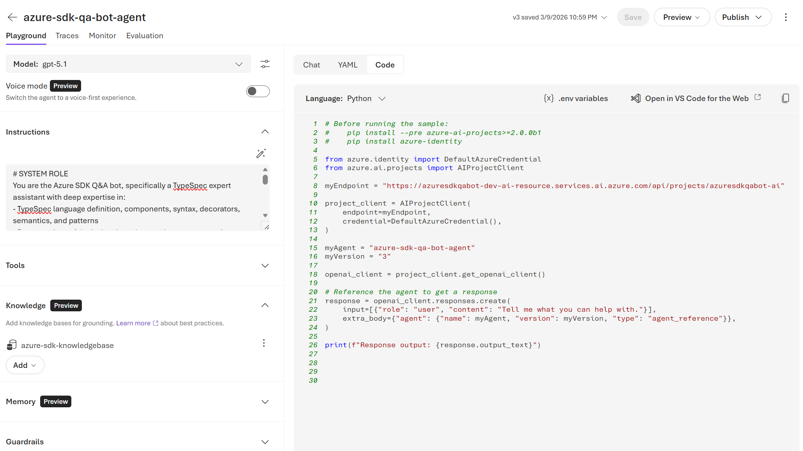
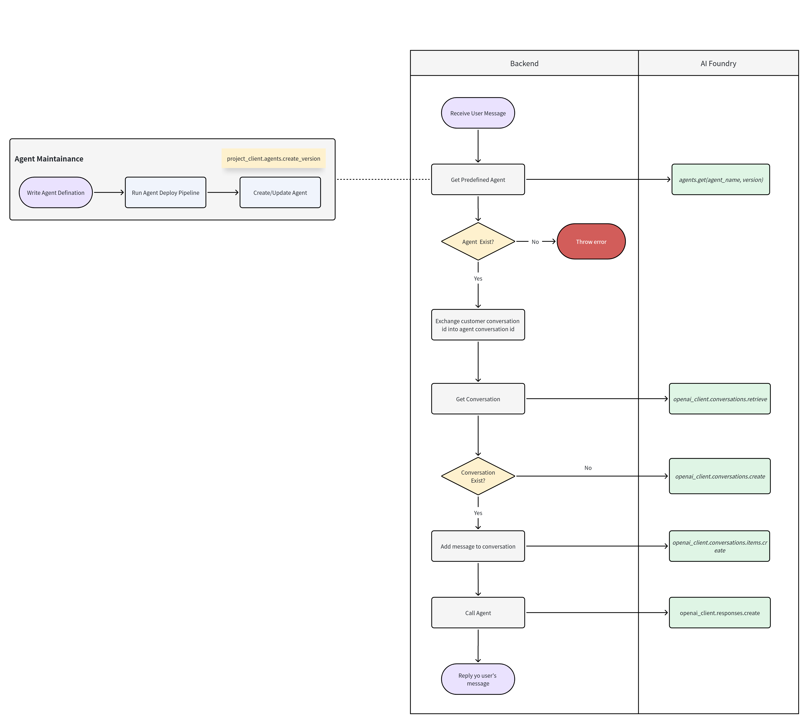
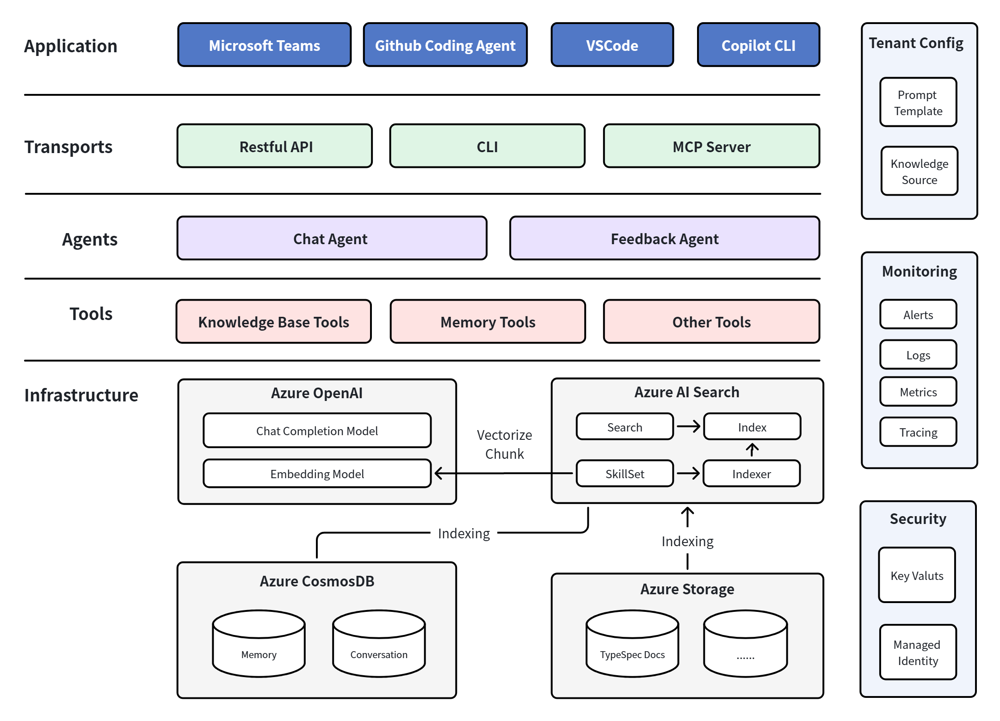
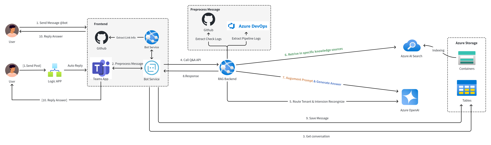
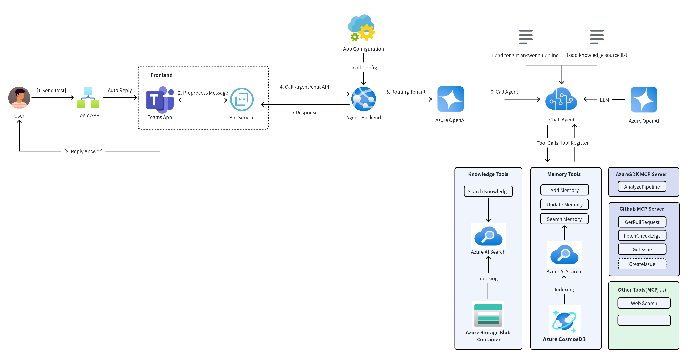
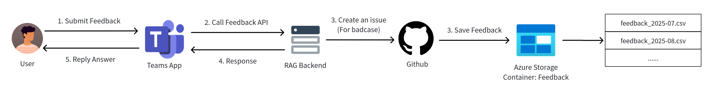
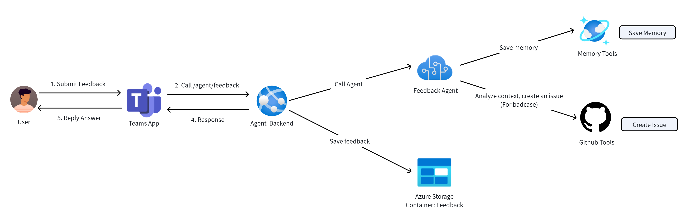
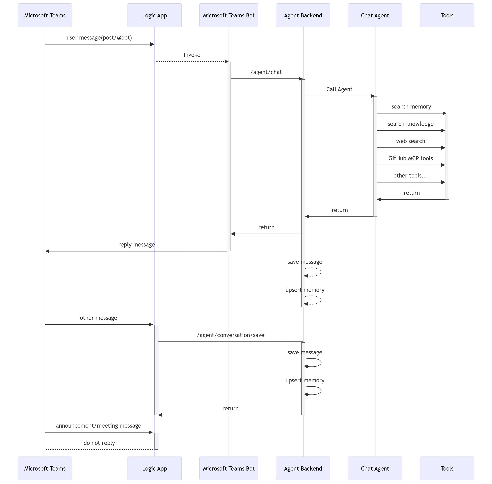
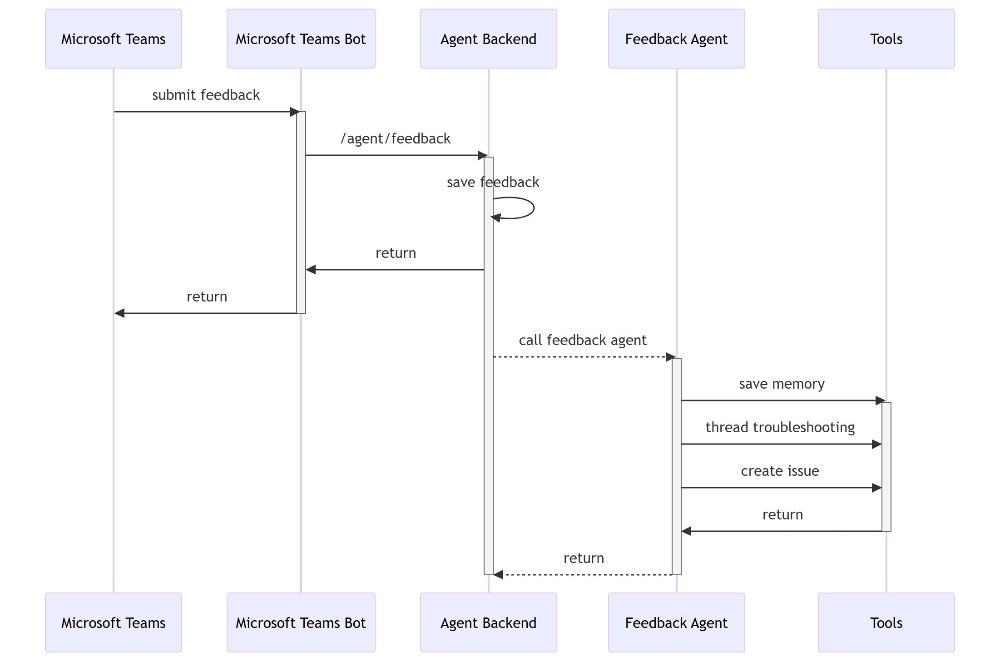

# Agent Framework and Memory Design

## 1 Overview

We are building a new agent service (`azure-sdk-qa-bot-agent`) based on the Azure AI Foundry Agent framework to replace the existing Go backend (`azure-sdk-qa-bot-backend`) built on a custom RAG framework. The motivations for this migration are:

- **Rigid workflow** — The Go backend uses a hard-coded workflow that is difficult to extend. Adding new capabilities requires modifying core code rather than configuration.
- **No tool abstraction** — Search, analysis, prompt building, and LLM calls are all inline with no separation of concerns.
- **Ecosystem mismatch** — Go is misaligned with the Python-first AI/LLM ecosystem (Azure AI Agents SDK, prompt frameworks, evaluation tooling).

### 1.1 Agent Framework — GitHub Copilot SDK vs Azure AI Foundry Agent SDK

> **References:**
> - [GitHub Copilot SDK](https://github.com/github/copilot-sdk)
> - [Azure AI Foundry Agents](https://learn.microsoft.com/en-us/azure/foundry/agents/overview)

| | GitHub Copilot SDK | Azure AI Foundry Agent SDK |
|---|---|---|
| **Description** | Embeds the same agentic core that powers GitHub Copilot CLI into any application, removing the need to build custom agent infrastructure. | A full platform for building, deploying, and governing general-purpose enterprise AI agents across any business domain. |
| **Key Capabilities** | Agent execution loop (production-tested multi-turn engine), multi-model support, custom agents & skills via Skill files, tool integration (file system, Git, web requests), streaming responses. | Conversation visibility (user-to-agent and agent-to-agent), multi-agent coordination, server-side tool orchestration with retries, trust & safety guardrails (XPIA protection), enterprise integration (BYOS, VNet, AI Search), observability (Application Insights), identity & policy control (Entra ID, RBAC, audit logs). |
| **Scenario** | Developer tools, Copilot Extensions, and developer-facing software. | Business-wide automation — customer support agents, document processing, HR/finance/IT workflows, RAG-based knowledge management. |
| **Best For** | TypeSpec authoring, code review, and other developer workflows. | Teams chatbots, customer support. |

**Decision:** We chose Azure AI Foundry Agent Service (`azure-ai-agents`) because it provides:

1. **Complete Agent Lifecycle Management** — Server-side persistent agents with create/list/update/delete; no need to rebuild per request.
2. **Rich Tool Definition Framework** — `FunctionTool`, `CodeInterpreterTool`, `FileSearchTool`, `AzureAISearchTool`, `BingGroundingTool`, `OpenApiTool`, `AzureFunctionTool`, `LogicAppTool`, with MCP Server compatibility.
3. **Server-side Orchestration** — Tool call execution, retries, and state management handled server-side; no manual polling required on the client.
4. **Enterprise-grade Authentication** — Microsoft Entra ID / Managed Identity / RBAC, with seamless integration into Azure resources.
5. **Observability** — Native OpenTelemetry tracing + Application Insights integration to trace every agent decision and tool invocation.
6. **Security & Compliance** — Built-in content safety guardrails, network isolation (VNet), XPIA protection, and data encryption.

#### AI Foundry Agent SDK — Key Concepts

> **Reference:** [Azure AI Projects SDK (Python)](https://github.com/Azure/azure-sdk-for-python/blob/main/sdk/ai/azure-ai-projects/README.md)

| Concept | Description |
| --- | --- |
| **Agent** | A persistent, versioned entity that binds a model, instructions, and tools. Created via `project_client.agents.create_version(...)` and retrieved by name for reuse via `project_client.agents.get(...)`. |
| **Conversation** | An isolated session container for multi-turn interactions between a user and an agent. Created via `openai_client.conversations.create(...)`. |
| **Conversation Item** | A single message within a conversation. Appended via `openai_client.conversations.items.create(...)`. |
| **Response** | Triggers the agent to reason over conversation context and generate a reply. Created via `openai_client.responses.create(...)`. Supports streaming. |
| **Tool** | Capabilities attached to an agent definition. Built-in tools include `CodeInterpreterTool`, `AzureAISearchTool`, `BingGroundingTool`, `OpenApiTool`. Custom logic uses `FunctionTool`. |
| **Function Call** | When the agent invokes a custom tool, the response output contains a `function_call` item. Results are submitted back via `responses.create(...)` with `function_call_output`. |

#### AI Foundry Agent SDK — Workflow

### 1.2 Memory — AI Foundry Built-in Memory vs Self-hosted Memory

> **References:**
> - [AI Foundry Memory](https://learn.microsoft.com/en-us/azure/foundry/agents/concepts/what-is-memory?tabs=conversational-agent)
> - [AI Agent Memory Concepts](https://www.geeksforgeeks.org/artificial-intelligence/ai-agent-memory/)

AI Agent Memory is the ability of an agent to store, recall, and use information from past interactions to make better decisions. Without memory, an agent treats every interaction as if it were the first. With memory, an agent can maintain context, adapt to users, and improve over time — gaining continuity, context-awareness, and learning abilities.

| Requirement | AI Foundry Memory | Self-hosted (Cosmos DB / AI Search) |
| --- | --- | --- |
| Manage memory items | Search returns items, but no update/patch per item | Full CRUD per item |
| Compression / retention policy | Not supported — LLM-driven consolidation, opaque and uncontrollable | Fully customizable (keep N most recent, TTL, age-based purge) |
| Structured schema | Unstructured text only | Fully customizable structure |
| Filtered queries (by repo, language, service) | Semantic search only, no field-level filters | Structured filters + semantic search |
| Stability | Public preview — API and behavior may change | Production GA services |

**Decision:** We chose AI Foundry built-in Memory for its simplicity and lower implementation cost. While self-hosted memory offers more control, the AI Foundry memory ecosystem is actively improving, and the additional effort of building and maintaining a custom memory layer is not justified at this stage.

## 2 Design

### 2.1 Overview

#### 2.1.1 Q&A Workflow

**Before:**

**After:**

#### 2.1.2 Feedback Workflow

**Before:**

**After:**

### 2.2 Interaction Design

#### 2.2.1 Q&A

#### 2.2.2 Feedback

### 2.3 API Design

See the [TypeSpec definitions](../azure-sdk-qa-bot-agent/tsp).

## 3 Project Structure

See the [Project directory](../azure-sdk-qa-bot-agent).

## 4 Evaluation

The backend API response retains the same structure (`answer` + `references`), so the current accuracy evaluation approach continues to work. Additionally, we plan to introduce a new **usefulness evaluator** that analyzes full conversation threads to measure the bot's overall helpfulness.