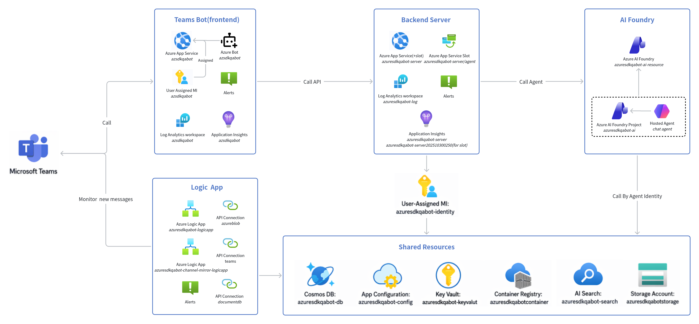

# Azure SDK QA Bot — Azure Resources Overview

This document lists the Azure resources backing the Azure SDK QA Bot project

Subscription: Azure SDK Engineering System
Resource group: azure-sdk-qa-bot
Primary region: West US 2 (Foundry is in Sweden Central)

## 1. Core Resources

### 1.1 Teams Bot (frontend) — `azure-sdk-qa-bot`

Bot Framework adapter that receives Teams activities and forwards Q&A calls to the backend.

| Resource | Type | Purpose |
|---|---|---|
| `azsdkqabot` | `Microsoft.Web/sites` | Teams bot App Service |
| `azsdkqabot` | `Microsoft.Web/serverFarms` | App Service Plan |
| `azsdkqabot` | `Microsoft.ContainerRegistry/registries` | Container registry for the bot image |
| `azsdkqabot` | `Microsoft.BotService/botServices` | Azure Bot — Teams channel registration |
| `azsdkqabot-insights` | `microsoft.insights/components` | Application Insights |
| `azsdkqabot` | `Microsoft.OperationalInsights/workspaces` | Log Analytics workspace |
| `azsdkqabot-email-alerts` | `microsoft.insights/actiongroups` | Email notification action group |
| `azsdkqabot-health-test` | `Microsoft.Insights/webtests` | Availability web test |
| `azsdkqabot-server-errors` | `microsoft.insights/metricalerts` | Server-error metric alert |
| `azsdkqabot-health-check-failure` | `microsoft.insights/metricalerts` | Health-check failure metric alert |
| `Failure Anomalies - azsdkqabot-insights` | `microsoft.alertsmanagement/smartDetectorAlertRules` | Smart Detector |
| `azsdkqabot` | `Microsoft.ManagedIdentity/userAssignedIdentities` | User-assigned managed identity bound to the Teams bot site |

### 1.2 Backend —`azure-sdk-qa-bot-agent` server

Backend Server, receives /agent/chat and /agent/feedback from the Teams bot.

| Resource | Type | Purpose |
|---|---|---|
| `azuresdkqabot-server` | `Microsoft.Web/sites` | Backend App Service (production slot) |
| `azuresdkqabot-server/agent` | `Microsoft.Web/sites/slots` | Deployment slot for the Python agent server |
| `azuresdkqabot-appserviceplan` | `Microsoft.Web/serverFarms` | App Service Plan |
| `azuresdkqabot-server` | `microsoft.insights/components` | Application Insights (prod) |
| `azuresdkqabot-server202510300250` | `microsoft.insights/components` | Application Insights (slot) |
| `azuresdkqabot-log` | `Microsoft.OperationalInsights/workspaces` | Log Analytics workspace (shared with Function & Agent) |
| `azuresdkqabot-alert` | `microsoft.insights/actiongroups` | Email notification action group |
| `azuresdkqabot-alert` | `microsoft.insights/metricalerts` | Backend metric alert |
| `Failure Anomalies - azuresdkqabot-server` | `microsoft.alertsmanagement/smartDetectorAlertRules` | Smart Detector |
| `Failure Anomalies - azuresdkqabot-server202510300250` | `microsoft.alertsmanagement/smartDetectorAlertRules` | Smart Detector (slot) |

### 1.3 Functions — `azure-sdk-qa-bot-function`

| Resource | Type | Purpose |
|---|---|---|
| `azuresdkqabot-function` | `Microsoft.Web/sites` | Function App |
| `azuresdkqabot-functionserviceplan` | `Microsoft.Web/serverFarms` | App Service Plan |
| `azuresdkqabot-function` | `microsoft.insights/components` | Application Insights |
| `Failure Anomalies - azuresdkqabot-function` | `microsoft.alertsmanagement/smartDetectorAlertRules` | Smart Detector |

### 1.4 Agent — `azure-sdk-qa-bot-agent` agent

Chat agent (hosted agent) deployed to a Foundry project.

| Resource | Type | Purpose |
|---|---|---|
| `azuresdkqabot-ai-resource` | `Microsoft.CognitiveServices/accounts` (Sweden Central) | Foundry account |
| `azuresdkqabot-ai-resource/azuresdkqabot-ai` | `Microsoft.CognitiveServices/accounts/projects` | Foundry project — chat + feedback agents |
| `azuresdkqabot-agent` | `microsoft.insights/components` (Sweden Central) | Application Insights |
| `azuresdkqabot-agent-alert` | `microsoft.insights/metricalerts` | Metric alert |
| `Failure Anomalies - azuresdkqabot-agent` | `microsoft.alertsmanagement/smartDetectorAlertRules` | Smart Detector |

### 1.5 Logic Apps

| Resource | Type | Purpose |
|---|---|---|
| `azuresdkqabot-logicapp` | `Microsoft.Logic/workflows` | Listening channel's message, call Teams Bot API |
| `azuresdkqabot-channel-mirror-logicapp` | `Microsoft.Logic/workflows` | Mirrors Teams channel messages to testting channels|
| `azuresdkqabot-ia` | `Microsoft.Logic/integrationAccounts` | Shared schemas/maps for Logic Apps |
| `teams`, `azureblob`, `documentdb` | `Microsoft.Web/connections` | API connectors used by the Logic Apps |
| `azuresdkqabot-logicapp-alert` | `microsoft.insights/metricalerts` | Logic-App metric alert |

### 1.7 Shared Resources

| Resource | Type | Consumed by |
|---|---|---|
| `azuresdkqabot-search` | `Microsoft.Search/searchServices` | `Agent` (read via Foundry knowledge tool) |
| `azuresdkqabotstorage` | `Microsoft.Storage/storageAccounts` | `Function App`, `Agent`, `Logic Apps`  |
| `azuresdkqabot-db` | `Microsoft.DocumentDb/databaseAccounts` (Cosmos DB) | `Agent` (episodes + conversations); `channel-mirror-logicapp` |
| `azuresdkqabot-config` | `Microsoft.AppConfiguration/configurationStores` | `Agent`, `Function App`, `knowledge-sync`, `Backend` |
| `azuresdkqabot-keyvalut` | `Microsoft.KeyVault/vaults` | `Function App` writes `ado-token`; `Agent` reads `ado-token` |
| `azuresdkqabotcontainer` | `Microsoft.ContainerRegistry/registries` | Container registry — images for `Backend`, `Agent`, and `Function App` |
| `azuresdkqabot-identity` | `Microsoft.ManagedIdentity/userAssignedIdentities` | Bound to `Backend`, `Function App`, `Foundry account`, `Logic Apps` |

## 2. Architecture

## 3 Deploy resources

### 3.1 Frontend — Teams Bot (`azsdkqabot`)

| Original resource name | ARM type | CDK name | Status |
|---|---|---|---|
| `userAssignedIdentities_azsdkqabot_name_resource` | `ManagedIdentity/userAssignedIdentities` | `userAssignedIdentity` | **Deploy** |
| `workspaces_azsdkqabot_name_resource` | `OperationalInsights/workspaces` | `workspace` | **Deploy** |
| `components_azsdkqabot_insights_name_resource` | `Insights/components` | `component` | **Deploy** |
| `webtests_azsdkqabot_health_test_name_resource` | `Insights/webtests` | `webtest` | **Deploy** |
| `actionGroups_azsdkqabot_email_alerts_name_resource` | `Insights/actionGroups` | `actionGroup` | **Deploy** |
| `metricAlerts_azsdkqabot_server_errors_name_resource` | `Insights/metricAlerts` | `metricAlert4` | **Deploy** |
| `metricAlerts_azsdkqabot_health_check_failure_name_resource` | `Insights/metricAlerts` | `metricAlert5` | **Deploy** |
| `registries_azsdkqabot_name_resource` | `ContainerRegistry/registries` | `registry` | **Deploy** |
| `serverfarms_azsdkqabot_name_resource` | `Web/serverfarms` | `serverfarm` | **Deploy** |
| `sites_azsdkqabot_name_resource` | `Web/sites` | `site` | **Deploy** |
| `botServices_azsdkqabot_name_resource` | `BotService/botServices` | `botService` | **Deploy** |
| `botServices_azsdkqabot_name_MsTeamsChannel` | `BotService/botServices/channels` | `channel2` | **Deploy** |
| `botServices_azsdkqabot_name_DirectLineChannel` | `BotService/botServices/channels` | `channel` | Auto-created |
| `botServices_azsdkqabot_name_WebChatChannel` | `BotService/botServices/channels` | `channel3` | Auto-created |
| `sites_azsdkqabot_name_ftp` | `Web/sites/basicPublishingCredentialsPolicies` | `basicPublishingCredentialsPolicy` | Auto-created |
| `sites_azsdkqabot_name_scm` | `Web/sites/basicPublishingCredentialsPolicies` | `basicPublishingCredentialsPolicy2` | Auto-created |
| `sites_azsdkqabot_name_web` | `Web/sites/config` | `config` | Auto-created |
| `sites_azsdkqabot_name_*_azurewebsites_net` | `Web/sites/hostNameBindings` | `hostNameBinding` | Auto-created |

### 3.2 Backend — Python Agent Server (`azuresdkqabot-server`)

| Original resource name | ARM type | CDK name | Status |
|---|---|---|---|
| `serverfarms_azuresdkqabot_appserviceplan_name_resource` | `Web/serverfarms` | `serverfarm2` | **Deploy** |
| `sites_azuresdkqabot_server_name_resource` | `Web/sites` | `site3` | **Deploy** |
| `sites_azuresdkqabot_server_name_main` | `Web/sites/sitecontainers` | `sitecontainer` | **Deploy** |
| `components_azuresdkqabot_server_name_resource` | `Insights/components` | `component4` | **Deploy** |
| `metricAlerts_azuresdkqabot_alert_name_resource` | `Insights/metricAlerts` | `metricAlert2` | **Deploy** |
| `sites_azuresdkqabot_server_name_ftp` | `Web/sites/basicPublishingCredentialsPolicies` | `basicPublishingCredentialsPolicy5` | Auto-created |
| `sites_azuresdkqabot_server_name_scm` | `Web/sites/basicPublishingCredentialsPolicies` | `basicPublishingCredentialsPolicy6` | Auto-created |
| `sites_azuresdkqabot_server_name_web` | `Web/sites/config` | `config3` | Auto-created |
| `sites_azuresdkqabot_server_name_*azurewebsites_net` | `Web/sites/hostNameBindings` | `hostNameBinding3` | Auto-created |
| `sites_azuresdkqabot_server_name_agent_ftp` | `Web/sites/slots/basicPublishingCredentialsPolicies` | `basicPublishingCredentialsPolicy7` | Auto-created |
| `sites_azuresdkqabot_server_name_agent_scm` | `Web/sites/slots/basicPublishingCredentialsPolicies` | `basicPublishingCredentialsPolicy8` | Auto-created |
| `sites_azuresdkqabot_server_name_agent_web` | `Web/sites/slots/config` | `config4` | Auto-created |
| `sites_azuresdkqabot_server_name_agent_*azurewebsites_net` | `Web/sites/slots/hostNameBindings` | `hostNameBinding4` | Auto-created |

### 3.3 Function App (`azuresdkqabot-function`)

| Original resource name | ARM type | CDK name | Status |
|---|---|---|---|
| `serverfarms_azuresdkqabot_functionserviceplan_name_resource` | `Web/serverfarms` | `serverfarm3` | **Deploy** |
| `sites_azuresdkqabot_function_name_resource` | `Web/sites` | `site2` | **Deploy** |
| `components_azuresdkqabot_function_name_resource` | `Insights/components` | `component3` | **Deploy** |
| `sites_azuresdkqabot_function_name_ftp` | `Web/sites/basicPublishingCredentialsPolicies` | `basicPublishingCredentialsPolicy3` | Auto-created |
| `sites_azuresdkqabot_function_name_scm` | `Web/sites/basicPublishingCredentialsPolicies` | `basicPublishingCredentialsPolicy4` | Auto-created |
| `sites_azuresdkqabot_function_name_web` | `Web/sites/config` | `config2` | Auto-created |
| `sites_azuresdkqabot_function_name_*azurewebsites_net` | `Web/sites/hostNameBindings` | `hostNameBinding2` | Auto-created |
| `sites_azuresdkqabot_function_name_adoTokenRefresh` | `Web/sites/functions` | `function` | **Deploy** (container image) |
| `sites_azuresdkqabot_function_name_channels` | `Web/sites/functions` | `function2` | **Deploy** (container image) |
| `sites_azuresdkqabot_function_name_convertActivity` | `Web/sites/functions` | `function3` | **Deploy** (container image) |
| `sites_azuresdkqabot_function_name_feedbacks` | `Web/sites/functions` | `function4` | **Deploy** (container image) |
| `sites_azuresdkqabot_function_name_records` | `Web/sites/functions` | `function5` | **Deploy** (container image) |

### 3.4 Agent — Foundry (`azuresdkqabot-ai-resource`)

| Original resource name | ARM type | CDK name | Status |
|---|---|---|---|
| `accounts_azuresdkqabot_ai_resource_name_resource` | `CognitiveServices/accounts` | `account` | **Deploy** |
| `accounts_*_azuresdkqabot_ai` (project) | `CognitiveServices/accounts/projects` | `project` | **Deploy** |
| `accounts_*_gpt_4_1` | `CognitiveServices/accounts/deployments` | `deployment` | **Deploy** |
| `accounts_*_gpt_4_1_mini` | `CognitiveServices/accounts/deployments` | `deployment2` | **Deploy** |
| `accounts_*_gpt_5_4` | `CognitiveServices/accounts/deployments` | `deployment5` | **Deploy** |
| `accounts_*_text_embedding_ada_002` | `CognitiveServices/accounts/deployments` | `deployment9` | **Deploy** |
| `accounts_*_azuresdkqabotcontainer` (acct conn) | `CognitiveServices/accounts/connections` | `accountConnection` | **Deploy** |
| `accounts_*_azuresdkqabot_agent` (acct conn) | `CognitiveServices/accounts/connections` | `accountConnection6` | **Deploy** |
| `accounts_*_azuresdkqabotstorage` (acct conn) | `CognitiveServices/accounts/connections` | `accountConnection7` | **Deploy** |
| `accounts_*_default` (capability host) | `CognitiveServices/accounts/capabilityHosts` | `accountCapabilityHost` | **Deploy** |
| `components_azuresdkqabot_agent_name_resource` | `Insights/components` | `component2` | **Deploy** |
| `metricAlerts_azuresdkqabot_agent_alert_name_resource` | `Insights/metricAlerts` | `metricAlert` | **Deploy** |
| `accounts_*_Microsoft_Default` (rai policy) | `CognitiveServices/accounts/raiPolicies` | `accountRaiPolicy` | Auto-created (built-in) |
| `accounts_*_Microsoft_DefaultV2` (rai policy) | `CognitiveServices/accounts/raiPolicies` | `accountRaiPolicy2` | Auto-created (built-in) |
| Project connections (x7) | `CognitiveServices/accounts/projects/connections` | `projectConnection`–`7` | Auto-created (inherited from account connections) |
| `*_defenderForAISettings_*_Default` | `CognitiveServices/accounts/defenderForAISettings` | `defenderForAiSetting` | Auto-created |

### 3.5 Logic Apps

| Original resource name | ARM type | CDK name | Status |
|---|---|---|---|
| `azuresdkqabot-logicapp` | `Microsoft.Logic/workflows` | N/A (no CDK package) | **Deploy** |
| `azuresdkqabot-channel-mirror-logicapp` | `Microsoft.Logic/workflows` | N/A (no CDK package) | **Deploy** |
| `azuresdkqabot-ia` | `Microsoft.Logic/integrationAccounts` | N/A (no CDK package) | **Deploy** |
| `teams` | `Microsoft.Web/connections` | N/A (no CDK package) | **Deploy** |
| `azureblob` | `Microsoft.Web/connections` | N/A (no CDK package) | **Deploy** |
| `documentdb` | `Microsoft.Web/connections` | N/A (no CDK package) | **Deploy** |
| `metricAlerts_azuresdkqabot_logicapp_alert_name_resource` | `Insights/metricAlerts` | `metricAlert3` | **Deploy** |
| Smart detector alert rules (x6) | `alertsmanagement/smartdetectoralertrules` | N/A (no CDK package) | Auto-created |

### 3.6 Base Infrastructure

| Original resource name | ARM type | CDK name | Status |
|---|---|---|---|
| `userAssignedIdentities_azuresdkqabot_identity_name_resource` | `ManagedIdentity/userAssignedIdentities` | `userAssignedIdentity2` | **Deploy** |
| `workspaces_azuresdkqabot_log_name_resource` | `OperationalInsights/workspaces` | `workspace2` | **Deploy** |
| `actionGroups_azuresdkqabot_alert_name_resource` | `Insights/actionGroups` | `actionGroup2` | **Deploy** |
| `vaults_azuresdkqabot_keyvalut_name_resource` | `KeyVault/vaults` | `vault` | **Deploy** |
| `configurationStores_azuresdkqabot_config_name_resource` | `AppConfiguration/configurationStores` | `configurationStore` | **Deploy** |
| `searchServices_azuresdkqabot_search_name_resource` | `Search/searchServices` | `searchService` | **Deploy** |
| `registries_azuresdkqabotcontainer_name_resource` | `ContainerRegistry/registries` | `registry2` | **Deploy** |

#### 3.6.1 Storage Account (`azuresdkqabotstorage`)

| Original resource name | ARM type | CDK name | Status |
|---|---|---|---|
| `storageAccounts_azuresdkqabotstorage_name_resource` | `Storage/storageAccounts` | `storageAccount` | **Deploy** |
| `storageAccounts_*_default` (blob) | `Storage/storageAccounts/blobServices` | `blobService` | **Deploy** |
| `storageAccounts_*_bot-configs` | blob container | `container3` | **Deploy** |
| `storageAccounts_*_evaluation-dataset` | blob container | `container4` | **Deploy** |
| `storageAccounts_*_feedback` | blob container | `container5` | **Deploy** |
| `storageAccounts_*_knowledge` | blob container | `container6` | **Deploy** |
| `storageAccounts_*_records` | blob container | `container7` | **Deploy** |
| `storageAccounts_*_TeamsChannelConversationsDev` | table | `table` | **Deploy** |
| `storageAccounts_*_TeamsChannelConversationsProd` | table | `table2` | **Deploy** |
| `storageAccounts_*_azure-webjobs-hosts` | blob container | `container` | Auto-created (Functions runtime) |
| `storageAccounts_*_azure-webjobs-secrets` | blob container | `container2` | Auto-created (Functions runtime) |
| `*_fileServices_*_default` | `Storage/storageAccounts/fileServices` | `fileService` | Auto-created |
| `*_queueServices_*_default` | `Storage/storageAccounts/queueServices` | `queueService` | Auto-created |
| `*_tableServices_*_default` | `Storage/storageAccounts/tableServices` | `tableService` | Auto-created |

#### 3.6.2 Cosmos DB (`azuresdkqabot-db`)

| Original resource name | ARM type | CDK name | Status |
|---|---|---|---|
| `databaseAccounts_azuresdkqabot_db_name_resource` | `DocumentDB/databaseAccounts` | `databaseAccount` | **Deploy** |
| `databaseAccounts_*_azure_sdk_qa_bot` (sql db) | `sqlDatabases` | `sqlDatabase` | **Deploy** |
| `databaseAccounts_*_conversation-mappings` | `sqlDatabases/containers` | `container8` | **Deploy** |
| `databaseAccounts_*_conversation-messages` | `sqlDatabases/containers` | `container9` | **Deploy** |
| `databaseAccounts_*_experience-episodes` | `sqlDatabases/containers` | `container10` | **Deploy** |
| `databaseAccounts_*_thread-mappings` | `sqlDatabases/containers` | `container11` | **Deploy** |

## Notes

- **Auto-created** resources should be **excluded** from the CDK translation — Azure provisions them automatically when the parent resource is created.
- **Logic Apps** and related resources (`Microsoft.Logic/workflows`, `integrationAccounts`, `Microsoft.Web/connections`, `smartdetectoralertrules`) have **no CDK package** — they remain swagger-only and must be deployed via Bicep or ARM templates separately.
- **Function definitions** (`Web/sites/functions`) are deployed via container image, not auto-registered by the Functions runtime.
