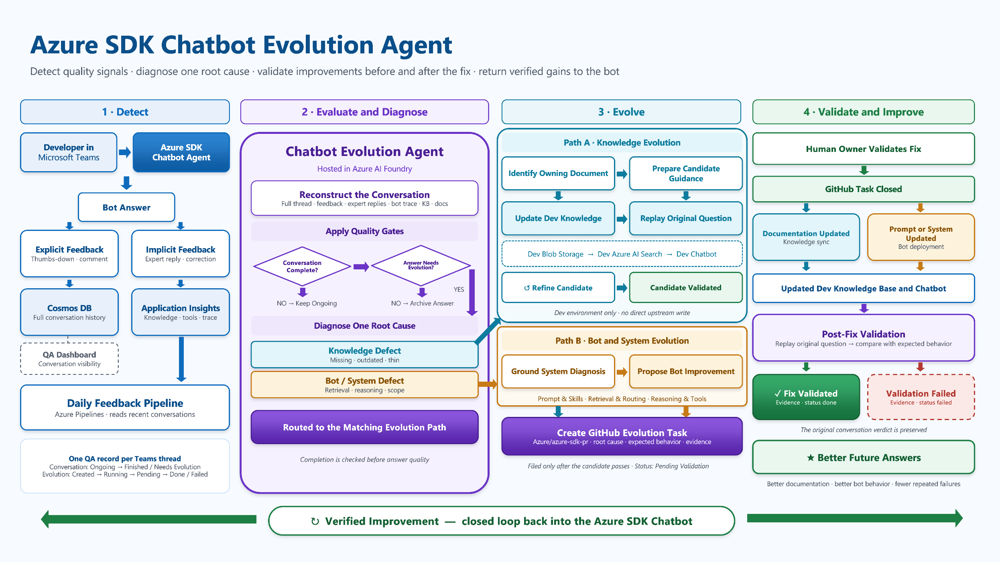

# Chatbot Evolution Agent Design

## 1 Background

When the chatbot's answer is wrong, today there is no systematic way to understand what the correct answer is, identify whether the underlying knowledge base (KB) is missing or stale, or close the gap so future similar queries are answered correctly. All follow-up is done manually by vendors investigating explicit thumbs-down feedback. The much more common implicit failure mode: an expert had to step in and answer — is never captured.

We are introducing a **Chatbot Evolution Agent** — a production-only hosted agent in the Foundry project. It automatically analyzes wrong production answers, classifies the root cause, and proposes a concrete fix. For knowledge-base (KB) issues, the agent loops through candidate generation and validation against isolated dev resources until the original bad case passes, then files an issue. For chatbot self-issues, the agent files an issue with its diagnosis and suggested fix without entering the validation loop. The daily job also revisits agent-created issues after they are closed and reruns the original bad case against the production Chat Agent to verify that the implemented fix reached production. Rather than firing in real time off an endpoint, the flow is driven by a **daily batch scan** (see §2.3): the Evolution Agent first decides whether each QA thread has concluded and whether its bot answer has a real problem; only confirmed failures continue into diagnosis and remediation. Two human signals in the thread inform that judgement and the agent's analysis:

| Signal | Source | Description |
| --- | --- | --- |
| **Explicit** | User feedback card (`reaction == bad`) | User clicked thumbs-down on a bot answer; captured in the thread and surfaced by `fetch_conversation`. |
| **Implicit** | Expert reply in the thread | A human expert (non-author, non-bot) replies in a thread the bot has already answered — a strong implicit "the bot didn't fully solve it." |

## 2 Design

### 2.1 Architecture



The architecture has five execution planes and three resource roles. Production configuration owns conversation ingestion, traces, QA records, issue state, and final validation. Dev configuration owns the temporary KB, search index, and dev Chat Agent used to test proposed remediations. The production Evolution Agent receives the dev App Configuration endpoint through `CANDIDATE_APPCONFIG_ENDPOINT` at deployment time.

- **Detection:** the daily feedback job ingests QA threads, and the Evolution Agent identifies concluded conversations with an incorrect or unconfirmed bot answer.
- **Evolution loop:** the Evolution Agent diagnoses the failure. For a KB issue, it writes a candidate to the dev knowledge source, validates the original bad case against the dev Chat Agent, and revises until the case passes or the attempt limit is reached.
- **Issue creation:** after KB validation passes, the same Evolution Agent creates or reuses an issue in the authoritative source's configured GitHub or ADO tracker, with `Azure/azure-sdk-pr` as the fallback. Normal GitHub issues are assigned to Copilot; GitHub wiki issues and ADO work items skip assignment. For chatbot self-issues, it creates or reuses the fallback GitHub issue immediately after diagnosis without candidate validation.
- **Restoration:** the feedback orchestrator queues the configured knowledge-sync pipeline at most once per run when an Evolution-agent session mutated the dev KB or a closed KB issue is ready for validation, then waits for authoritative content to be restored or promoted before continuing.
- **Closed-item validation:** for an agent-created GitHub issue or ADO work item whose QA record is `pending_validation`, the pipeline waits for the provider's closed state and the required production rollout, then the Evolution Agent reruns the original bad case against the production Chat Agent, comments the result through the matching provider, and persists the terminal Cosmos state. Presentation labels are updated only for `Azure/azure-sdk-pr`.

```text
ongoing QA record
    │
    ▼
Evolution agent completion/correctness gates
    │
    ├── ongoing → keep qa_status=ongoing
    ├── correct → qa_status=finished
    └── problem → qa_status=failed → diagnosis
    │
    ├── KB issue
    │     └── update_knowledge
    │           └── validate_agent_response(original bad case)
    │                 ├── fail → revise candidate and retry
    │                 └── pass → resolve source tracker → search/reuse or create
    │
    └── chatbot self-issue → search/reuse or create in Azure/azure-sdk-pr

normal GitHub issue → assign Copilot → feedback.status=pending_validation
GitHub wiki issue → skip Copilot → feedback.status=pending_validation
ADO Issue work item → feedback.status=pending_validation
closed agent-created item → validate original bad case in prod → comment evidence → persist validation result
```

### 2.2 Agent Design

The Chatbot Evolution Agent is built on the `agent_framework` library and deployed only to the production Foundry project. Its default App Configuration endpoint supplies production control-plane resources. `CANDIDATE_APPCONFIG_ENDPOINT` supplies an immutable dev configuration snapshot used to construct separate knowledge, search, storage, and Chat Agent clients. The deployment pipeline rejects attempts to deploy the Evolution Agent to a non-production environment.

| Component | Purpose |
| --- | --- |
| **Instruction** | System prompt that tells the agent how to act as a feedback analyst: what the root-cause categories are, how to back up findings with evidence, and how to propose a safely testable fix. |
| **Tools** | Analysis: `fetch_chat_trace`, `fetch_conversation`, `search_knowledge_base` (reused), `web_fetch` (reused), and `resolve_kb_source`. Validation: guarded `update_knowledge` and `validate_agent_response`, explicitly routed to `candidate` or `prod`. Issue lifecycle: GitHub MCP, ADO MCP, provider-neutral state polling, and the GitHub Copilot assignment tool. |

#### 2.2.1 Tools

| Tool | File | Type | Description |
| --- | --- | --- | --- |
| `fetch_chat_trace` | `tools/monitor_tools.py` (new) | `FunctionTool` | Fetches the Chat Agent's App Insights trace by `trace_id` and returns the trace details: ordered tool calls (name, args summary, results summary, duration), retrieved chunks, final answer, prompt. |
| `fetch_conversation` | `tools/conversation_tools.py` (new) | `FunctionTool` | Returns the full thread transcript for the conversation under analysis (Cosmos `conversation-messages`); each bot message includes its `trace_id`. |
| `search_knowledge_base` | `tools/knowledge_tools.py` | `FunctionTool` | Re-runs targeted KB searches to confirm what is/isn't indexed today. Reused unchanged from the Chat Agent. |
| `web_fetch` | `tools/web_tools.py` | `FunctionTool` | Fetches the source-of-truth doc URL to detect drift between KB content and upstream docs. Reused unchanged from the Chat Agent. |
| `resolve_kb_source` | `tools/knowledge_tools.py` (extend) | `FunctionTool` | Maps a chunk's `source` folder and optional exact `blob_path` to authoritative GitHub or ADO ownership plus the optional `issueTracker` configured in `knowledge-config.json`. The blob path disambiguates folders backed by different sources; missing-content cases may omit it when all configured paths share ownership. |
| `issue_write`, `search_issues`, `issue_read`, `add_issue_comment` | `tools/github_mcp_tools.py` | MCP Server | Creates, reuses, reads, and comments on GitHub issues in the configured source repository or the fallback repository. |
| `assign_issue_to_copilot` | `tools/github_mcp_tools.py` | `FunctionTool` | Assigns created or reused non-wiki GitHub issues to Copilot using a user-authorized token. GitHub wiki issues and ADO work items skip this step because Copilot cannot modify those source repositories. |
| `wit_create_work_item`, `wit_query_by_wiql`, `wit_get_work_item`, `wit_list_work_item_comments`, `wit_add_work_item_comment` | `tools/ado_mcp_tools.py` | MCP Server | Creates, reuses, reads, and comments on Azure Boards `Issue` work items in the configured ADO project. |
| `update_knowledge` | `tools/knowledge_tools.py` | `FunctionTool` | Writes candidate markdown to an existing tenant-configured folder in dev storage and refreshes the dev AI Search index. The injected clients prevent production KB mutation. |
| `validate_agent_response` | `tools/chatagent_tools.py` | `FunctionTool` | Sends the original bad case to the explicitly selected Chat Agent. `target="candidate"` routes to the dev Chat Agent during remediation analysis; `target="prod"` is used only for post-close final validation. |

#### 2.2.2 Issue classification

The agent classifies each case into exactly one root cause and acts accordingly:

| Classification | Description | Category | Issue destination |
| --- | --- | --- | --- |
| `missing_content` | No KB chunk covers the user's intent. | KB issue | Best maintained KB source's configured tracker; fallback when unavailable |
| `outdated_content` | KB guidance contradicts or has drifted from the current source of truth. | KB issue | Authoritative KB source's configured tracker; fallback when unavailable |
| `insufficient_content` | Related KB guidance exists but omits the rule, applicability, decision criteria, or cross-document connection needed for reasonable use. This includes facts that exist elsewhere but are not coherently connected to the owning workflow. | KB issue | Authoritative KB source's configured tracker; fallback when unavailable |
| `retrieval_mismatch` | A complete passage or explicit cross-reference chain exists but was not retrieved. Disconnected facts across documents are not sufficient. | System issue | `Azure/azure-sdk-pr` |
| `reasoning_gap` | Retrieved chunks explicitly state the correct rule and its applicability, but the bot reasoned poorly or ignored them. | System issue | `Azure/azure-sdk-pr` |
| `out_of_scope` | The intent is outside the tenant's scope. | System issue | `Azure/azure-sdk-pr` |

#### 2.2.3 Agent instruction

The Agent receives a small JSON payload identifying the QA thread and requested mode (serialized as a single user message). In analysis mode it first applies the completion and correctness gates, then runs the existing bounded validation loop for confirmed KB failures. For a KB classification it must prepare bounded candidate markdown and validation evidence for the issue. Chatbot self-issues skip the candidate-validation loop and are created directly. In validation mode the Agent reruns the original bad case after the stored issue closes. The Agent cannot perform arbitrary repository writes or write directly to production storage. Draft instruction:

```md
# Feedback Analyst Instructions

You are an Azure SDK QA feedback analyst. First decide whether the past
conversation is complete and whether the bot answer has a real problem.
For a confirmed failure, find the root cause and prepare a precise issue.
For a knowledge gap, validate the KB fix before creating the issue. After
the issue closes, validate the deployed fix against the original case.

## Input

A JSON payload with `mode`, `tenant_id`, `conversation_id`,
`conversation_type`, and `issue_url` (validation only).

## Workflow

1. **Reconstruct the thread.** Call
   `fetch_conversation(conversation_id, conversation_type)` first and use
   the full thread, including user feedback and expert replies.
2. **Apply the analysis gates.** Decide whether the conversation is
   complete, then whether the answer has a problem. Stop before diagnosis
   for `conversation_ongoing` or `no_issue`.
3. **Gather failure evidence.** For a confirmed problem, call
   `fetch_chat_trace(trace_id)` using the failed bot turn from the
   transcript.
4. **Reproduce the retrieval.** Call `search_knowledge_base` with the user's
   intent to confirm what is indexed today. If a chunk looks stale, call
   `web_fetch` on its source URL to check for drift.
5. **Classify** the case into exactly one root cause (see taxonomy below).
6. **Select the owning source.** Extract every document or documentation
  issue linked by the expert. Prefer the official document named there,
  then a mapped upstream source that owns the workflow. Resolve the source
  before mutation. Static mirrors and historical Q&A may provide evidence,
  but cannot replace an available official source as the fix target.
7. **Propose a fix.** For `missing_content`, `outdated_content`, and `insufficient_content`, provide candidate markdown plus source/path and tenant metadata. For system issues, describe the suggested bot change.
8. **Validate KB remediation.** For `missing_content`, `outdated_content`, and `insufficient_content`,
   call `update_knowledge` to write the candidate into the matching existing
  dev knowledge folder, then call `validate_agent_response` with
  `target="candidate"` and the original bad
   case. If it fails, revise the candidate and repeat within the attempt limit.
9. **Create the KB issue after validation.** When the original bad case passes, call `resolve_kb_source` for the authoritative source, search the configured tracker for the stable source/classification/scope marker, and create or reuse the item. Use GitHub issues for GitHub targets and ADO `Issue` work items for ADO targets. When no configured source tracker can accept the issue, fall back to `Azure/azure-sdk-pr`. Never create a KB issue before validation passes.
10. **Handle chatbot self-issues.** Record the diagnosis and suggested fix, then search, reuse, or create the fallback GitHub issue without entering the candidate-validation loop.
11. **Complete provider setup.** Assign non-wiki GitHub issues to Copilot before returning success. Do not assign GitHub wiki issues or ADO work items to Copilot.
12. **Validate a closed item.** In validation mode, read `issue_url` with the matching provider, refetch the persisted conversation using its input coordinates, replay the original bad case through `validate_agent_response` with `target="prod"`, comment the evidence, update Azure/azure-sdk-pr presentation labels only when applicable, and return the result.
13. **Return** the fixed-schema result.

## Classification

- `missing_content` — no KB chunk covers the intent (KB issue, cite source).
- `outdated_content` — KB contradicts the source URL (KB issue, cite source).
- `insufficient_content` — related KB content exists but is buried, fragmented, ambiguous, or not reasonably usable without missing context, an explicit workflow, or a cross-document connection. If making the owning document self-contained or adding a necessary cross-reference would prevent the failure, this classification applies even when another document contains the missing fact (KB issue, cite source).
- `retrieval_mismatch` — a complete, explicit, reasonably discoverable passage or cross-reference chain exists but wasn't retrieved. The diagnosis must cite that connected guidance; disconnected facts across documents instead indicate `insufficient_content`.
- `reasoning_gap` — the retrieved document already states the complete rule, applicability, and necessary connections coherently, but the bot reasoned poorly. No documentation change or cross-reference should be needed.
- `out_of_scope` — the intent is outside the tenant's scope.

## Output

Return only the fixed-schema JSON object containing `outcome`, `reasoning`,
`confidence`, `classification`, and `issue_url`.
Candidate content and validation evidence are recorded in the remediation
issue rather than duplicated in the status result.
Use `remediation_failed` after the completion and correctness gates have
confirmed a real answer problem but diagnosis, candidate validation, or issue
creation cannot finish. Persist its classification when the Agent established
one, even though no issue was created. Reserve `processing_failed` for failures
before those gates complete, or for validation-workflow failures.

## Rules

- Ground every claim in tool results — never invent KB state or URLs.
- Do not diagnose or mutate dev knowledge before the completion and
  correctness gates pass.
- When an expert corrected the bot, treat the expert's message as the
  correct answer. Extract any documentation gap they identify as the first
  KB hypothesis, inspect linked documentation issues, and use the official
  document they identify as the preferred fix target. Do not patch a static
  mirror merely because it makes one validation case pass.
- Redact PII (names, emails, tokens) from anything you write into an issue.
- Be concise; this output feeds a dataset and an issue, not a chat reply.
```

### 2.3 QA Status Table & Job Lifecycle

The feedback loop is driven by a **daily batch job** over a durable status table rather than by real-time endpoint triggers. Every QA thread the bot answered is recorded once in the `qa-records` Cosmos container (partition key `/tenant_id`, `id = {conversation_type}:{conversation_id}`), and each record carries **two status layers**:

| Layer | Field | States | Meaning |
| --- | --- | --- | --- |
| **1 — QA lifecycle** | `qa_status` | `ongoing` → `finished` \| `failed` | `ongoing` while the thread is still open; `finished` once it concluded with a **correct** bot answer (archived); `failed` once it concluded with an **incorrect/unknown** bot answer (worth a feedback analysis). |
| **2 — Feedback lifecycle** | `feedback.status` | `created` → `running` → `done` \| `pending_validation` → `validation_passed` \| `validation_failed`; operational errors → `failed` | Tracks Agent execution, issue remediation, and post-close validation. `done` and both validation outcomes are terminal; `failed` is retryable. |

#### Daily scan (`scripts/run_feedback_jobs.py`, `pipelines/feedback-job.yml`)

1. **Ingest** — read conversation messages active in the window, aggregate them by `conversation_id` into threads, and upsert one QA record per thread (new threads start `ongoing`). Threads in **testing channels** identified from their configured `channel.yaml` display names are excluded so the loop never files issues for test traffic.
2. **Analyze** — invoke the hosted Evolution Agent for every eligible `ongoing` record. The Agent first decides whether the thread has **finished**, then whether the bot answer has a real problem:
    - still ongoing → clear transient feedback state and stay `ongoing`;
    - finished + correct → `qa_status=finished`, `feedback.status=done`;
    - finished + problem → set `qa_status=failed`, run diagnosis and the KB candidate-validation loop when applicable, then create the remediation issue and set `feedback.status=pending_validation`.
    - finished + problem + remediation blocker → keep `qa_status=failed`, persist the Agent's failure reason, and set `feedback.status=failed`.
    - processing failure before a verdict → set `qa_status=failed` with an unknown verdict and `feedback.status=failed`; the Dashboard distinguishes this from an incorrect bot answer.
3. **Closed-item scan** — read `pending_validation` records and retryable `failed` records with an issue URL, dispatch to GitHub or ADO according to the stored canonical URL, and find items in the provider's closed state. Item state, not labels or tags, determines validation eligibility.
4. **Restore** — if any analysis session mutated the KB or a closed KB issue needs validation, queue the knowledge-sync pipeline once and wait for successful restoration.
5. **Validate fixes** — rerun each closed item's original bad case, comment the evidence through the matching provider, update presentation labels only for `Azure/azure-sdk-pr`, and persist terminal `feedback.status=validation_passed` or `feedback.status=validation_failed`. Operational failures persist retryable `feedback.status=failed`.

The whole feature is gated by `CHATBOT_EVOLUTION_AGENT_ENABLED` so it can be disabled without a code rollback.

#### 2.3.1 Feedback-session invocation

The production daily batch job (`scripts/run_feedback_jobs.py`) invokes `ChatbotEvolutionAgentService` synchronously in `analysis` or `validation` mode. Analysis starts with the completion and correctness gates. For a confirmed KB issue, the hosted Agent performs the existing bounded loop: it gathers evidence, proposes a candidate, writes it to the dev knowledge source, calls the dev Chat Agent, interprets the result, and revises the candidate when needed. The Agent creates or reuses a provider item only after the original bad case passes. Chatbot self-issues skip candidate validation and use the fallback GitHub repository after diagnosis. In validation mode, the same Agent calls the production Chat Agent to validate closed agent-created items without proposing another fix.

The Agent is invoked through the Responses API (`store=True`) with bounded analysis and iteration limits. Its fixed-schema result drives the production Cosmos status transition. The guarded tools own dev-storage writes, indexing, explicitly routed chatbot invocation, and evidence collection. No public issue is created for an unvalidated KB candidate. Records in `failed` are retried automatically: a record with an issue URL retries validation, while one without an issue URL retries analysis. Records in `done`, `validation_passed`, or `validation_failed` are terminal and are not retried.

The feedback orchestrator runs mutating sessions serially and validates each case immediately after its candidate update. Before `update_knowledge` writes anything, its wrapper sets a run-scoped `restore_required` Azure Pipelines output variable to `true`, ensuring that partial writes or later failures still trigger cleanup without adding fields to `QARecord`. After those sessions finish, the orchestrator queues `sync_knowledge.yml` once through the Azure DevOps Build REST API using `$(System.AccessToken)` when `restore_required` is `true` or a closed KB issue needs validation, waits for completion, and then validates the closed issues. The feedback job is not complete until required restoration and closed-issue validation finish.

#### QA record

Each row is a `QARecord` in the `qa-records` Cosmos container.

```typespec
@doc("Layer-1 lifecycle state of a QA thread")
union QAStatus {
  @doc("Thread still open / not yet conclusively judged")
  Ongoing: "ongoing",

  @doc("Thread concluded with a correct bot answer (archived)")
  Finished: "finished",

  @doc("Thread concluded with a wrong/unconfirmed answer (needs feedback)")
  Failed: "failed",
}

@doc("Layer-2 lifecycle state of the chatbot-evolution-agent analysis")
union FeedbackStatus {
  @doc("A feedback session has been requested/persisted")
  Created: "created",

  @doc("The hosted agent accepted and is processing")
  Running: "running",

  @doc("An issue was created; wait for it to close before validating")
  PendingValidation: "pending_validation",

  @doc("The agent finished and the result was persisted")
  Done: "done",

  @doc("Validation completed and confirmed the remediation")
  ValidationPassed: "validation_passed",

  @doc("Validation completed but rejected the remediation")
  ValidationFailed: "validation_failed",

  @doc("The agent errored, timed out, or was cancelled; retry next run")
  Failed: "failed",
}

@doc("Embedded Layer-2 feedback lifecycle")
model FeedbackState {
  status: FeedbackStatus;

  @doc("Failure context; absent while healthy")
  error?: string;

  issue_url?: string;
  copilot_assigned?: boolean;
  classification?: string;
  validation_reasoning?: string;
  validated_at?: utcDateTime;
  created_at?: utcDateTime;
  updated_at?: utcDateTime;
}

@doc("Two-layer status row for one QA thread, in the `qa-records` Cosmos container")
model QARecord {
  @doc("Deterministic thread key `{conversation_type}:{conversation_id}`")
  id: string;

  @doc("Tenant the thread belongs to (partition key)")
  tenant_id: string;

  conversation_id: string;
  conversation_type: ConversationType;

  @doc("Teams channel the thread belongs to (used to exclude testing channels)")
  channel_id?: string;

  @doc("Deep link back to the conversation thread")
  message_link?: string;

  // -- Layer 1 --
  qa_status: QAStatus;

  @doc("The Evolution Agent's verdict on the bot's answer")
  verdict?: string;
  reasoning?: string;
  confidence?: float32;
  has_expert_reply: boolean;
  message_count: int32;

  // -- Layer 2 --
  feedback?: FeedbackState;

  last_activity_at?: utcDateTime;
  first_seen_at: utcDateTime;
  evaluated_at?: utcDateTime;
  created_at: utcDateTime;
  updated_at: utcDateTime;
}
```

### 2.4 Conversation Evaluation

In the feedback loop, the Evolution Agent judges each `ongoing` thread and decides **two things, in order**: first whether the conversation is **finished** (vs. still ongoing), then whether the bot answer has a real problem. A thread with no explicit closing message is considered finished after 72 hours without activity only when no unanswered question, pending action, or participant waiting for a response remains; inactivity alone never closes an unresolved thread. The `finished` gate lets a thread stay `ongoing` across runs until it actually concludes, and the correctness gate prevents diagnosis or KB mutation for a successful answer.

The existing `conversation-eval` pipeline remains an independent reporting workflow and continues to use `prompts/conversation_evaluation.md` and `ConversationService.evaluate_conversation`. Its result does not drive the feedback lifecycle.

### 2.5 KB validation loop

Only KB classifications enter the automated validation loop. A knowledge-gap issue cannot be validated by rerunning the current production bot because the missing content is still absent. In the isolated dev environment, the Agent therefore writes candidate markdown into the existing tenant-configured knowledge folder, refreshes the dev index, and calls the dev Chat Agent.

The Evolution agent owns the loop through two guarded tools:

1. Call `update_knowledge` to write the candidate to the dev knowledge source and refresh the index.
2. Call `validate_agent_response` with `target="candidate"` and the original bad case.
3. If validation fails, revise the candidate and repeat within the attempt limit. If it passes, create the issue with the answer and trace ID as evidence.

After all agent sessions finish, fail, or time out, the feedback pipeline triggers the knowledge-sync pipeline once if any session mutated the KB. The feedback job waits for restoration from the authoritative sources and is marked failed if restoration does not succeed.

### 2.6 Issue creation

The Evolution Agent may prepare issue content during analysis, but it must complete the KB validation loop before creating an item. After `validate_agent_response(target="candidate")` shows that the original bad case passes, the Agent calls `resolve_kb_source` and routes the defect through the source's optional `issueTracker`: a GitHub issue for a GitHub target or an Azure Boards `Issue` work item for an ADO target. GitHub wiki sources configure their parent GitHub repository. Known non-writable sources omit `issueTracker`; missing configuration or a permanent provider capability/permission failure uses the existing `Azure/azure-sdk-pr` fallback. Timeouts, provider 5xx responses, and ambiguous create responses remain retryable failures rather than fallback triggers.

Before creation, the Agent searches the selected tracker for a stable HTML marker containing the source, classification, and scope. It reuses only an item representing the same defect and adds the new conversation and validation evidence as a comment. New and reused non-wiki GitHub issues must be assigned to Copilot before the Agent returns success: source-repository issues target that repository, while every fallback or system issue in `Azure/azure-sdk-pr` targets `Azure/azure-sdk-tools` on `main`. GitHub wiki issues and ADO work items are not assigned because Copilot cannot modify their source repositories.

Every Agent-created item includes concise expected behavior, detailed fixed-document provenance, and validation evidence. It does not duplicate the complete conversation or validated answer. The backend stores the canonical issue URL, conversation coordinates, GitHub Copilot assignment status, and `feedback.status=pending_validation` so the daily job can validate it after closure. Labels are presentation metadata written only in `Azure/azure-sdk-pr`; they never control routing, deduplication, scheduling, validation, persistence, retries, or dashboard reporting. For KB issues (`missing_content` / `outdated_content` / `insufficient_content`), the Agent cites the exact KB document or proposed missing-content location and authoritative source:

> **Title:** [Doc] No guidance on the TypeSpec `@added` versioning decorator
>
> **Marker:** `<!-- chatbot-evolution source="typespec_docs" classification="missing_content" scope="documentation/typespec/versioning.md" -->`
>
> **Fixed document:** `typespec_docs/documentation/typespec/versioning.md`
>
> **Upstream:** `Azure/azure-rest-api-specs-pr @ main: documentation/typespec/versioning.md`
>
> **Gap:** There is no documentation covering the `@added` decorator; the bot answered with a generic versioning explanation that did not address the question.
>
> **Suggested change:** Add a section to `versioning.md` documenting `@added`/`@removed`, with an example. Source: [TypeSpec versioning decorators](https://typespec.io/docs/libraries/versioning/reference/decorators)
>
> **Validation:** The dev Chat Agent passed the original bad case. Trace ID: `abc123def456`.

For `missing_content`, the Agent chooses the best maintained location using tenant scope, verified ownership, related evidence, expert corrections, and provenance even when no exact blob path exists. `resolve_kb_source` can resolve a folder without a blob path when every configured path shares the same source and tracker ownership. Unknown source folders, blob paths outside configured roots, and folders spanning different owners without a disambiguating path return `resolved=false`. Chatbot self-issues include the diagnosis and suggested fix but no candidate-validation evidence and use the fallback repository.

### 2.7 Closed-issue validation

The daily feedback job reads production `pending_validation` QA records and checks each stored GitHub issue or ADO work item through a provider-neutral state dispatcher; labels and tags do not gate validation eligibility. For a KB issue, it first waits for the configured knowledge-sync or rollout pipeline so the production Chat Agent uses authoritative fixed content rather than the temporary candidate. The Evolution Agent reads the item and all provider comments, identifies the latest maintainer disposition, refetches the production conversation, recovers the original question, and calls `validate_agent_response` with `target="prod"`.

The Agent comments the returned answer, trace ID, and pass/fail evidence through the matching provider. Only an item in `Azure/azure-sdk-pr` receives a presentation-only `fix-validation:passed`, `fix-validation:failed`, or `fix-validation:skipped` label; a rejected validation does not automatically reopen it. The backend persists terminal `feedback.status=validation_passed`, `feedback.status=validation_failed`, or `feedback.status=validation_skipped`. Operational failures use retryable `feedback.status=failed`, and the stored canonical URL routes the next daily run back to the correct provider. The historical `qa_status` remains `failed` because the original answer was wrong. The terminal Cosmos status, not a provider label or tag, prevents repeated validation.
