# Code Index and Search with CocoIndex — Design

## 1 Background

The QA bot currently grounds answers in documentation, generated wiki pages, web search, and GitHub tools. This works well for process and policy questions, but a significant portion of the questions contain source code, TypeSpec snippets, configuration files, stack traces, implementation questions, or references to exact repository files. GitHub Code Search helps with exact text on the current default branch, but it does not provide semantic retrieval over a controlled, reproducible repository snapshot.

We will add a separate code-retrieval path built directly on CocoIndex, using its incremental dataflow model, memoized transformations, filesystem connector, recursive code splitter, embedding operations, target reconciliation, and an Azure SDK-owned Azure AI Search target connector.

## 2 Goals

- Let every tenant explicitly declare its code repositories and index the deduplicated union at resolved commit SHAs.
- Use CocoIndex directly for code-aware chunking, embeddings, memoized incremental processing, and deletion reconciliation into Azure AI Search.
- Support multiple repositories while preserving Git remote URL, ref, commit, path, language, and line range in every result.
- Add first-class TypeSpec indexing through an Azure SDK-owned CocoIndex transformation backed by `@typespec/compiler`.
- Publish immutable, validated index generations so online queries never observe a partially updated repository.
- Expose a bounded `search_indexed_code` tool to the Chat Agent without colliding with the GitHub MCP `search_code` tool.
- Keep documentation retrieval and code retrieval on separate ranking tracks so implementation snippets do not displace authoritative policy guidance.
- Establish retrieval and end-to-end evaluation before expanding the repository or language set.

## 3 Initial scope

- Index the public repositories declared by tenant configuration.
- Resolve configured refs to immutable commits and publish commit-pinned citations.
- Index source, TypeSpec, configuration, test, sample, and selected generated files.
- Use Azure AI Search hybrid semantic and vector retrieval with tenant, repository, generation, language, and bounded path filtering.
- Use syntax-aware TypeSpec chunking and recursive language-aware chunking for other files.
- Refresh indexes incrementally through a scheduled pipeline and serve only validated immutable generations.

## 4 Design

### 4.1 CocoIndex indexing framework

The Azure SDK-owned indexing App will use these CocoIndex capabilities:

| Capability | CocoIndex implementation |
| --- | --- |
| File discovery | `localfs.walk_dir` with an Azure SDK-owned matcher for include/exclude patterns, `.gitignore`, binary filtering, and maximum file size |
| Language detection | `detect_code_language` plus tenant-configured extension overrides |
| Default chunking | `RecursiveSplitter` with an initial 1,000-byte target, 250-byte minimum, and 150-byte overlap |
| TypeSpec chunking | An Azure SDK-owned per-extension dispatcher returning CocoIndex `Chunk` values |
| Incremental indexing | Memoized per-file `@coco.fn(memo=True)` transformations and `mount_each` target reconciliation |
| Deletion | CocoIndex target reconciliation closes documents that are no longer part of the next repository generation |
| Embedding | A pinned Azure OpenAI embedding deployment used by the CocoIndex App and the Azure AI Search query vectorizer |
| Storage | An Azure SDK-owned CocoIndex target connector that synchronizes chunks into a dedicated Azure AI Search index |

The application owns the complete `CodeChunk` schema, including stable chunk identity, Git URL/ref identity, generation visibility, artifact classification, parser and symbol metadata, and future relationship fields.

The existing QA bot will add an in-process `CodeSearchClient` and expose it through a custom Function Tool named `search_indexed_code`. The client will read the tenant catalog, query the dedicated Azure AI Search code index with tenant and active-generation filters, fuse multiple query formulations, enforce result limits, attach commit metadata, and return immutable GitHub links.

### 4.2 Repository and ref isolation

Each Git URL/ref pair will use an independent CocoIndex App, state database, indexing lock, and monotonically increasing generation number. All code chunks are stored in one dedicated Azure AI Search index and isolated by filterable Git URL, ref, and generation fields.

The isolation key is `canonical Git remote URL + full Git ref`. Repository configuration uses a canonical HTTPS clone URL ending in `.git` and a full ref name such as `refs/heads/main` or `refs/tags/v1.0.0`. The Code Index Builder creates one CocoIndex `Environment` and `App` per pair, provides repository-specific source and state contexts, and maintains an independent indexing lock and sequence of immutable generations. Tenants that reference the same URL and ref share the App state and generation; different refs use separate App states even when they belong to the same Git repository.

| Isolation boundary | Implementation |
| --- | --- |
| Index state and deletion reconciliation | Use a Git URL/ref-specific CocoIndex state database and restore it for incremental updates |
| Search documents | Store all chunks in a dedicated Azure AI Search index with filterable `git_url`, `git_ref`, `valid_from_generation`, and `valid_to_generation` fields |
| Configuration | Build App arguments and context values from the aggregated tenant configuration and reject conflicting definitions |
| Index concurrency | Maintain a Git URL/ref lock and schedule or retry builds independently |
| Process and model resources | Apply bounded concurrency and run repository builds in isolated jobs where needed |
| Cross-repository search | Issue one filtered hybrid query to Azure AI Search for the tenant's allowed Git URL/ref generations |
| Repository identity and commit | Attach Git URL/ref/commit from the immutable generation manifest |
| Tenant scope | Enforce repository and path bindings through the published catalog and `CodeSearchClient` |

The `CodeSearchClient` enforces tenant scope by accepting Git URL/ref pairs, intersecting them with the tenant catalog, and constructing server-owned Azure AI Search filters. Tenant IDs are not copied into every chunk, so tenant-only configuration changes do not require reindexing.

All documents in the code index use the same embedding deployment, dimensions, vector profile, analyzers, and semantic configuration.

## 5 Architecture

```mermaid
flowchart LR
    subgraph BUILD["Offline code-index build"]
        cfg["Tenant configs<br/>code_repositories"]
        plan["Aggregate and validate<br/>repository build plan"]
        resolve["Resolve ref tip<br/>git ls-remote"]
        restore["Restore prior shallow Git workspace<br/>+ cocoindex.db"]
        fetch["Fetch missing tip objects<br/>depth 1 + incremental checkout"]
        index["Azure Code Index App<br/>CocoIndex + TypeSpec chunker"]
        target["Custom Azure AI Search target<br/>stage upserts + closes"]
        validate["Validate prospective generation<br/>counts, queries, and errors"]
        state[("Blob state + manifest<br/>active tenant catalog")]
        searchIndex[("Azure AI Search<br/>code index")]
        cfg --> plan --> resolve --> restore --> fetch --> index --> target --> validate --> state
        target --> searchIndex
    end

    subgraph AGENT["QA bot"]
        catalog["Tenant catalog<br/>active generations"]
        client["CodeSearchClient<br/>filter + search + fusion"]
        tool["search_indexed_code"]
        answer["Grounded answer<br/>commit-pinned citations"]
        state --> catalog --> client
        searchIndex --> client
        tool --> client --> answer
    end

    schedule["Scheduled Azure Pipeline"] --> plan
```



### 5.1 Components

| Component | Responsibility |
| --- | --- |
| **Tenant configuration** | Each `TenantConfig` explicitly declares its code repositories and tenant-visible path scopes. This is the source of truth for both indexing and online repository selection. |
| **Build-plan aggregator** | Loads every tenant configuration, deduplicates Git URL/ref pairs, validates shared index settings, unions requested file scopes, and emits the incremental build plan plus tenant-to-repository catalog. |
| **Code Index Builder** | Resolves the configured ref, restores the previous successful generation's shallow Git workspace and CocoIndex state, fetches only objects required by the new tip, updates the stable checkout, runs `App.update()`, validates the prospective generation, and publishes it. |
| **Azure AI Search target** | Implements CocoIndex `TargetHandler` reconciliation and an asynchronous batched action sink for document upserts and generation closes. |
| **State and catalog store** | Stores immutable per-repository shallow Git workspace caches, `cocoindex.db` snapshots, resolved repository configuration, generation manifests, and the aggregated tenant catalog that pins the active generation for every repository. |
| **Azure AI Search code index** | Stores all repository chunks in a dedicated index with vector, searchable text, filterable metadata, and generation visibility fields. |
| **CodeSearchClient** | Runs inside the QA bot, resolves tenant-visible repositories from the catalog, builds server-owned filters, executes hybrid semantic/vector search, fuses query formulations, applies diversity and content limits, and generates links. |
| **Chat Agent tool** | Selects repositories and query formulations, calls `CodeSearchClient`, and returns code evidence separately from documentation evidence. |
| **Evaluation pipeline** | Measures retrieval, citation, answer quality, freshness, latency, and cost against the code-oriented dataset. |

## 6 Repository and generation model

Each configured Git URL/ref pair is one logical index App:

```text
git_url: https://github.com/Azure/typespec-azure.git
git_ref: refs/heads/main
resolved_commit_sha: <40-character SHA>
```

The App key is the canonical `git_url` plus `git_ref`. If two tenants configure the same pair, they share one index generation. Different refs use separate App state because they resolve to different source snapshots. A deterministic hash of the pair may be used internally for filesystem and Blob paths, but it is not a separately configured repository identity.

Every successful build publishes a manifest:

```json
{
  "schema_version": 1,
  "git_url": "https://github.com/Azure/typespec-azure.git",
  "git_ref": "refs/heads/main",
  "previous_commit_sha": "<previous-active-commit>",
  "resolved_commit_sha": "<commit>",
  "tree_sha": "<tree>",
  "generation": 42,
  "indexed_at": "<UTC timestamp>",
  "cocoindex_version": "<resolved version>",
  "code_index_schema_version": 1,
  "search_index_alias": "azure-sdk-code",
  "search_index_name": "azure-sdk-code-v1",
  "embedding_provider": "azure-openai",
  "embedding_model": "<deployment>",
  "embedding_dimensions": "<resolved dimensions>",
  "chunker_version": "<version>",
  "files": 0,
  "chunks": 0,
  "languages": {},
  "parser_failures": [],
  "documents_added": 0,
  "documents_updated": 0,
  "documents_closed": 0,
  "git_cache_sha256": "<sha256>",
  "state_database_sha256": "<sha256>"
}
```

The manifest and active catalog, not a mutable branch name or a document's introduction generation, are the authority for result citations. `CodeSearchClient` attaches the active catalog's commit to every returned chunk.

Each search document has a generation visibility interval:

```text
valid_from_generation <= active_generation
and
(valid_to_generation == 0 or valid_to_generation > active_generation)
```

`valid_to_generation == 0` means the document remains visible indefinitely. While building generation `N + 1`, new and changed chunks are inserted with `valid_from_generation = N + 1`; replaced and removed chunks are updated to `valid_to_generation = N + 1`. Queries pinned to active generation `N` continue seeing the previous complete repository. After validation, publishing the catalog entry for generation `N + 1` switches the repository atomically without rewriting unchanged chunks.

The scheduled task also publishes a catalog that maps each tenant to its configured Git URL/ref pairs and path scopes, and each App to its active generation:

```json
{
  "schema_version": 1,
  "tenants": {
    "typespec_channel_qa_bot": [
      {
        "git_url": "https://github.com/Azure/typespec-azure.git",
        "git_ref": "refs/heads/main",
        "path_prefixes": ["packages"]
      }
    ]
  },
  "repositories": [
    {
      "git_url": "https://github.com/Azure/typespec-azure.git",
      "git_ref": "refs/heads/main",
      "active_generation": "<generation>",
      "resolved_commit_sha": "<commit>",
      "indexed_at": "<UTC timestamp>",
      "manifest_uri": "<blob URI>"
    }
  ]
}
```

The catalog is generated from tenant configuration rather than maintained manually. `CodeSearchClient` follows the exact generation IDs pinned by the catalog instead of independently following per-repository mutable pointers. A tenant-only mapping change can publish a new catalog without rebuilding an unchanged repository index.

## 7 Index build

### 7.1 Stable shallow Git checkout

CocoIndex component identity can be invalidated when the source mount moves. Each repository build therefore mounts its checkout at the same in-container path, such as `/workspace/repository`, and restores both the shallow Git workspace and `cocoindex.db` from the last successfully published generation.

The builder first resolves `git_ref` with `git ls-remote`. If the resolved SHA and effective index identity are unchanged, no checkout or CocoIndex update is required. Otherwise, the builder restores the previous successful workspace into staging, verifies its origin URL and baseline commit, and performs an explicit-ref fetch equivalent to:

```text
git fetch --no-tags --depth=1 origin <git_ref>
git checkout --detach --force <resolved_commit_sha>
```

The existing Git object store participates in fetch negotiation, so Git downloads only missing objects required by the new ref tip instead of cloning full history. Updating the existing worktree from the previous commit also avoids rematerializing unchanged files. The build does not fetch unrelated branches, tags, submodules, or commit history.

The previous successful workspace remains immutable while the prospective generation runs. After catalog promotion, the staged shallow workspace becomes the baseline cache for the new active generation. If the cache is missing, invalid, or incompatible with the configured URL/ref, the builder initializes a new repository and fetches only the resolved ref at depth one; it never falls back to a full-history clone. A force-push or non-fast-forward ref update uses the same depth-one fetch and relies on CocoIndex reconciliation rather than Git ancestry.

### 7.2 Build sequence

1. Load every `TenantConfig` and flatten its `code_repositories` entries.
2. Validate and group entries by canonical `git_url` and full `git_ref`.
3. Validate that duplicate entries agree on exclusions, language overrides, chunkers, file-size limits, and other index-level settings. A conflict fails configuration validation instead of selecting one definition silently.
4. Union the tenant-requested include/path scopes for each Git URL/ref App and retain the original per-tenant scopes for online query enforcement.
5. Resolve each configured Git ref to an immutable commit SHA with `git ls-remote` and calculate the effective index identity.
6. Reuse the active generation when the resolved commit and effective index identity are unchanged.
7. When the commit or aggregate file scope changes, reserve `active_generation + 1` and restore the previous successful generation's shallow Git workspace and CocoIndex state into staging.
8. Verify that the restored Git workspace matches `git_url`, `git_ref`, and the catalog-pinned previous commit; initialize a new depth-one workspace when no valid cache exists.
9. Fetch only the configured ref at depth one and update the stable worktree from the previous commit to the resolved commit.
10. Construct the repository-specific `RepositoryIndexConfig`, CocoIndex `ContextProvider`, `Environment`, `App`, and Azure AI Search target from the aggregated configuration and reserved generation. Expanding a tenant scope adds chunks; contracting the last tenant scope that needs a path closes its chunks in the new generation.
11. Invoke the Azure SDK-owned builder command, which runs the pinned CocoIndex `App.update()` with a fixed image, package lock, embedding model, and network policy.
12. Let the target sink batch deterministic document upserts and generation-close updates into Azure AI Search. Inspect every per-document result and retry only transient failures.
13. Poll Azure AI Search until the prospective generation is queryable, then run count, metadata, citation, and representative hybrid-search validation using the prospective generation filter.
14. Fail the build if CocoIndex reports processing errors, required parsers fail above the configured threshold, any indexing action remains unsuccessful, or validation queries fail.
15. Record file/chunk/language counts, Git fetch and checkout metrics, versions, parser failures, target action counts, state checksum, previous commit, and resolved commit in the generation manifest.
16. Upload the immutable shallow Git workspace cache, `cocoindex.db` snapshot, and manifest without changing the currently published catalog.
17. Publish the aggregated tenant-to-repository catalog last using an ETag-protected compare-and-swap.

If a build fails, the published tenant catalog remains unchanged and online search continues using the previous complete generations. Documents staged for the unpublished generation remain invisible and are eligible for cleanup. Retrying the same generation is safe because document IDs and close operations are deterministic. A full rebuild first closes every currently visible document for the Git URL/ref pair at the reserved generation, then materializes the complete checkout from a fresh CocoIndex state database. A repository removed from every tenant is removed from the next catalog and its documents and state are retained only for the configured rollback period.

### 7.3 Generation cleanup

A separate daily garbage-collection job runs after catalog publication and never blocks a build. For each Git URL/ref pair, it retains the active generation, the two most recent earlier published generations, and every generation less than seven days old. If `rollback_floor` is the oldest retained generation, a historical document is safe to delete when:

```text
valid_to_generation != 0
and valid_to_generation <= rollback_floor
```

An unpublished generation remains available for deterministic retry for 24 hours after its builder lease expires. If it is then abandoned, cleanup deletes documents introduced by that generation, reopens older documents closed by it, and removes its staged Git workspace and CocoIndex state. Git workspace caches and CocoIndex state snapshots follow the same rollback floor; manifests are retained for 90 days. A Git URL/ref pair removed from every tenant and a physical index replaced through an alias switch are deleted after seven days.

### 7.4 Initial repositories

| Repository | Initial scope |
| --- | --- |
| `Azure/typespec-azure` | TypeSpec libraries, HTTP specs, samples, implementation, and relevant tests |
| `microsoft/typespec` | Compiler, HTTP/REST libraries, HTTP specs, samples, and relevant tests |
| `Azure/azure-rest-api-specs` | `.tsp`, `tspconfig.yaml`, suppressions/configuration, and an allowlist of evaluation-relevant OpenAPI files |
| `Azure/azure-sdk-for-python` | Core infrastructure and packages, tests, and samples represented in the evaluation dataset |

Forks and temporary PR repositories are not persistent index sources. Pull-request and arbitrary-ref content remains the responsibility of GitHub tools.

These repositories are introduced through the relevant `TenantConfig.code_repositories` entries. The scheduled pipeline has no separate static repository list.

### 7.5 File policy

The builder will generate repository-specific include and exclude patterns instead of accepting patterns from Agent input. Common exclusions include VCS metadata, dependency directories, build output, binary files, caches, recordings, coverage output, minified assets, lock files that provide no answer value, and oversized generated artifacts.

Generated code is not excluded unconditionally because the evaluation dataset contains valid questions whose authoritative implementation is generated. Repository-specific configuration will include generated directories only where they provide useful API or behavior evidence.

## 8 TypeSpec chunking

The CocoIndex default language detection and recursive splitter do not currently provide TypeSpec-aware declaration boundaries. The aggregated repository configuration will include `.tsp`, override its language to `typespec`, and route the file through an Azure SDK-owned chunker:

```python
RepositoryIndexConfig(
    include_patterns=("**/*.tsp",),
    language_overrides={".tsp": "typespec"},
    chunkers={".tsp": typespec_chunker},
)
```

The Python chunker will use a bounded pool of long-lived Node workers running a pinned `@typespec/compiler`; it will not start a Node process for every file. Each request parses one file and returns CocoIndex `Chunk` records at namespace, model, enum, union, scalar, interface, operation, alias, decorator declaration, and top-level statement boundaries. Oversized declarations will be split at member or block boundaries while preserving the declaration header and exact line range.

The first phase will produce syntax-aware TypeSpec chunks with declaration names, kinds, content, and exact line ranges. Parser failures will be surfaced in the generation manifest and logs; a configured fallback splitter may preserve search coverage, but the fallback must never be silent.

## 9 Azure AI Search target and schema

The code corpus will use a dedicated Azure AI Search index rather than the documentation/Wiki index. The code index has independent schema, analyzers, semantic configuration, vector profile, scaling, retention, and deployment lifecycle.

The Azure SDK-owned CocoIndex App will declare target documents equivalent to:

```python
@dataclass(frozen=True)
class CodeSearchDocument:
    chunk_id: str
    git_url: str
    git_ref: str
    valid_from_generation: int
    valid_to_generation: int
    path: str
    path_prefixes: list[str]
    language: str
    artifact_type: str
    content: str
    content_vector: list[float]
    content_hash: str
    start_line: int
    end_line: int
    symbol_name: str | None
    symbol_kind: str | None
    identifiers: list[str]
    parser: str
```

`chunk_id` is the Azure AI Search document key and is deterministically derived from the Git URL/ref pair, logical chunk identity, content fingerprint, and `valid_from_generation`. Including the generation prevents a removed and later reintroduced chunk from overwriting retained history. `valid_to_generation == 0` represents an open visibility interval.

The index will configure:

| Field group | Azure AI Search behavior |
| --- | --- |
| `content` | Searchable and used as the semantic content field |
| `content_vector` | Vector-searchable with HNSW cosine similarity |
| `path`, `symbol_name`, `symbol_kind`, `identifiers` | Searchable; symbol and identifier fields contribute semantic keywords |
| `git_url`, `git_ref`, `language`, `artifact_type`, `parser` | Filterable and facetable where useful |
| `valid_from_generation`, `valid_to_generation`, `start_line`, `end_line` | Filterable and retrievable |
| `path_prefixes` | Filterable collection used for server-side tenant path scoping |

The vector profile will use the configured Azure OpenAI embedding deployment and exact dimensions recorded in the index schema and generation manifest. The CocoIndex App generates index-time embeddings with the same deployment; `CodeSearchClient` uses the Azure AI Search vectorizer through `VectorizableTextQuery`.

### 9.1 Custom target connector

The connector will register a root target-state provider for code chunks. Its tracking record contains the target fingerprint and currently visible Azure AI Search document ID. Reconciliation is non-blocking and emits one of these idempotent actions:

| Desired change | Target action |
| --- | --- |
| New chunk | Upsert a new document with `valid_from_generation = next_generation` and `valid_to_generation = 0` |
| Changed chunk | Close the previous document at `next_generation`, then upsert the new version |
| Removed chunk | Close the previous document at `next_generation` |
| Unchanged chunk | Emit no action |

The asynchronous action sink will use `merge_or_upload_documents` for new versions and `merge_documents` for visibility closes. It will batch within Azure AI Search document-count and payload-size limits, inspect every indexing result, and fail the CocoIndex update when any permanent document failure occurs. Deterministic IDs and generation values make retries safe after partial or interrupted requests. Physical `delete_documents` calls are reserved for retention garbage collection after a generation is no longer eligible for rollback.

The following values form the index identity and require a full rebuild when changed:

- Embedding provider, model, revision, dimensions, normalization, and indexing/query parameters.
- CocoIndex version and the Azure SDK-owned App/schema version.
- Built-in splitter sizes and overlap.
- Custom chunker source/version.
- Include/exclude patterns and maximum file size.
- Azure AI Search schema, analyzers, semantic configuration, vectorizer, and vector profile.

The deployment pipeline provisions the index and validates schema compatibility before builders run. The custom target writes documents but does not mutate index schema during a repository build.

## 10 Multi-repository search

### 10.1 Search sequence

1. Resolve the trusted caller-provided tenant context and load its repository/path bindings from the published catalog.
2. Resolve omitted Git URL/ref pairs from that tenant's configured code sources, or intersect explicit repository and path requests with the tenant bindings.
3. Build a server-owned OData filter containing each allowed `git_url` and `git_ref`, its catalog-pinned active generation interval, tenant path prefixes, and optional language or artifact filters.
4. Run one Azure AI Search hybrid semantic/vector query for each query formulation, with bounded concurrency and a wider candidate set than the final tool budget.
5. Fuse query-formulation rankings with reciprocal rank fusion and deduplicate overlapping spans.
6. Apply diversity limits by repository and file.
7. Cap and truncate content to the Agent tool budget.
8. Attach Git URL, ref, commit, path, exact lines, index timestamp, and an immutable GitHub permalink.

The generation clause for one Git URL/ref pair is:

```text
git_url eq '<canonical HTTPS clone URL>'
and git_ref eq '<full Git ref>'
and valid_from_generation le <active>
and (valid_to_generation eq 0 or valid_to_generation gt <active>)
```

Clauses for the tenant's selected repositories are OR-combined and then AND-combined with language, artifact, and path restrictions. `CodeSearchClient` escapes every filter value and never accepts a raw OData expression from Agent input.

### 10.2 Filtering

Git URL/ref, generation, language, artifact type, and normalized path-prefix filters execute inside Azure AI Search. Tenant path prefixes are normalized and matched against the indexed `path_prefixes` collection; unsupported arbitrary glob expressions are rejected rather than evaluated as raw search filters.

### 10.3 Result identity

The stable result identity is:

```text
git_url + resolved_commit_sha + file_path + start_line + end_line + content_hash
```

`CodeSearchClient` generates links deterministically by deriving the GitHub owner and repository name from `git_url`:

```text
https://github.com/{owner}/{repo}/blob/{commit_sha}/{path}#L{start_line}-L{end_line}
```

## 11 QA bot integration

### 11.1 CodeSearchClient

The QA bot will add a typed client that owns catalog loading, filter construction, Azure AI Search calls, result fusion, citation generation, timeouts, and output limits:

```python
class CodeSearchClient:
    async def search(
        self,
        *,
        tenant_id: TenantID,
        queries: list[str],
        repositories: list[GitRepositoryRef] | None = None,
        languages: list[str] | None = None,
        path_prefixes: list[str] | None = None,
        top_k: int | None = None,
    ) -> SearchIndexedCodeResult:
        ...
```

`CodeSearchClient` enforces one to three queries, intersects requested repositories and path prefixes with the tenant catalog, bounds candidate and final result counts, caps content size, propagates cancellation, and reports unavailable repositories explicitly.

### 11.2 Chat Agent tool

The Function Tool is named `search_indexed_code` to avoid collision with GitHub MCP's `search_code`:

```python
search_indexed_code(
    queries: list[str],
    repositories: list[GitRepositoryRef] | None = None,
    languages: list[str] | None = None,
    path_prefixes: list[str] | None = None,
) -> SearchIndexedCodeResult
```

The tool is read-only and cannot refresh indexes. It returns structured code references rather than raw service diagnostics.

The active request's `tenant_id` is injected by the Agent integration and is not a model-selectable tool argument. The tool passes it directly to `CodeSearchClient` before any repository or path filters are resolved.

### 11.3 Routing

| Question | Primary retrieval |
| --- | --- |
| Policy, process, required pattern, or official guidance | `search_knowledge_base` and `wiki_search` |
| Implementation concept without an exact symbol | `search_indexed_code` |
| Exact identifier, error string, file path, current GitHub state, PR, or arbitrary ref | GitHub MCP `search_code` / `get_file_contents` |
| Question containing both normative and implementation aspects | Documentation and indexed-code retrieval in parallel |

Code search is not run for every domain question. Documentation remains authoritative for policy and prescribed behavior; indexed source describes the implementation at the cited commit.

## 12 Configuration and tenant scope

`TenantConfig` is the only source of repository demand. Every tenant definition explicitly sets `code_repositories`; tenants without indexed code use an empty list. The scheduled indexing command imports the same tenant configuration, aggregates all entries, and emits the repository build plan and tenant catalog. There is no independent scheduler allowlist that can drift from Agent routing.

Example:

```python
@dataclass(frozen=True)
class GitRepositoryRef:
    git_url: str
    git_ref: str


@dataclass(frozen=True)
class CodeRepositoryConfig:
    git_url: str
    git_ref: str
    path_prefixes: tuple[str, ...]
    include_patterns: tuple[str, ...]
    exclude: tuple[str, ...] = ()
    language_overrides: tuple[LanguageOverride, ...] = ()
    chunkers: tuple[ChunkerConfig, ...] = ()


@dataclass(frozen=True)
class TenantConfig:
    # Existing tenant fields omitted.
    code_repositories: list[CodeRepositoryConfig] = field(default_factory=list)


_TENANT_CONFIG_MAP = {
    TenantID.TYPESPEC_CHANNEL_QA_BOT: TenantConfig(
        # Existing tenant settings omitted.
        code_repositories=[
            CodeRepositoryConfig(
                git_url="https://github.com/Azure/typespec-azure.git",
                git_ref="refs/heads/main",
                path_prefixes=("packages",),
                include_patterns=("packages/**/*.tsp", "packages/**/*.ts"),
                exclude=("**/node_modules/**", "**/dist/**"),
                language_overrides=(LanguageOverride(extension="tsp", language="typespec"),),
                chunkers=(ChunkerConfig(extension="tsp", name="typespec"),),
            ),
        ],
    ),
}
```

Only Git URL/ref pairs referenced by at least one tenant are indexed. Duplicate pairs must have compatible index-level settings; tenant-specific `include_patterns` are unioned for indexing and `path_prefixes` are preserved separately for search filtering.

Tenant scoping is topic selection, not a content-security boundary, for the initial public-repository corpus. It still prevents irrelevant repositories and paths from entering a tenant's retrieval context.

## 13 Evaluation

Evaluation uses the existing `qa-bot-perf-<scenario>:latest` datasets and their latest accepted baseline results. Every perf scenario is included: `typespec`, `onboarding`, `python`, `apispec`, `general`, `releasesupport`, and `authoring`. TypeSpec is the primary analysis slice, but code search must be evaluated against every scenario because repository retrieval and Agent routing can affect all categories.

### 13.1 Case selection

Within each perf scenario, existing failed cases form the improvement set and existing passing cases form the regression set. Each failed case is classified before rerunning:

- **Code-retrieval applicable:** The answer depends on compiler, SDK, library, tool, test, sample, or implementation behavior that can be grounded in indexed source.
- **Documentation-only:** The case asks about policy, process, approval, migration procedure, or prescribed guidance and should continue using documentation retrieval.
- **Combined:** The case needs both normative documentation and implementation evidence.
- **Evaluation issue:** The failure is caused by stale expected references, grader instability, missing ground truth, or infrastructure rather than retrieval behavior.

All scenarios use the same classification and case-level comparison. TypeSpec receives additional review because its code-retrieval-applicable cases can depend on compiler behavior, decorators, Azure libraries, templates, emitters, HTTP specs, and tests spread across multiple repositories.

For code-retrieval-applicable and combined cases, evaluation annotations identify acceptable Git URLs, files, symbols where known, and line ranges. TypeSpec cases are annotated first and at greater coverage. The original perf question, expected answer, expected documentation references, and graders remain unchanged so results are comparable with the existing baseline.

### 13.2 Comparison

Every perf scenario is run with the same model, tenant mapping, and grader configuration against:

1. The current QA bot without indexed code.
2. The QA bot with `search_indexed_code` enabled.
3. For TypeSpec only, the indexed-code path using fallback splitting instead of the TypeSpec chunker.

Results are reported by scenario and by case with fail-to-pass, pass-to-fail, unchanged-fail, and unchanged-pass counts for every grader. TypeSpec additionally reports retrieval success by repository and file, code-tool routing decisions, and the difference between the TypeSpec chunker and fallback splitting. Aggregate scores remain secondary because they can hide regressions in individual cases or categories.

### 13.3 Success criteria

- Every perf scenario is evaluated and reported separately; improvements in TypeSpec cannot hide regressions in another category.
- Across all scenarios, code-retrieval-applicable cases show a positive net fail-to-pass result without unexplained pass-to-fail regressions.
- TypeSpec code-retrieval-applicable cases show a measurable fail-to-pass improvement and no regression in existing passing cases.
- Documentation-only cases do not invoke code search unless the question also requires implementation evidence.
- Improved code-retrieval-applicable cases retrieve an acceptable repository and relevant file within the top ten candidates.
- The final answer uses the retrieved implementation correctly rather than only returning a matching code fragment.
- Every code citation resolves to the exact content and line range at the catalog-pinned commit.
- Cases classified as evaluation issues are reported separately and are not counted as code-search failures or improvements.
