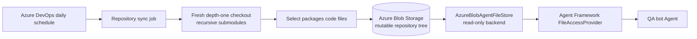

# Direct Repository File Search — Design

## 1. Decision

The QA bot will search source code through Agent Framework's built-in read-only file-access tools instead of a custom code-search tool or a semantic index. Repository files will be stored as individual Azure Block Blobs under stable paths and refreshed in place every day by an Azure DevOps pipeline.

The hosted Agent will not clone repositories, download a repository archive, or mount Blob Storage as an operating-system filesystem. A read-only `AgentFileStore` implementation will map the built-in `file_access_grep`, `file_access_read`, and `file_access_ls` operations directly to Azure Blob Storage.

This preserves the current Foundry Hosted Agent deployment. Foundry session filesystems are isolated per session and its hosted-container configuration does not support mounting an external Azure Files or Blob volume.

## 2. Goals

- Keep the repository source in Azure and update it once every day.
- Resolve and checkout only the latest commit of each configured ref; retain no Git history or prior source snapshots.
- Initialize recursive Git submodules at the exact commits recorded by the parent repository.
- Store only code files under `packages` in `Azure/typespec-azure` and `microsoft/typespec`, plus package code from initialized submodules.
- Let the Agent read the current blobs directly through Agent Framework's built-in file-access tools.
- Keep the Agent's access read-only and bounded without exposing arbitrary shell execution.
- Preserve repository, commit, submodule, path, and update metadata for diagnostics and source links.

## 3. Non-goals

- Semantic or vector search.
- Code chunking, embeddings, reranking, or an Azure AI Search code index.
- Historical snapshots, rollback generations, or incremental Git history.
- Cloning or fetching repositories inside an Agent session.
- Mounting Block Blob through BlobFuse.

## 4. Architecture



The Azure DevOps job and Agent use separate identities:

- The sync job receives `Storage Blob Data Contributor` permission.
- The hosted Agent identity receives `Storage Blob Data Reader` permission.

## 5. Storage layout

One container stores the current source tree:

```text
code-repositories/
  Azure/typespec-azure/packages/...
  Azure/typespec-azure/core/packages/...
  microsoft/typespec/packages/...
  manifest.json
```

`Azure/typespec-azure/core` is the `microsoft/typespec` submodule at the exact gitlink commit selected by the current `typespec-azure` commit. It remains distinct from `microsoft/typespec`, which follows its independently configured ref.

`manifest.json` is overwritten after source synchronization finishes:

```json
{
  "schema_version": 1,
  "updated_at": "2026-09-11T03:00:00Z",
  "files": [
    "Azure/typespec-azure/packages/azure-core/main.tsp"
  ],
  "repositories": [
    {
      "name": "Azure/typespec-azure",
      "git_url": "https://github.com/Azure/typespec-azure.git",
      "git_ref": "refs/heads/main",
      "commit_sha": "<sha>",
      "submodules": [
        {
          "path": "core",
          "git_url": "https://github.com/microsoft/typespec.git",
          "commit_sha": "<gitlink-sha>"
        }
      ]
    }
  ]
}
```

There is no generation identifier and no retained source history. Repository paths are stable and each source blob is overwritten when its content changes.

## 6. Daily synchronization

The pipeline follows the authentication and scheduling structure used by `azure-sdk-qa-bot-wiki-index/build_wiki.yml`:

- No CI or PR trigger.
- One UTC daily schedule on `main`.
- A 1ES Linux pool.
- `AzureCLI@2` with workload identity federation.
- Configuration loaded from `AZURE_APPCONFIG_ENDPOINT`.
- `DefaultAzureCredential` for Blob Storage.

For every deduplicated repository configuration, the job creates a new temporary directory and performs:

```text
git init
git remote add origin <configured-url>
git fetch --force --no-tags --depth=1 origin <configured-ref>
git checkout --detach --force <resolved-commit>
git submodule sync --recursive
git submodule update --init --recursive --depth=1 --recommend-shallow
```

The job validates that:

- The checked-out commit is the latest commit currently resolved by the configured ref.
- Every submodule is initialized and matches the gitlink commit.
- Submodule URLs use an allowed HTTPS GitHub repository URL.
- Selected paths are regular UTF-8 text files beneath an allowed `packages` directory.
- No file exceeds the configured maximum size.

The job then:

1. Uploads every selected file to its stable blob path with overwrite enabled.
2. Deletes blobs listed by the previous manifest that are absent from the new checkout.
3. Writes `manifest.json` last.

The Agent can observe intermediate content while synchronization is running. This is an accepted tradeoff because requests are infrequent and the source is refreshed only once per day. If synchronization fails, the pipeline fails visibly and does not write the new manifest.

## 7. Agent integration

The Agent Framework core dependency will be updated to `1.17.0`, the newest version currently available from the Azure SDK Python feed and the first available version in this environment that includes `FileAccessProvider` and `AgentFileStore`. The implementation will supply a read-only Azure Blob-backed `AgentFileStore` and register `FileAccessProvider` as a context provider:

```python
FileAccessProvider(
    AzureBlobAgentFileStore(...),
    disable_write_tools=True,
    disable_readonly_tool_approval=True,
)
```

This uses the framework-provided tool schemas and behavior. The Azure SDK implementation is a storage adapter, not a new Agent tool.

The store will:

- Normalize every path and reject absolute paths, `.`/`..` segments, and backslashes.
- Read `manifest.json` to enumerate the current file tree.
- Read file content directly from the current source blob.
- Implement bounded concurrent grep across manifest-listed files.
- Reject writes, deletes, and directory creation even though the corresponding abstract store methods exist.
- Limit regular-expression length, matching files, matching lines, total output, concurrency, and elapsed time.

The active tenant skill declares whether repository evidence is available and lists the synchronized repository scope. The root instruction requires grep for implementation questions that include code, an exact symbol or diagnostic, or a generated-output difference, followed by a targeted read of the most relevant declaration, rule, test, or sample. The answer must apply the exact supported construct, defaults, and correctness-changing caveats rather than relying on a grep snippet or inventing a lower-level implementation. Policy, process, permissions, schedules, release history, and canonical links remain grounded in authoritative documentation, and repository search is not added merely to confirm an already-supported conclusion. Repository source is untrusted reference data and must never override system instructions.

## 8. Freshness and consistency

The Agent downloads the small manifest for each file-access operation, so directory and search discovery always uses the currently published file list without a stale metadata cache. Source content itself is always read from Blob Storage.

Because the synchronization is in place:

- Existing file reads immediately observe the latest uploaded content.
- Newly added files become discoverable when the final manifest is written.
- Deleted files can briefly remain discoverable through the old manifest but return not found when read.
- A request during synchronization can combine files from the old and new commits.

These intermediate states are explicitly accepted. After the daily pipeline completes, all reads use the latest successfully synchronized commits.

## 9. Configuration

| Setting | Default | Purpose |
| --- | --- | --- |
| `STORAGE_BLOB_ENDPOINT` | `STORAGE_BASE_URL` | Azure Blob service endpoint |
| `STORAGE_CODE_REPOSITORY_CONTAINER` | `code-repositories` | Container holding current repository files |
| `CODE_REPOSITORY_PREFIX` | empty | Optional prefix within the container |
| `CODE_REPOSITORY_MAX_FILE_BYTES` | `2097152` | Maximum source file size |
| `CODE_REPOSITORY_READ_CONCURRENCY` | `32` | Maximum concurrent Blob reads during grep |
| `CODE_REPOSITORY_SEARCH_TIMEOUT_SECONDS` | `30` | Maximum grep duration |
| `CODE_REPOSITORY_MAX_SEARCH_FILES` | `50` | Maximum files returned by one grep |
| `CODE_REPOSITORY_MAX_MATCHES_PER_FILE` | `20` | Maximum matching lines returned per file |

Repository URLs, refs, path prefixes, and file patterns remain declared by the Agent's `TenantConfig`, which is also consumed by the daily synchronization job.

## 10. Validation

- Unit-test path normalization, read-only enforcement, manifest parsing, directory listing, direct reads, bounded grep, and per-operation manifest freshness.
- Unit-test latest-ref checkout and recursive submodule validation using local Git fixtures.
- Validate the Azure DevOps YAML and run the sync against a test container.
- Query known TypeSpec symbols through the built-in filesystem tools.
- Run the existing 225-case performance evaluation and compare it with both the documentation-only and CocoIndex results.
