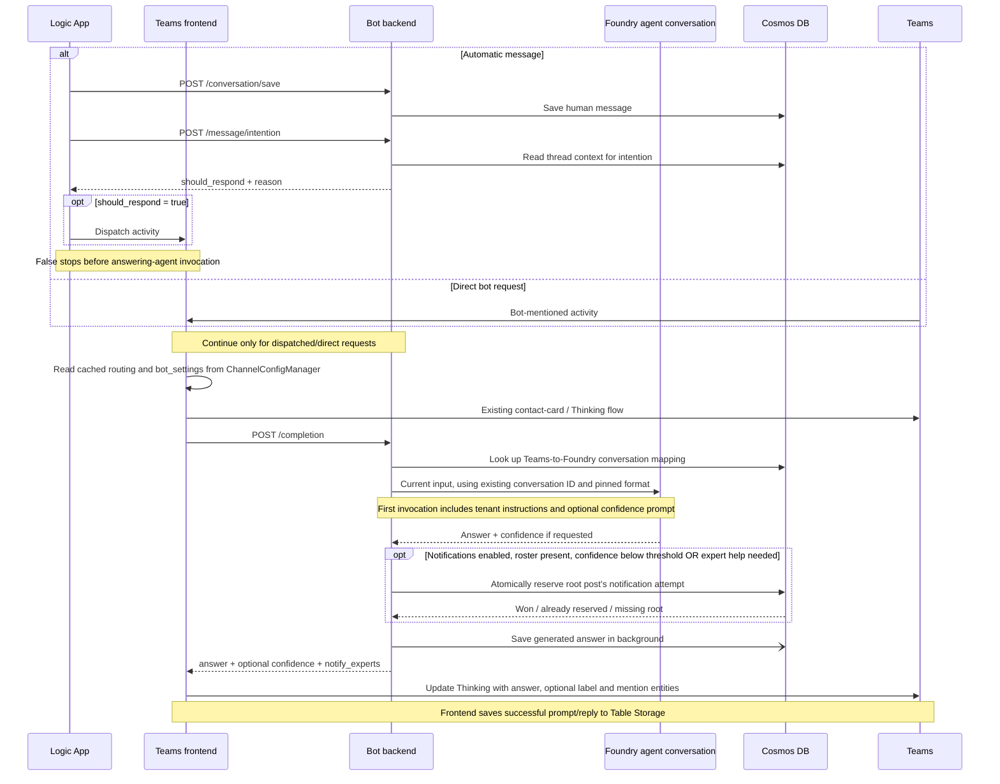

# Confidence-Aware Teams Chatbot

**Status:** Implemented locally; rollout pending  
**Updated:** 2026-09-21

| Issue | Revised behavior |
| --- | --- |
| [Azure/azure-sdk-pr#2964](https://github.com/Azure/azure-sdk-pr/issues/2964) | Show answer confidence and optionally request expert help; low confidence does not hide the answer |
| [Azure/azure-sdk-pr#2965](https://github.com/Azure/azure-sdk-pr/issues/2965) | Let intention approve appropriate new questions after humans join, without requiring a confidence threshold on the eventual answer |

## 1. Separate participation from answer confidence

| Responsibility | Owner | Decision |
| --- | --- | --- |
| Should the bot participate? | Existing intention classifier, before automatic generation | `should_respond` |
| How confident is the bot in its guidance, and is expert help needed? | Answering agent, with its answer | Optional `confidence` |
| Should experts be mentioned? | Backend settings + confidence + atomic reservation | `notify_experts` |
| What does Teams show? | Frontend | The generated answer, optional confidence label and expert mentions |

- **Keep the existing Foundry conversation for the same Teams post.** Do not start a fresh conversation for each question.
- **No answer-stage suppression:** low confidence, changed human activity, or notification opt-out does not discard a valid generated answer.
- **Confidence means:** "How confident am I in the guidance I provide, based on available evidence?" It is not verified correctness, a probability, complete request resolution, or a separate evaluator's score.
- **Expert need is independent:** `needs_expert_help` identifies specialized human knowledge, investigation, or authorized action required to resolve the request. Missing details the user can supply do not alone imply expert need.
- An approved question can receive a useful partial answer, an explanation of limitations, or a clarifying question.
- Direct bot requests go to completion without automatic intention classification. They cannot authorize human-only approvals.
- Remove `minimum_post_human_confidence`, answer-stage `response_appropriate` / `human_handling`, history fingerprints, and the completion `publish` field.

## 2. End-to-end workflow



`ChatService.chat()` remains the shared orchestration for agent setup, context, invocation/recovery, response processing, and persistence. `_should_notify_experts()` only determines notification eligibility; it cannot suppress an answer.

## 3. Conversation context and persistence

| Source | Use |
| --- | --- |
| Foundry conversation | Normal answering context: prior agent interactions and tool context managed by the hosted runtime |
| Cosmos thread messages | Intention classification; existing exceptional recovery of a broken Foundry conversation |
| Tenant instructions, skills, memory providers, attachments, tools | Existing answering-agent context; preserved |
| Frontend Table Storage | Existing UI/history handling and attachment collection |

- Resolve the existing `agent_conversation_id` for the post; do not routinely replay the full Cosmos transcript into the answering model.
- Keep existing broken-conversation recovery and stateless warm-session reuse. Recovery may replay Cosmos history, as before.
- Pin the response format in `ConversationMappingItem.confidence_enabled` when the post's mapping is first created. The same saved boolean controls parsing on every subsequent turn; channel changes cannot switch an existing post between JSON assessment and ordinary Markdown.
- Append `answer_confidence.md` to the tenant instructions in the first invocation's system message when confidence is enabled. Conversation creation receives no initial messages. Do not resend either instruction on later turns. Concurrent initial requests use the first saved mapping and its format.
- Existing mappings without `confidence_enabled` default to `false`. Missing/deleted Foundry conversations and broken-conversation recovery preserve the saved format and initialize the replacement's prompt once.
- No new requirement to save a direct request before `/completion`; automatic ingestion remains unchanged.
- Backend saves generated answers to Cosmos using `bot-{response_id}` without waiting for Teams delivery. Frontend saves successful prompt/reply pairs to Table Storage.
- The hosted agent's memory updates remain generation-time behavior. There is no intentional post-generation suppression, but delivery failures can still leave unseen answers in Foundry, Cosmos, or memory.

**Known context limits:** human messages saved only in Cosmos are not automatically synchronized into the Foundry conversation. Intention sees that discussion; the answering agent may need clarification. This revision does not add a synchronization or summarization subsystem. If added later, human-context updates should be bounded rather than replaying the entire thread. Existing intention history and exceptional recovery remain unbounded; reusing a Foundry conversation does not make context tokens free. Hosted tool-result compaction is not a general transcript token budget.

Initial instructions follow the existing tenant flow: the mapping is saved before
the first invocation stores its system message. Initialization is not atomic with
mapping creation; a concurrent turn may run before that message is stored, or the
initial invocation may fail before storing it. Confidence instructions share this
existing tenant-initialization limitation; no new initialization lock is introduced.

## 4. API contract

| API | Signature | Behavior |
| --- | --- | --- |
| `GET /config/channel?channel_id={id}` | `channel_id -> ChannelConfigResponse` | Routing and channel settings |
| `POST /conversation/save` | `ConversationMessage -> {}` | Existing ingestion; cannot supply a notification reservation |
| `POST /message/intention` | `IntentionRequest -> {should_respond, reason}` | Sole automatic participation gate |
| `POST /completion` | `ChatRequest -> ChatResponse` | Generate an answer; optionally assess confidence and reserve expert help |
| `POST /agent/chat` | Same as `/completion` | Existing alias |

**Completion request**

```json
{
  "tenant_id": "typespec_channel_qa_bot",
  "conversation_id": "channel-1;messageid=1001",
  "conversation_type": "teams_channel",
  "message": {
    "role": "user",
    "content": "How do I rerun the check, and does this failure qualify for an exception?",
    "user_id": "poster-id",
    "user_name": "Poster"
  }
}
```

- Required: `tenant_id`, `message.role`, `message.content`.
- The Teams frontend sends the existing `conversation_id`; the backend derives the channel from it to select settings. No separate channel ID or incoming message ID is sent in completion requests.
- Existing optional fields: `additional_infos`, `with_full_context`, sender identity.

**Completion response: partial answer with expert notification**

```json
{
  "id": "resp_123",
  "answer": "Here are the rerun steps. I cannot determine whether this failure qualifies for an exception.",
  "has_result": true,
  "references": [],
  "agent_conversation_id": "conv_123",
  "confidence": {
    "level": "medium",
    "summary": "I can explain the rerun steps, but not whether an exception applies.",
    "unresolved_needs": ["Determine whether this failure qualifies for an exception"],
    "needs_expert_help": true
  },
  "notify_experts": true
}
```

| Response field | Meaning |
| --- | --- |
| `answer`, `has_result`, `references` | Existing generated answer and references |
| `confidence.level` | `high`, `medium`, or `low`; self-assessed confidence in the provided guidance |
| `confidence.needs_expert_help` | Independent model judgment that specialized human knowledge, investigation, or authorized action is needed |
| `summary`, `unresolved_needs` | Explanation of confidence, limits, remaining needs, and why expert help is needed, if any |
| `notify_experts` | Backend permission for one mention attempt, not a delivery guarantee |
| `agent_conversation_id`, `trace_id`, `route_tenant`, `full_context` | Existing optional conversation/diagnostic/context fields |

`AssessedAnswer` is the internal model-output schema containing only `answer` and `confidence`. It is not a separate evaluator. `_postprocess()` decodes this envelope before processing the answer and references. If JSON/schema validation fails, log a warning and keep a string `answer` field when available; otherwise process the original output as plain text. Omit confidence and expert notifications rather than raising a formatting error or fabricating a Low score. `show_confidence_label`, `allow_notify_experts`, and `experts` come from channel configuration, not `ChatResponse`. There is no `publish`, reply-decision field, delivery token, or acknowledgement endpoint.

## 5. Channel configuration and expert help

**Reuse Blob:** `bot-configs/channel.yaml`, under `channels[].bot_settings`. Backend `BotConfigService` caches settings for 300 seconds by default. Existing overrides: `STORAGE_BASE_URL`, `STORAGE_CONFIG_CONTAINER`, `CHANNEL_CONFIG_BLOB`, `CHANNEL_CONFIG_CACHE_TTL_SECONDS`. The frontend reads display/mention settings through its existing `ChannelConfigManager`, which watches the configured blob every five seconds. No per-reply HTTP configuration lookup is added; tenant/endpoint routing and local overrides are preserved.

```yaml
channels:
  - id: channel-1
    tenant: typespec_channel_qa_bot
    bot_settings:
      show_confidence_label: false
      allow_replies_after_humans: false
      allow_notify_experts: false
      expert_help_threshold: high
      experts: []
```

| Setting | Default | Responsibility |
| --- | --- | --- |
| `show_confidence_label` | `false` | Show the confidence label; summaries/unresolved needs may still appear without the label |
| `allow_replies_after_humans` | `false` | Let intention approve appropriate questions after humans join |
| `allow_notify_experts` | `false` | Enable eligible expert notification attempts |
| `expert_help_threshold` | `high` | Request help when answer confidence is below this level; does not enable notifications itself |
| `experts` | `[]` | Approved recipients: `{id: "<Entra object ID or UPN>", name: "<display name>"}` |

**Choose the format for a new post's mapping using:** `show_confidence_label OR allow_notify_experts`. Persist that result as `confidence_enabled`; it is internal conversation state, not a channel setting or API field. Post-human participation alone chooses ordinary answers. Non-Teams/stateless calls retain their original behavior. All three flags are independent; a threshold or roster alone enables nothing.

| Change after a post starts | Existing post |
| --- | --- |
| Enable confidence features on a plain-format post | Remains plain; the new setting takes effect for new posts |
| Hide/show labels on a confidence-enabled post | Takes effect through frontend channel settings; assessment generation continues |
| Disable notifications or change recipients/threshold | Takes effect through current channel settings; format stays fixed |
| Change `allow_replies_after_humans` | Affects subsequent automatic intention decisions; format stays fixed |
| Recreate a missing/broken Foundry conversation | Keep the post's saved format, not the latest channel default |

Old/plain-format posts may legitimately return no confidence even when current channel settings request it. Display the plain answer without inventing a label or treating it as malformed. A missing mapping field is a backward-compatible plain default; an explicitly malformed saved boolean is an error.

**Expert notification rules**

- Eligible when confidence is below `expert_help_threshold` OR `needs_expert_help=true`. Ordering: `low < medium < high`; equality is not below the threshold. Default `high` includes Low and Medium; `medium` includes Low; `low` leaves only explicit expert need as a trigger. There is no `scope` field or implicit trigger from unresolved needs.
- Require `allow_notify_experts=true`, a nonempty roster, and a successful atomic reservation.
- Apply to first answers and follow-ups, including direct requests. Intention handles whether automatic participation is appropriate; there is no second human-handling veto after generation.
- Limit: **one notification attempt per root post and all replies**, regardless of later questions or send failures.
- Backend rechecks notification settings, not whether to display the answer. Turning notification settings off does not discard an in-flight answer.
- Frontend requires both backend `notify_experts=true` and its loaded `allow_notify_experts=true`; uses escaped `<at>` text and mention entities, never plain `@Name`.

The prompt assesses these two signals independently. Low confidence may simply require
user clarification (`needs_expert_help=false`), but still qualifies below the threshold.
High-confidence guidance may require an authorized human to approve or act
(`needs_expert_help=true`), qualifying regardless of threshold. Summary and unresolved
needs make the distinction visible; neither signal guarantees the model's judgment is correct.

Missing channel/section, null whole `bot_settings`, or an empty section defaults all flags off. Omitted individual fields receive defaults. Backend settings retrieval failures are logged and use all-off settings without caching the failure. The frontend preserves its existing cache behavior: failed refreshes log the error and retain the last loaded configuration, including bot settings and routing. The frontend trusts supplied bot settings like the existing routing fields, without runtime schema validation; malformed values may cause reply errors rather than being normalized. Backend validation, intention, and threshold policy are unchanged. Existing conversation formats remain unchanged.

## 6. Delivery, storage, and accepted limits

The frontend retains the contact-card check for accepted requests. Thinking is shown for each accepted request, including follow-ups. A single completion path cancels the Thinking timer on a best-effort basis, formats the answer with optional confidence and mention entities, updates the existing Thinking activity, and saves delivery history with its activity ID. Cancellation failures are logged without blocking delivery. Low confidence is displayed rather than suppressed. All replies use the existing update helper, which retries only HTTP 429 responses, not timeouts; no delete/new-message path or fallback message is used. History failures never trigger another reply. Whether adding mentions through an update triggers Teams notifications remains to be verified live. No post-send callback or delivery lifecycle is added.

New durable fields reuse existing documents:

| Document | Field | Purpose |
| --- | --- | --- |
| Teams-to-Foundry conversation mapping | `confidence_enabled`, default `false` for old mappings | Pin the answer format across turns and recovery |
| Root `conversation_message` in `conversation-messages` | `expert_notification: {response_id, reserved_at}` | Reserve one expert-notification attempt |

Mapping creation uses create-if-absent so the first saved ID/format wins. ETag-conditional message writes allow only one notification reservation. Ingress and `should_reply` updates preserve it; no new container, synthetic root, reservation expiry, or release is introduced.

Message writes make at most three application-level attempts for known concurrency
conflicts. Missing ETags, exhausted retries, and storage failures are logged and
skipped, never followed by an unconditional write or notification authorization.
Message ingestion is also best-effort: `/conversation/save` keeps its empty
response without guaranteeing persistence, and only a confirmed save triggers
the background tenant-memory update. Cosmos SDK transport retries are unchanged.

| Condition | Outcome |
| --- | --- |
| Intention declines an automatic message | No answering-agent invocation or generated answer |
| Approved question gets Low confidence | Display limitations/partial guidance; optionally notify experts |
| Human responds while the bot is generating | Finish displaying the answer; accept possible overlap |
| Notifications disabled, root missing, roster empty, or attempt already reserved | Display answer without mentions |
| Reservation service/timeout error | Log error; display answer without mentions; an ambiguous write may consume the attempt |
| Message save fails or exhausts conflict retries | Log failure; continue the request without triggering tenant-memory update; history may be missing |
| Agent returns a non-completed status with usable output | Log status/details and continue processing, as for plain answers |
| Missing/malformed confidence output | Log a warning, preserve available answer text, omit confidence and mentions |
| Invalid confidence/notification metadata received by frontend | Log a warning; render the answer with normal references and footers, without confidence or mentions |
| Frontend expert roster is empty | Log a warning; display the answer without mentions |
| Generation fails without returning a response | Existing error handling; do not invent an answer or confidence |
| Teams delivery fails or completion response is lost | Existing generated-history mismatch remains; notification attempt stays consumed |
| Repeated/concurrent completion | Ordinary duplicate-answer limitations remain; only one expert attempt can be reserved |

Intention can misclassify and cannot predict the final answer's confidence before tools run. Its checks are not a transaction with subsequent human messages. Direct requests bypass automatic intention, not authority restrictions. Actual Teams notifications depend on user settings. Rare configuration changes can leave frontend display/recipients based on its earlier settings; no snapshots, hashes, or version matching are added.

## 7. Rollout

- Deploy backend and frontend before opting in channels; the existing converter and Logic App are unchanged.
- Start with explicit flags in API Spec Review and approve expert rosters with channel owners.
- Review intention false positives/negatives, confidence usefulness, expert-notification rate, and cost/latency. Confidence is informational, never an automatic reply threshold.
- No issue edits, deployments, or live configuration changes are included in this implementation.

References: [Teams mentions](https://learn.microsoft.com/en-us/microsoftteams/platform/bots/how-to/conversations/channel-and-group-conversations#add-mentions-to-your-messages) | [Existing learning pipeline](chatbot-evolution-agent-design.md)
