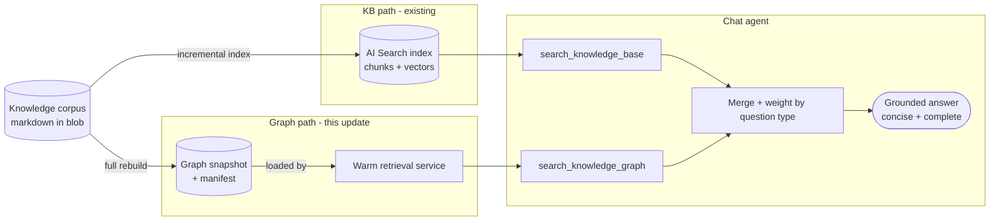
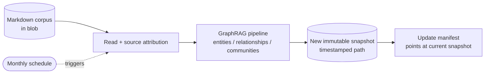
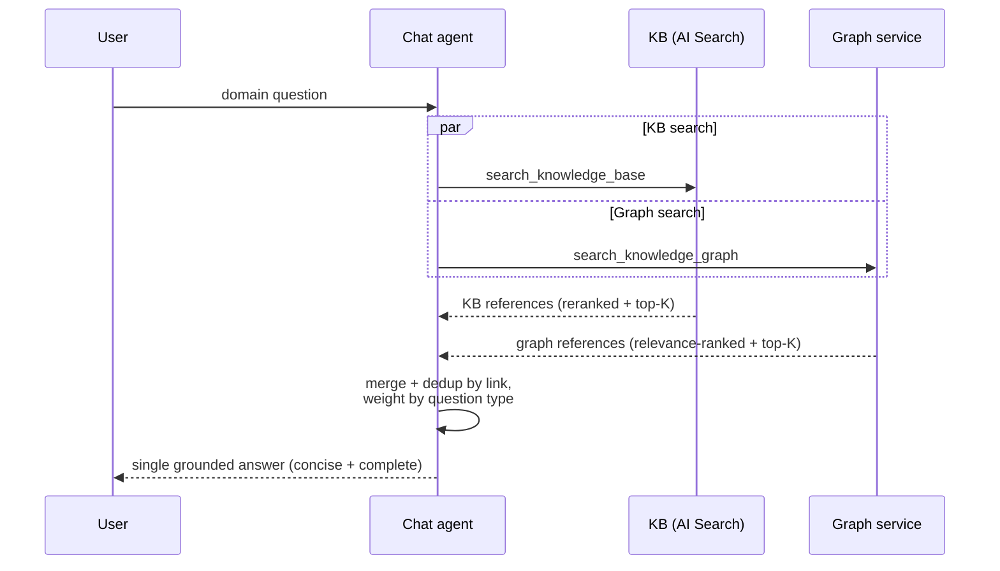

# GraphRAG Knowledge-Graph Retrieval — Design

## 1 Background

The Azure SDK QA Bot answers developer questions by grounding a chat agent on a curated knowledge corpus (TypeSpec docs, ARM/API guidelines, SDK repo docs, samples, resolved support threads). Until now the only retrieval path was **vector / agentic search over an Azure AI Search index** (the "KB path"). Vector search excels at single-concept, definitional, verbatim-rule lookups, but it retrieves each chunk independently and has no notion of how entities relate **across** documents — so it under-serves relational, multi-hop, cross-document, and troubleshooting questions where the answer depends on connecting facts that live in different chunks.

This design adds a second, complementary retrieval path built on **Microsoft GraphRAG** (entity-graph traversal) that runs **side-by-side** with the existing KB path. The agent issues both retrievers in parallel and synthesises one answer over the merged references.

> This document describes the overall design of the GraphRAG update and how it is used, and contrasts it with the original KB architecture. It complements [`agent_framework_and_memory_design.md`](agent_framework_and_memory_design.md).

### 1.1 Goals / non-goals

- **Goal** — add graph-grounded recall for relational/cross-document questions **without regressing** the KB path or the concise, in-scope answer style.
- **Goal** — keep the graph reference shape **identical** to KB references — same fields, same relevance-ranked + top-K-capped contract — so the agent and UI treat both uniformly, and tenant-scope graph retrieval with the same semantics as the KB tool.
- **Non-goal** — replacing the KB path. GraphRAG is additive; the two are weighted per question type (see [Hybrid synthesis](#4-hybrid-synthesis--how-the-two-paths-combine)).
- **Non-goal** — running GraphRAG's own answer generation. We use only its retrieval (context-building) stage and let the chat agent compose the answer.

---

## 2 Design overview

GraphRAG is added as a **second retriever over the same corpus**, not a replacement for the KB path. Three pieces make it work:

1. **An offline graph build** turns the existing markdown corpus into a knowledge graph (entities, relationships, communities) and publishes it as an immutable, versioned snapshot in blob storage.
2. **A warm backend retrieval service** loads the current snapshot and answers graph queries over HTTP, returning source references in the same shape as KB results.
3. **The chat agent** calls the KB tool and the graph tool in parallel, then merges and weights the two reference sets before composing a single grounded answer.

The rest of this section walks through each piece; [Freshness and tenant scoping](#3-freshness-and-tenant-scoping) covers how snapshots stay fresh and tenant-scoped, and [Hybrid synthesis](#4-hybrid-synthesis--how-the-two-paths-combine) covers synthesis.

### 2.1 The graph build (offline)

A separate sync project reads the **same** markdown the KB path indexes and runs the GraphRAG pipeline to extract entities and relationships and cluster them into communities. Every document keeps a **source attribution** tag so each graph hit can be traced back to a concrete knowledge source and resolve a link consistent with the KB path.

Each run is a **full rebuild** that writes a new, immutable snapshot (a set of graph artifacts) under a timestamped path, plus a small manifest file that points at the current snapshot. Full rebuilds keep snapshots reproducible and make activation atomic — nothing consumes a snapshot until the manifest flips to it. The build runs on a monthly schedule; the corpus changes slowly, so a monthly rebuild keeps the graph current while keeping the (heavier) full-build cost low.

### 2.2 The retrieval service (online)

Loading a graph and building its search context is expensive, so graph retrieval lives in the **backend as a warm, long-lived service** rather than being reconstructed inside each short-lived chat-agent sandbox. The backend loads the current snapshot once and serves graph queries over an HTTP endpoint; the chat agent reaches it through a `search_knowledge_graph` tool that mirrors the KB tool's interface and fails soft (an empty result never breaks a turn).

Crucially, the service runs **only the retrieval half** of GraphRAG: it embeds the query, finds the most relevant entities, expands one hop through their relationships, and resolves back to the **source text passages** those entities came from. It also surfaces the single most relevant **community report** — a cross-document summary GraphRAG generates offline during the build and bakes into the snapshot — giving the agent synthesised context that spans documents, something the chunk-based KB cannot produce. It does **not** call an LLM *at query time* to write an answer: both the text passages and the pre-computed community summary are returned as references — the passages in the same shape as KB chunks, **relevance-ranked, scored, and capped to a top-K** (see [Hybrid synthesis](#4-hybrid-synthesis--how-the-two-paths-combine)) — and the chat agent composes the final answer over them, exactly as it does for KB results. This keeps a single, consistent answering path and preserves the concise answer style.

---

## 3 Freshness and tenant scoping

**Snapshot refresh (pull-based).** The backend periodically checks the manifest and hot-swaps to a newer snapshot only when the build id changes. Reloads are atomic with rollback on failure, so a bad build never leaves the service half-loaded. The bot *pulls* new knowledge on its own schedule rather than being pushed to.

**Tenant scoping (same semantics as KB).** Every tenant is limited to its own set of knowledge sources. Graph retrieval enforces this with two layers that mirror the KB tool: it restricts results to the tenant's allowed sources, and it further honours any per-source narrowing the tenant applies (e.g. a language- or title-based filter on a shared source). The net effect is that a question scoped to a tenant sees the same slice of the corpus through the graph as it does through the KB.

---

## 4 Hybrid synthesis — how the two paths combine

Both retrievers are **mandatory on every domain question** and are issued in the **same parallel batch**, so there is no added latency turn. The agent then merges the two reference sets and **de-duplicates by link**, with the KB (primary-source) hit winning when both return the same document.

**Symmetric ranking so the two sets fuse cleanly.** The two retrievers must hand the agent reference sets it can weigh on the same terms. The KB tool returns its chunks ordered by a semantic reranker, each carrying a relevance score, capped at a small top-K. The graph tool now does the same: GraphRAG already orders the passages it surfaces by graph relevance (most-connected first), so the service **preserves that order, keeps the most-relevant passage per document, stamps a normalised relevance score on each reference, and caps the result at a comparable top-K**. Before this, the graph returned every resolved passage (~20 per query) ordered only by chunk length with no score — a large, unranked set that crowded the tightly-ranked KB list and diluted the answer on definitional questions. Ranking and capping the graph side gives both sets shared ordering semantics and a comparable size, so the agent's per-question-type weighting operates on an even footing.

**Cross-document synthesis via community reports.** Beyond individual passages, the graph path also contributes the single most relevant **community report** — GraphRAG's offline-generated summary of a cluster of related entities spanning multiple documents. This is the graph path's distinctive contribution: where the KB returns the best individual chunks, the community report gives a connected, cross-document synthesis the agent can lean on for relational, onboarding, and release-process questions. It is appended to the graph reference set as an unlinked synthesis reference and always kept through de-duplication. Only the top report or two that fit the default context budget are surfaced (a small, deliberately narrow slice): the community report is the graph's differentiator on relational questions, but widening the budget to include more crowds out the source passages and regresses the passage-driven categories.

The two sources are **weighted by question type** rather than blended equally (this weighting was tuned from case-level analysis of where each path helps or hurts):

- **Definitional / decorator / language-feature questions → KB is the backbone**, graph is confirmation-only, with an anti-dilution rule: don't pull in adjacent or legacy mechanisms the user didn't ask about, and prefer the KB answer if the graph contradicts it.
- **Process / workflow / permissions / CI / release / cross-team questions → graph is the backbone**, with KB grounding exact wording and links.

The answer aims to be **concise and in-scope**: lead with the direct answer, cover every specific fact the question needs, and cut generic padding — completeness on the specific point, not length.

---

## 5 Evaluation

- **Evaluations run with memory disabled.** The agent can inject historical Q&A from its memory store; because the eval datasets are built from prior Q&A, leaving memory on leaks ground-truth answers and biases the comparison. All evaluation is run with memory off.
- **Result (223-case perf set, memory off).** On a like-for-like, same-day run the hybrid KB+graph configuration scores **~82 %** vs **~79 %** for KB-only. The gain comes from two reinforcing levers on the **graph path** (the answer prompt is held identical to the KB-only baseline, so the delta is attributable to retrieval alone): **(1) community-report synthesis** — surfacing GraphRAG's pre-computed cross-document community summary, the artifact the chunk-based KB cannot produce, which lifts the relational, onboarding, and release-support categories the graph is designed to help; and **(2) symmetric graph-reference ranking** (see [Hybrid synthesis](#4-hybrid-synthesis--how-the-two-paths-combine)), which removes the earlier graph dilution on definitional questions so the ranked graph set fuses cleanly with the tightly-ranked KB set. Groundedness/relevance/coherence/fluency stay at ~100 %; `response_completeness` is the sole gating metric and tracks the headline rate.
- **Remaining failures are dominated by corpus gaps** — short, thread-specific facts that simply aren't in the indexed corpus, so no retrieval change can recover them. The next lever is **curated corpus expansion**, not further retrieval tuning. (Answer-prompt changes that trade conciseness for coverage were evaluated separately and did not net-improve this metric — a tighter, non-enumerative answer suppresses `response_completeness` as much as it saves length — so the graph path is optimised independently of answer style.)
- **Measurement caveat.** Category pass rates carry meaningful run-to-run and cross-day noise (the largest category alone swings ~±5 pp), so configurations are compared from same-day runs and small deltas are treated as noise rather than signal.
- **Corpus/eval overlap caveat.** The perf dataset cases were curated from the same historical support-thread snapshots that are also indexed into the knowledge corpus (both the KB search index and the graph build read the shared knowledge container). Retrieval can therefore surface a near-verbatim prior answer for some recurring questions, so the **absolute** pass rates are somewhat optimistic versus genuinely novel questions. The KB-vs-graph **delta** is measured over the identical corpus, so the relative comparison stays meaningful; a fully leak-free baseline would exclude the historical-Q&A sources at eval time.
