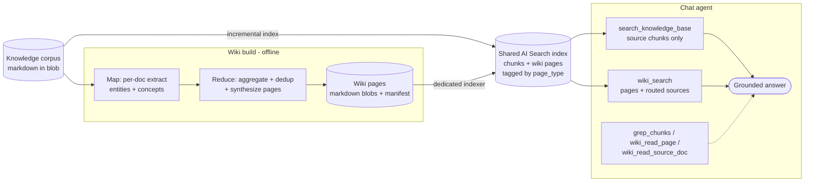
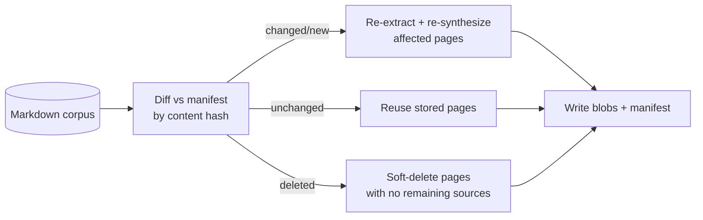
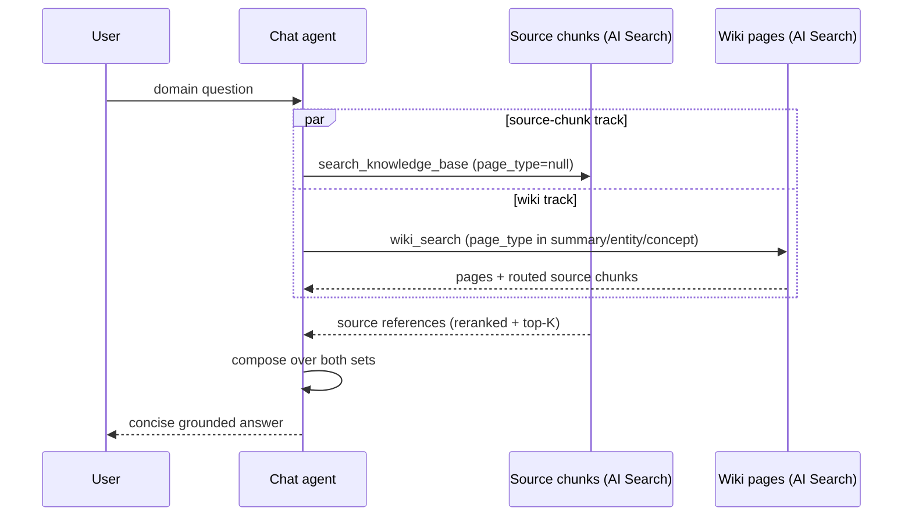

# Wiki Knowledge-Layer Retrieval — Design

## 1 Background

The Azure SDK QA Bot answers developer questions by grounding a chat agent on a curated knowledge corpus (TypeSpec docs, ARM/API guidelines, SDK repo docs, samples, resolved support threads). The original retrieval path was **vector / agentic search over an Azure AI Search index** (the "KB path"): it retrieves each document chunk independently and excels at single-concept, verbatim-rule lookups, but it has no consolidated, cross-document view of a symbol or topic — so conceptual and "how does X work" questions must be reassembled from many scattered chunks.

This design adds a **wiki knowledge layer**: an offline, LLM-generated set of pages that distil the corpus into per-document **summaries**, per-symbol **entity** pages (decorators / APIs / types), and per-topic **concept** pages. The wiki is retrieved on a **second track that is kept strictly separate from the source-chunk track** and consulted through its own tools.

> This document describes the design of the wiki update and how it is used, and contrasts it with the source-chunk KB path. It complements [`agent_framework_and_memory_design.md`](agent_framework_and_memory_design.md).

### 1.1 Goals / non-goals

- **Goal** — add a consolidated, cross-document knowledge layer for conceptual / symbol-centric questions **without regressing** the source-chunk path or the concise answer style.
- **Goal** — keep the wiki page and source-chunk retrievals on **separate tracks** that never fuse into one ranked list, and reuse the existing index, indexer, and tenant-scoping machinery.
- **Non-goal** — replacing the source-chunk path. The wiki is additive; source chunks remain the authoritative grounding.
- **Non-goal** — a live wiki (agent-edited pages, issue tracking). The wiki is a rebuildable, read-only retrieval layer.

---

## 2 Design overview

The wiki is added as a **second retrieval layer over the same corpus**, distinguished from raw chunks by a `page_type` field on the shared index. Three pieces make it work:

1. **An offline wiki build** turns the markdown corpus into wiki pages (summary / entity / concept) and persists them as markdown blobs plus a reconcile manifest.
2. **A dedicated indexer** pulls those blobs into the *shared* Azure AI Search index, so one index serves both raw chunks and wiki pages with no second store.
3. **The chat agent** retrieves the two layers on **separate tracks**: `search_knowledge_base` searches source chunks only, `wiki_search` searches the wiki layer and routes to the sources each page was built from.

### 2.1 The wiki build (offline)

A separate build project reads the **same** markdown the KB path indexes and produces four page types with a map-reduce:

- **summary** — one comprehensive page per document, synthesised from the document's full text (definitions, exact names/signatures, rules, constraints and exceptions, steps, examples, gotchas). It inherits the source document's `context_id` and carries the source's relative path so links resolve back to the real document.
- **entity** — one page per named symbol (a decorator such as `@added`, an API, or a type such as `TrackedResource`) that recurs across documents. A map step extracts candidate symbols per document; a reduce step aggregates mentions across documents, merges aliases and near-duplicates, and synthesises one grounded page.
- **concept** — one page per cross-cutting topic (e.g. API versioning, long-running operations, pagination), built the same way as entity pages.
- **index** — a navigation page listing the generated entity/concept pages.

Extraction granularity is tunable (`focused` / `standard` / `exhaustive`); `focused` keeps the page set tight. Each entity/concept page records the **source documents it was built from** (`chunk_refs`), which the retrieval path uses to route from a wiki page back to its sources.

Pages are rendered to markdown blobs. Each build is reconciled against a **manifest** so unchanged documents are not re-processed:

### 2.2 The dedicated indexer (offline → index)

Wiki pages are projected into the **shared** KB index by a dedicated indexer, so the agent retrieves wiki pages and raw chunks from one index with no query-path change. The indexer:

- reads the wiki blob container, chunks and embeds each page with the KB's own embedding model (shared vector space),
- maps each page's `page_type`, `context_id`, `title`, and source refs into the index (the source refs are stored as a JSON-array string in an `Edm.String` field — index projections cannot populate a collection from a scalar — and parsed back to a list at query time),
- honours **soft-delete**: a page blob tombstoned by the reconcile is removed from the index on the next run.

Raw KB chunks leave `page_type` null; wiki pages set it to `summary` / `entity` / `concept` / `index`. That one field is what keeps the two layers separable at query time.

---

## 3 Freshness and tenant scoping

**Incremental reconcile.** The build diffs the corpus against the manifest by content hash. Only changed or new documents are re-extracted and their summaries regenerated; entity/concept pages are re-synthesised only for groups whose source set changed. Documents removed from the corpus have their pages soft-deleted once no source remains. The first run against an empty manifest degenerates to a full build.

**Tenant scoping (same semantics as KB).** Wiki retrieval reuses the KB tool's source scoping. Summary pages inherit their source document's `context_id`, so they are already restricted to the tenant's sources; cross-document entity/concept pages carry dedicated `wiki_entity` / `wiki_concept` contexts registered as tenant sources. A question scoped to a tenant therefore sees the same slice of the corpus through the wiki as through the source chunks.

---

## 4 Two-track retrieval — how wiki and chunks stay separate

The central decision is that **wiki pages and source chunks are never fused into one ranked result set**. They are retrieved on two separate tracks and combined only in the final answer.

- **Source-chunk track — `search_knowledge_base`.** Runs the dense + sparse (BM25) retrievers with RRF fusion and the semantic reranker over **source chunks only** — a `page_type is null` filter (plus a defensive post-filter) excludes every wiki page. This keeps the authoritative, tightly-ranked source list free of wiki pages.
- **Wiki track — `wiki_search`.** Runs the same hybrid retrieval over **wiki pages only** and is **self-contained**: for the top pages it returns the full synthesised content **and** the specific source-document chunks each page was built from (routed via `chunk_refs`). One call yields both the cross-document overview and grounded source detail.
- **Targeted drills (optional).** `grep_chunks` (literal / keyword match over source chunks for exact symbols and error strings), `wiki_read_page` (read a specific wiki page by title), and `wiki_read_source_doc` (read an original source document a wiki page lists) let the agent drill only when a specific fact is still missing.

For most domain questions the agent issues `search_knowledge_base` and `wiki_search` in the **same parallel batch** and answers on the next turn; drills add a turn only when needed.

---

## 5 Evaluation

- **Evaluations run with memory disabled.** The agent can inject historical Q&A from its memory store, and the eval datasets are built from prior Q&A, so leaving memory on leaks ground-truth answers; all evaluation is run with memory off, and the `main` KB-only baseline is run with the same gate so both arms are memory-off.
- **Two-track separation is the load-bearing decision.** Retrieving wiki pages in the *same* ranked pool as source chunks lets the generic wiki pages displace specific source docs and regresses the score sharply; moving the wiki to its own `wiki_search` track — source chunks filtered clean, wiki consulted separately and routed back to its sources — removes that displacement and restores the source-chunk quality while adding the wiki's cross-document recall.
- **Richer wiki content improves completeness.** Comprehensive summary pages (versus terse ones) raise `response_completeness` — the sole gating metric — and lift conceptual, general, and process categories.
- **Result (219-case perf set, memory off, gpt-5.4 grader, same-day).** The wiki two-track configuration scores **64.8 %** versus **60.3 %** for the memory-off KB-only baseline (**+4.5 pp**), with the best `response_completeness` of the runs and the largest gains on the general and conceptual categories; groundedness / relevance / coherence / fluency stay at ~100 %.
- **Answer-length trade-off.** Richer retrieved evidence pushes the model to write longer answers even under a concise-answer instruction; keeping answers short and keeping them complete are in tension, and the concise-answer instruction is retained as the product constraint.
- **Remaining failures are dominated by corpus gaps and specific-fact precision** on process / language-specific questions — not addressable by further retrieval-shape tuning. The next lever is curated corpus expansion.

---

## 6 Known limitations

- **Cross-document page scoping.** Entity and concept pages aggregate several source documents and carry a shared `wiki_entity` / `wiki_concept` context rather than any single source's `context_id`. A tenant able to read those pages can therefore see synthesised facts drawn from documents outside its own sources. This is acceptable because the corpus is public documentation and tenants map to topic channels, not access boundaries; summary pages and raw source chunks remain scoped to their source `context_id`.
- **Multi-chunk wiki page ordering.** A synthesised page larger than the indexer's chunk size is split into several index chunks. Wiki reads reassemble a page by `ordinal_position`, which the current projection does not set on wiki chunks, so a page split across chunks can be concatenated out of order. It is mitigated by keeping synthesised pages within the single-chunk size budget; a projected ordinal is the durable fix and requires a reindex.
