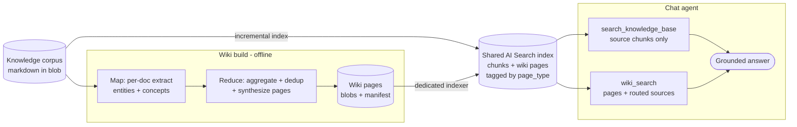

# Wiki Knowledge-Layer Retrieval — Design

## Background

The QA bot grounds its answers on a curated corpus (TypeSpec docs, ARM/API guidelines, SDK repo docs, samples, resolved threads). The original path is vector/agentic search over an Azure AI Search index of document chunks ("KB path"): strong for single-concept, verbatim-rule lookups, but with no consolidated cross-document view of a symbol or topic.

This design adds a **wiki knowledge layer**: an offline, LLM-generated set of pages that distil the corpus into per-document **summaries**, per-symbol **entity** pages, and per-topic **concept** pages. It is additive and rebuildable; source chunks remain the authoritative grounding.

## Architecture

The wiki is a second layer over the **same** corpus, distinguished from raw chunks by a `page_type` field on the shared index.

- **Build (offline).** A map-reduce over the markdown corpus produces four page types: `summary` (one per document, from its full text), `entity` (one per recurring named symbol), `concept` (one per cross-cutting topic), and an `index` navigation page. Entity/concept pages aggregate mentions across documents with alias/near-duplicate merging and record the source docs they were built from (`chunk_refs`) for query-time routing. Granularity is tunable (`focused` / `standard` / `exhaustive`). Pages are written as markdown blobs plus a reconcile manifest.
- **Indexer (blobs → index).** A dedicated indexer projects the wiki blobs into the **shared** KB index, so one index serves both layers. Raw chunks leave `page_type` null; wiki pages set it. `chunk_refs` are carried as a JSON-array string (index projections cannot populate a collection from a scalar) and parsed back at query time. Soft-deletes propagate to the index. `setup_indexer.py` (re)creates the datasource / skillset / indexer.

## Two-track retrieval

The load-bearing decision: **wiki pages and source chunks never fuse into one ranked list** — fusing lets generic wiki pages displace specific source docs and regresses the score. They are retrieved on separate tracks and combined only in the answer.

- **`search_knowledge_base`** — source chunks only (`page_type` null); dense + BM25 with RRF fusion and semantic rerank.
- **`wiki_search`** — wiki pages only, **self-contained**: for the top pages it returns their full content **plus** the source chunks each was built from (routed via `chunk_refs`).
- **`grep_chunks`** (literal symbol/error-string match), **`wiki_read_page`**, **`wiki_read_source_doc`** — optional targeted drills.

For most questions the agent issues `search_knowledge_base` + `wiki_search` in one parallel batch and answers on the next turn.

## Freshness and tenant scoping

- **Incremental reconcile.** The build diffs the corpus against the manifest by content hash: only changed/new documents are re-extracted and their summaries regenerated; entity/concept pages are re-synthesised only when a group's source set or content changed; removed documents have their pages soft-deleted. A scoped (`--prefix`) build preserves out-of-scope pages and sources. The first run against an empty manifest is a full build.
- **Tenant scoping** reuses the KB tool's source scoping. Summary pages inherit their source document's `context_id`; cross-document entity/concept pages carry dedicated `wiki_entity` / `wiki_concept` contexts registered as tenant sources.

## Evaluation

219-case perf set, memory off, gpt-5.4 grader, same-day runs.

- Wiki two-track scores **64.8 %** vs **60.3 %** for the memory-off KB-only baseline (**+4.5 pp**), with the best `response_completeness` and the largest gains on general/conceptual categories; groundedness / relevance / coherence / fluency stay ~100 %.
- The separation is essential — retrieving wiki pages in the same pool as source chunks regresses the score. Richer summary pages drive the completeness gain, in tension with the concise-answer cap.

## Known limitations

- **Cross-document page scoping.** Entity/concept pages carry a shared `wiki_entity` / `wiki_concept` context, so a tenant reading them can see facts synthesised from documents outside its own sources. Acceptable because the corpus is public docs and tenants map to topic channels, not access boundaries; summary pages and raw chunks stay scoped to their source `context_id`.
- **Multi-chunk page ordering.** A synthesised page larger than the indexer chunk size is split into several chunks; wiki reads reassemble by `ordinal_position`, which is not projected onto wiki chunks, so a split page can concatenate out of order. Mitigated by keeping pages within the single-chunk budget; a projected ordinal is the durable fix and needs a reindex.
