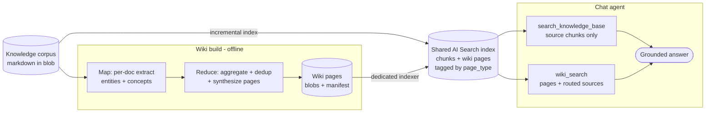

# Wiki Knowledge-Layer Retrieval — Design

## Background

The QA bot grounds its answers on a curated corpus (TypeSpec docs, ARM/API guidelines, SDK repo docs, samples, resolved threads). The original path is vector/agentic search over an Azure AI Search index of document chunks ("KB path"): strong for single-concept, verbatim-rule lookups, but with no consolidated cross-document view of a symbol or topic.

This design adds a **wiki knowledge layer**: an offline, LLM-generated set of pages that distil the corpus into per-document **summaries**, per-symbol **entity** pages, and per-topic **concept** pages. It is additive and rebuildable; source chunks remain the authoritative grounding.

## Architecture

The wiki is a second layer over the **same** corpus, distinguished from raw chunks by a `page_type` field on the shared index.


```mermaid
flowchart LR
    corpus[(Knowledge corpus<br/>markdown in blob)]
    idx[(Shared AI Search index<br/>chunks + wiki pages<br/>tagged by page_type)]
    subgraph BUILD[Wiki build - offline]
        map[Map: per-doc extract<br/>entities + concepts]
        red[Reduce: aggregate + dedup<br/>+ synthesize pages]
        blob[(Wiki pages<br/>blobs + manifest)]
    end
    corpus -->|incremental index| idx
    corpus --> map --> red --> blob
    blob -->|dedicated indexer| idx
    subgraph AGENT[Chat agent]
        kbtool[search_knowledge_base<br/>source chunks only]
        wikitool[wiki_search<br/>pages + routed sources]
        ans([Grounded answer])
    end
    idx --> kbtool --> ans
    idx --> wikitool --> ans
```

- **Build (offline).** A map-reduce over the markdown corpus produces three page types: `summary` (one per document, from its full text), `entity` (one per recurring named symbol), and `concept` (one per cross-cutting topic). Entity/concept pages aggregate mentions across documents with alias/near-duplicate merging and record the source docs they were built from (`chunk_refs`) for query-time routing. Named decorators and framework templates (`@`-prefixed names, `Azure.ResourceManager.Legacy.*`) are always extracted — even from a single document — and their constraints and anti-patterns captured, so symbol-specific questions route to a consolidated page. Pages are written as markdown blobs plus a reconcile manifest. All three LLM prompts live as markdown under `prompts/`.
- **Indexer (blobs → index).** A dedicated indexer projects the wiki blobs into the **shared** KB index, so one index serves both layers. Raw chunks leave `page_type` null; wiki pages set it. `chunk_refs` are carried as a JSON-array string (index projections cannot populate a collection from a scalar) and parsed back at query time. Soft-deletes propagate to the index. `setup_indexer.py` (re)creates the datasource / skillset / indexer.

## Two-track retrieval

The load-bearing decision: **wiki pages and source chunks never fuse into one ranked list** — fusing lets generic wiki pages displace specific source docs and regresses the score. They are retrieved on separate tracks and combined only in the answer.

- **`search_knowledge_base`** — source chunks only (`page_type` null).
- **`wiki_search`** — wiki pages only, **self-contained**: for the top pages it returns bounded synthesized content **plus** query-ranked source chunks from the documents recorded in `chunk_refs`. The next-ranked pages that did not make the cut are appended as a titles-only "Related wiki pages" reference for orientation; those titles are not answer evidence.

Both tracks run the same retrieval pipeline (`SearchClient.fused_search`) and differ only by page-type filter: dense + BM25 (+ agentic in `deep` mode) run in parallel for every query, all query/retriever rankings are fused together with RRF, then the caller dedupes and caps. Retrieval uses a wider candidate pool than the final answer budget.

For most questions the agent issues `search_knowledge_base` + `wiki_search` in one parallel batch and answers on the next turn.

Wiki results use separate content budgets for synthesized pages and routed source chunks. The exact matched source passage is placed first before truncation. This keeps every ranked reference available while bounding the hosted-agent tool payload. The backend requests the completed Responses API result rather than consuming an SSE stream because it already buffers the final answer, and large multi-tool completion events can exceed the streaming parser's safe event size.

## Faithfulness of generated pages

Summarisation naturally drops qualifiers, and a wiki page that states a conditional fact as an unconditional rule is worse than no page at all: at query time a confident general principle can override the case-specific answer the user needs. The build prompts therefore require each fact to keep the scope its source gives it — conditions, exceptions, and tolerated deviations are recorded next to the rule they qualify, and a verdict given for one situation never becomes general guidance. The answer rules mirror this from the other side: a source that answers the exact situation wins over a source stating a broad rule.

## Tenant scoping

There is no access-control layer: tenant scoping is **retrieval-scope selection**, expressed as an OData filter on the index's `context_id` field. Three layers:

1. **A global source registry** (`config/tenant_config.py`). Every knowledge source is registered once as a `KnowledgeSource`, whose `name` is also the `context_id` value carried by its documents in the index. The source's description is surfaced in the retrieval tools' parameter docs, so the model picks sources itself.
2. **Tenants reference sources by name.** A `TenantConfig` holds an ordered source list, and may override an individual source's filter via `source_filter`.
3. **Query time expands them into one filter** (`_resolve_source_filters`). Each source becomes `context_id eq '<name>'`, optionally `and`-ed with the tenant's override and a service-type clause; the per-source clauses are then OR-ed into the single `filter` passed to Azure AI Search.

Wiki pages join this scheme through the `context_id` written at build time:

| Page type | `context_id` | Source |
| --------- | ------------ | ------ |
| `summary` | the source document's first path segment | `reader.source_folder` — blob `typespec_docs/x.md` → `typespec_docs` |
| `entity` | `wiki_entity` | fixed, `wiki_reduce.CONTEXT_BY_TYPE` |
| `concept` | `wiki_concept` | fixed |

Summary pages therefore inherit their source document's tenant scope automatically and need no configuration. Cross-document entity/concept pages cannot — they are synthesised from many documents — so they carry two dedicated contexts that a tenant opts into by listing `SRC_WIKI_ENTITY` / `SRC_WIKI_CONCEPT` among its sources.

The consequence is the cross-document scoping limitation below: a tenant reading `wiki_entity` can see facts synthesised from documents outside its own source list.

## Update model

`reconcile()` is the single entry point. State lives in one manifest blob in the wiki container:

```
{"sources": {source_path: {hash, entities, concepts}},
 "pages":   {slug: {content_hash, input_hash, source_refs, is_deleted, ...}}}
```

Five phases:

1. **Diff sources by content hash and generation identity.** The corpus reader skips blobs the KB sync has tombstoned (`IsDeleted` metadata) and empty/whitespace-only documents, so retired or unusable documents do not enter generation. `changed` = hash differs from the manifest; `deleted` = in the manifest but absent from the corpus. The generation identity includes the synthesis model, prompt hashes, minimum-document threshold, manifest version, and build-logic version; changing any of them invalidates cached generation.
2. **Extraction.** Only changed documents are re-extracted; every other document's entities/concepts are deserialised from the manifest.
3. **Summary pages.** Only changed documents are re-summarised; the rest are reused from the manifest.
4. **Entity/concept pages.** A group's page is reused only when it already has content **and** its `source_refs` set is unchanged **and** its `input_hash` (a digest of the group name plus all member descriptions) is unchanged. So a single changed document re-synthesises only the groups that reference it.
5. **Apply.** A page is uploaded only when its rendered content hash changed. Pages that no longer exist are **soft-deleted** via `IsDeleted` blob metadata — the same convention the KB sync pipeline uses, so the shared indexer drops them — and their manifest entry is reduced to a tombstone. Documents whose extraction or summary generation failed have their stored hash cleared, so the next run retries them. A transient entity/concept synthesis failure preserves the prior active page and leaves its input hash empty for retry.

The first run against an empty manifest is a full build. A run over an unchanged corpus writes nothing and makes no LLM calls: measured end to end, ~14 minutes for a 72-document delta over 1029 sources, ~1 second of reconcile for no delta, against ~80 minutes for a full rebuild.

Two properties of this design are easy to trip over:

- **The build only writes blobs.** `azure-sdk-knowledge-wiki-indexer` projects them into the shared index on its own daily schedule, so a fresh build is not queryable until the indexer runs. Trigger it explicitly when the new pages are needed immediately.
- **A clean physical rebuild is still operationally distinct.** Prompt/model/build changes invalidate cached generation automatically, but recreating the blob and search state still requires clearing the wiki container, deleting only index documents matching `page_type ne null`, rebuilding, then running the dedicated indexer.

## Scheduling

`azure-sdk-qa-bot-wiki-index/build_wiki.yml` runs the build daily at 04:00 UTC, two hours after the knowledge sync that writes its input. Configuration comes from Azure App Configuration, so the pipeline itself only carries an endpoint and a service connection.

## Evaluation

227-case perf set (7 scenarios), memory off, and GPT-5.6 Sol for answering, wiki construction, and grading. The three configurations ran against the same rebuilt index and shared code base. A case passes only when all six core metrics score ≥ 4. The KB-only arm filters wiki pages out of retrieval, so it measures the existing knowledge-base path alone.

| | TOTAL | typespec | apispec | python | authoring | general | onboarding | release support |
| --- | --- | --- | --- | --- | --- | --- | --- | --- |
| N | 227 | 125 | 26 | 24 | 26 | 20 | 3 | 3 |
| KB-only baseline (`main`, memory off) | 54.2 % | 60.8 | 42.3 | **54.2** | 50.0 | **40.0** | **33.3** | 33.3 |
| Wiki without source backfill | 52.9 % | 60.8 | **50.0** | 33.3 | 50.0 | **40.0** | 0.0 | **66.7** |
| Wiki two-track | **56.4 %** | **64.8** | 46.2 | 45.8 | **53.8** | 35.0 | **33.3** | **66.7** |

Wiki two-track is **+2.2 pp** overall over the KB-only baseline, net **+5** cases (22 fixed, 17 regressed). The largest and most reliable scenario, `typespec`, improves **+4.0 pp**. `similarity` pass rate moves 70.5 → 74.4 % and `response_completeness` 59.0 → 62.1 %, while groundedness and coherence remain 100 %, relevance remains about 95 %, and fluency remains 100 %. Median answer length decreases from 121 to 118 words.

Source backfill adds **+3.5 pp** over Wiki without backfill, net **+8** cases (22 fixed, 14 regressed). Its strongest signals are `typespec` (net +5 cases) and `python` (net +3), while `apispec` and `general` each lose one net case. The paired churn remains substantial, but the positive effect is stronger than in the GPT-5.4 grader run and supports retaining query-ranked source evidence for provenance and detail.

These are new baselines rather than a continuation of the GPT-5.4 score series: changing the grader and regenerating answers makes the absolute pass rates non-comparable with the earlier 67.8/72.2/73.6 % results.

One intermediate streaming run was excluded: 101 cases returned HTTP 500 after the SSE client received an oversized multi-tool completion event. The backend now uses the non-streaming Responses API, which matches its buffered HTTP contract. All three reported runs have zero synthetic/corrupt rows.

The final online tool set is `search_knowledge_base` and `wiki_search`. Exact terms remain verbatim in the first `search_knowledge_base` query, whose fused retrieval already includes BM25. `wiki_search` is self-contained because it returns bounded page content and source backfill, so separate keyword, page, and source-document read tools are unnecessary.

Reading the numbers: same-config reruns have previously churned ~16 % of cases and moved the total by up to ±5 pp, so paired case changes matter alongside the aggregate score. `typespec` (N = 125) is the only single scenario large enough to trust on its own; `onboarding` and `releasesupport` (N = 3) swing 33 pp on one case and are reported for completeness only.

Earlier targeted ablations, run under a different model/index state, established the design choices that were held constant here:

- **Track separation is essential** — retrieving wiki pages in the same ranked pool as source chunks lets generic pages displace the specific source document.
- **Full symbol coverage** gives decorator/template questions a consolidated page to route to.
- **Faithfulness rules** prevent a generated broad rule from overriding a source that answers the user's exact situation.
- **Chunk-level retrieval beats one vector per whole page**; the selected passage is expanded only after retrieval.

The wiki layer is only measurable when it actually returns results. A silent retrieval outage previously cost the entire lead while every tool call still appeared to fire, so any evaluation of this feature should first assert that `wiki_search` returns a non-empty result and that the collector contains no synthetic failures.

## Known limitations

- **Wiki pages have no header hierarchy.** The indexer maps `header_1` from the page title and leaves `header_2` / `header_3` null, unlike raw chunks. `KnowledgeChunk` coerces null headers to `""`, without which every wiki chunk fails validation and `wiki_search` silently returns empty. Any new index-backed field must tolerate an explicit `null`.
- **Cross-document page scoping.** Entity/concept pages carry a shared `wiki_entity` / `wiki_concept` context, so a tenant reading them can see facts synthesised from documents outside its own sources. Acceptable because the corpus is public docs and tenants map to topic channels, not access boundaries; summary pages and raw chunks stay scoped to their source `context_id`.
- **Multi-chunk page ordering.** A synthesised page larger than the indexer chunk size is split into several chunks; wiki reads reassemble by `ordinal_position`, which is not projected onto wiki chunks, so a split page can concatenate out of order. Raising the split budget so pages stay single-chunk removes the disorder but costs more than it saves — one vector per whole page retrieves measurably worse than one per section, and reassembly runs on the retrieved hit anyway. A projected ordinal is the durable fix and needs a reindex.
- **Document-level provenance.** `chunk_refs` identifies source documents rather than exact supporting spans. Query-time backfill reranks chunks within those referenced documents, but generated claims are not yet bound to stable source chunk IDs.
