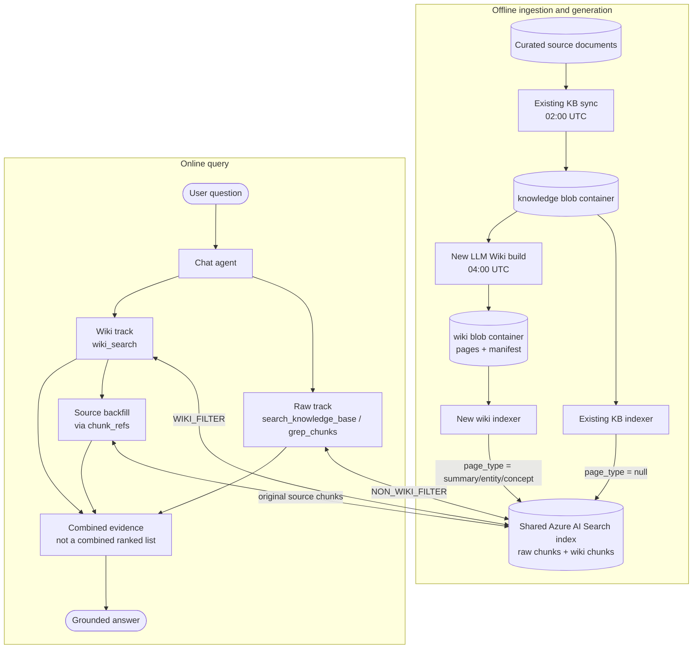
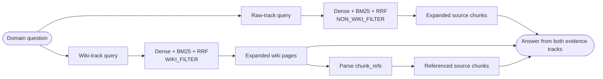
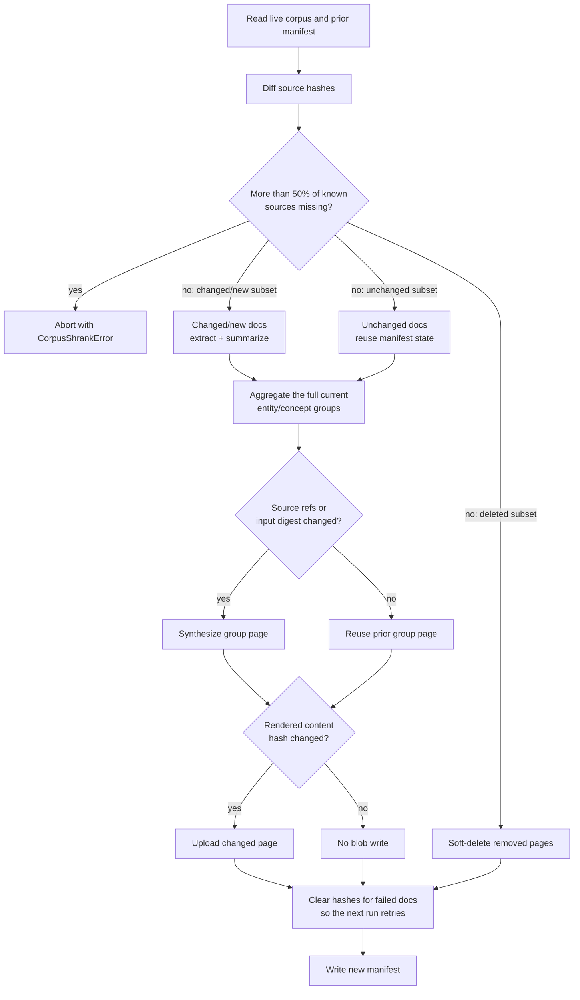

# LLM Wiki Review

## 0. Executive summary

This PR adds a daily-built LLM wiki over the existing Azure SDK knowledge corpus. Generated summary, entity, and concept pages share the current Azure AI Search index with raw chunks, but the agent retrieves the two tracks separately and routes wiki hits back to their source documents for grounding. On the current 227-case perf set, this improves the clean KB-only baseline from **69.2% to 74.9% (+5.7 points)**, with no scenario below baseline.

---

## 1. Current design

### 1.1 Goal

The existing KB path retrieves exact facts from individual document chunks, but cannot consolidate guidance spread across documents. The wiki adds per-document summaries and cross-document pages for recurring symbols and concepts, then routes every generated-page hit back to the original source chunks. The design reuses the existing index and updates only content affected by corpus changes.

### 1.2 Architecture



The existing KB sync, raw indexer, and raw retrieval path remain in place. The PR adds the wiki build, wiki blob/indexer path, and the separate wiki retrieval track; the only shared online component is the search index.

### 1.3 Generated page types

| Page type | Cardinality | Input | `context_id` |
| --- | --- | --- | --- |
| `summary` | one per source document | full source document | inherited from the source folder |
| `entity` | one per recurring named symbol | all documents mentioning the symbol | `wiki_entity` |
| `concept` | one per recurring topic | all documents covering the topic | `wiki_concept` |

Entity and concept pages store `chunk_refs`: the source documents used to synthesize the page. Because an index projection cannot populate a collection from scalar blob metadata, the refs are stored as a JSON-array string in `chunk_refs_str` and parsed by the agent.

### 1.4 Offline build

The build is map-reduce:

1. Read live markdown blobs from the `knowledge` container; skip blobs whose `IsDeleted` metadata is `true`.
2. Extract entities and concepts per changed document.
3. Generate a summary for each changed document.
4. Merge entity aliases and near-duplicate concepts.
5. Synthesize entity/concept pages from all grouped source evidence.
6. Write markdown pages and `_manifest.json` to the `wiki` container.
7. A dedicated indexer projects the wiki blobs into the shared search index.

The three prompts are versioned as files:

- `prompts/extract.md`
- `prompts/summary.md`
- `prompts/compile.md`

The prompts explicitly preserve conditions, exceptions, scope, and tolerated deviations. This matters because an over-generalized generated page can be more confident and less correct than a raw source chunk.

### 1.5 Shared index, separate retrieval tracks

Raw and generated content share the same index:

- Raw chunks: `page_type` is null.
- Wiki chunks: `page_type` is `summary`, `entity`, or `concept`.

The tracks deliberately do **not** share one ranked list:

- `search_knowledge_base` and `grep_chunks` apply `NON_WIKI_FILTER`.
- `wiki_search` and `wiki_read_page` apply `WIKI_FILTER`.

Fusing generic wiki pages into the raw ranked list was measured as a regression: generic summaries displaced specific source passages. The final design combines the two tracks only at answer composition time.

Both tracks reuse `SearchClient.fused_search`:

1. Dense/vector and BM25 searches run in parallel.
2. The ranked lists are fused with reciprocal-rank fusion.
3. Results are deduplicated and capped.
4. Retrieved chunks are expanded by hierarchy.

For `wiki_search`, the top page chunks are expanded into full page content and then routed through `chunk_refs` to a bounded set of original source chunks. The next-ranked wiki page titles are exposed as a compact related-pages hint; the agent can drill into one only when a detail is still missing.

The default agent flow for a domain question is:



Each track performs dense + BM25 retrieval and RRF internally. Raw and wiki results are never fused into one ranked list; they meet only as evidence supplied to the answer model.

### 1.6 Tenant scoping

Tenant scoping is retrieval-scope selection, not an authorization boundary:

1. `tenant_config.py` registers every source name.
2. A tenant selects source names and optional per-source filters.
3. The tools convert them into an OData filter over `context_id`.

Summary pages inherit their source folder's `context_id`, so they naturally follow the source document's scope. Entity and concept pages aggregate multiple documents and cannot inherit one source scope; tenants opt into the shared `wiki_entity` and `wiki_concept` scopes.

**Accepted trade-off:** a tenant that enables a cross-document wiki scope can retrieve facts synthesized from public documents outside its narrower source list. This is currently acceptable because tenants are topic channels over public documentation, not security boundaries.

### 1.7 Incremental reconcile

State lives in one manifest:

```json
{
  "sources": {
    "<source path>": {
      "hash": "...",
      "entities": [],
      "concepts": []
    }
  },
  "pages": {
    "<page slug>": {
      "content_hash": "...",
      "input_hash": "...",
      "source_refs": [],
      "is_deleted": "false"
    }
  }
}
```



Each run:

1. Diffs source documents by content hash.
2. Re-extracts and re-summarizes changed documents only.
3. Reuses unchanged extraction and summary results from the manifest.
4. Re-synthesizes an entity/concept page only when its source set or grouped input digest changed.
5. Uploads only pages whose rendered content hash changed.
6. Soft-deletes removed pages with `IsDeleted=true`, matching the KB sync convention.
7. Clears the stored hash for failed documents so the next run retries them.

Safety:

- If more than 50% of previously known source documents disappear, the build raises `CorpusShrankError` instead of tombstoning the wiki.
- Tombstone manifest entries discard page bodies, preventing unbounded manifest growth and forcing correct re-synthesis if a page is resurrected.

Measured cost:

| Situation | Result |
| --- | --- |
| Full rebuild | about 80 minutes |
| 72 changed documents out of 1029 | about 14 minutes |
| Unchanged corpus | about 1 second of reconcile, 0 blob writes, 0 LLM calls |

---

## 2. Code, automation, and validation

The PR adds the wiki-index package and updates the existing chat-agent retrieval path:

| Area | Main files | Change |
| --- | --- | --- |
| Wiki generation | `azure-sdk-qa-bot-wiki-index/{main,reader,wiki_extract,wiki_reduce,wiki,reconcile,storage}.py`, `prompts/*.md` | New map-reduce builder, manifest-based incremental reconcile, blob persistence, soft deletion, retries, and versioned prompts |
| Search projection | `setup_indexer.py` | New wiki datasource, skillset, vectorization, soft-delete policy, and indexer targeting the shared index |
| Agent retrieval | `knowledge_tools.py`, `azure_ai_search.py`, `knowledge.py` | Raw/wiki filters, shared dense+BM25+RRF implementation, wiki tools, page expansion, source backfill, and null/index-field coercion |
| Agent policy/scoping | `init.py`, `instruction.md`, `tenant_config.py` | Register new tools, define two-track retrieval behavior, and add `wiki_entity`/`wiki_concept` scopes |
| Automation/docs | `build_wiki.yml`, `ci.yml`, `README.md`, this design/review documentation | Daily build, PR validation, and operating guidance |

The null-header coercion in `KnowledgeChunk` is load-bearing: the wiki indexer leaves `header_2` and `header_3` null, and without coercing explicit nulls to empty strings every wiki result fails validation and `wiki_search` silently returns empty.

### 2.1 Daily build

`build_wiki.yml` runs daily at **04:00 UTC** on `main`, two hours after the existing 02:00 UTC knowledge sync. It runs even when repository code is unchanged, uses the service connection's federated token, reads resource/model settings from App Configuration, and invokes:

```bash
python -m azure_sdk_qa_bot_wiki_index.main --min-docs 2
```

The build writes blobs only; `azure-sdk-knowledge-wiki-indexer` projects them into search separately. A manual build must therefore trigger the indexer before the new pages become queryable. The first run with this revision will rewrite blobs that still contain the removed static `Related` section, but unchanged source and group hashes mean no LLM regeneration is needed. Dev pipeline **8303** (`azure-sdk-qa-bot-wiki-index-dev`) is enabled; its latest steady-state verification, [run 6633530](https://dev.azure.com/azure-sdk/internal/_build/results?buildId=6633530), wrote and regenerated nothing. Its default branch must change from `wiki-tree-rag` to `main` after merge.

### 2.2 Validation

| Area | Result | Coverage |
| --- | --- | --- |
| Wiki-index package | **21 passed** | reconcile incrementality, empty-result retry, tombstones, mass-delete guard, alias/group merge, rendering/storage, corpus reads |
| Agent integration | **19 passed** | RRF, null/header coercion, `chunk_refs`, source scoping, OData escaping, raw/wiki separation |
| Total | **40 passed** | offline; no Azure connectivity required |

Pyright reports 0 errors. Package CI runs type checking and unit tests and publishes coverage.

---

## 3. Evaluation

The two arms use the same 227-case, 7-scenario dataset, `gpt-5.4` grader, threshold 4, memory disabled, and same-day back-to-back execution. A case passes only when all six reported core metrics score at least 4. The baseline also filters wiki pages out of raw retrieval; otherwise the shared index contaminates the KB-only arm.

| | TOTAL | typespec | apispec | python | authoring | general |
| --- | ---: | ---: | ---: | ---: | ---: | ---: |
| N | 227 | 125 | 26 | 24 | 26 | 20 |
| KB-only baseline | 69.2% | 76.8% | 57.7% | 50.0% | 76.9% | 55.0% |
| **Wiki two-track** | **74.9%** | **81.6%** | **65.4%** | **62.5%** | **80.8%** | **60.0%** |

The wiki arm gains **5.7 points overall** with no scenario below baseline and a net +12 cases (27 fixed, 15 regressed). Groundedness, relevance, coherence, and fluency remain approximately 100%; median answer length is nearly flat (165 to 173 words). The measurable gain is in similarity (79.3% to 83.7%) and completeness (70.0% to 76.2%).

### 3.1 Interpretation limits

Same-config reruns churn about **16%** of cases and move the total by up to **5 points**, so a single run cannot resolve a smaller delta. `typespec` (N=125) is the only individual scenario large enough to interpret independently; the 3-case onboarding and releasesupport scenarios move 33 points on one flip. The final +5.7-point gain is treated as meaningful because it clears this measured band and is supported by the net case shift.

---

## 4. Known limitations

- **Cross-document scope:** entity/concept pages use shared `wiki_entity`/`wiki_concept` contexts, so an opted-in tenant can retrieve facts synthesized from public documents outside its narrower source list. This is retrieval scoping, not authorization.
- **Multi-chunk ordering:** the wiki indexer does not project `ordinal_position`, so a split page can be reassembled out of order. One-chunk pages removed this issue but cost typespec **5.6 points**; projecting the ordinal is the durable fix.
- **Prompt invalidation:** reconcile hashes source content, not prompt versions, so prompt changes require a full wiki rebuild and reindex.
- **Build/indexer separation:** the daily build writes blobs; pages are not queryable until the separate indexer runs.
- **Observability:** smoke tests must assert that `wiki_search` returns content, not only that the tool was invoked; a prior null-field validation failure made the track silently empty.
- **Corpus ceiling:** about 60% of remaining failures ask for knowledge absent from the corpus and require corpus curation rather than retrieval tuning.

---

## 5. Examples: baseline failures that pass under the current two-track design

The examples below come from the latest perf dataset and A/B archives. For these historical Q&A cases, `expected_references` is empty; therefore **Dataset ref** below means the test's human-authored `ground_truth` reference answer. **Current answer/ref** shows the behavior and citations surfaced by the new arm.

### 5.1 Updating ARM resource-name validation

**Question**

> A `TrackedResource` needs a new name regex and length constraints. Should the model replace `ResourceNameParameter`, keep a legacy scalar, and use `@typeChangedFrom` for the validation change?

**Score:** baseline 1.0 -> wiki arm 4.0; similarity 1 -> 4, completeness 1 -> 4.

**Baseline problem**

The baseline correctly kept `ResourceNameParameter`, but recommended preserving a legacy scalar and applying `@typeChangedFrom`. That modeled the validation as an API-version-specific type change even though the service enforces the same validation for every version.

**Dataset ref**

> Apply the updated validation universally because it matches the service behavior across all API versions. This is not an SDK breaking change because there is no client-side validation. Keep the updated model, but remove the legacy type and `@typeChangedFrom`.

**Current answer/ref**

The new answer preserves the standard ARM resource-name template while applying all constraints through one scalar:

```typespec
@pattern("^[a-zA-Z][a-zA-Z0-9]*(-[a-zA-Z0-9]+)*$")
@minLength(4)
@maxLength(64)
scalar StorageDiscoveryWorkspaceName extends string;

model StorageDiscoveryWorkspace
  is Azure.ResourceManager.TrackedResource<StorageDiscoveryWorkspaceProperties> {
  ...Azure.ResourceManager.ResourceNameParameter<
    Resource = StorageDiscoveryWorkspace,
    KeyName = "storageDiscoveryWorkspaceName",
    SegmentName = "storageDiscoveryWorkspaces",
    Type = StorageDiscoveryWorkspaceName
  >;
}
```

It explicitly says to remove the legacy scalar and `@typeChangedFrom` when service behavior is uniform, while still noting that a genuinely version-dependent validation change would need versioning.

References surfaced:

- [Azure.ResourceManager `ResourceNameParameter`](https://azure.github.io/typespec-azure/docs/libraries/azure-resource-manager/reference/data-types)
- [ARM resource modeling with `TrackedResource`](https://azure.github.io/typespec-azure/docs/howtos/arm/resource-type)
- [Define a resource model with `ResourceNameParameter`](https://azure.github.io/typespec-azure/docs/getstarted/azure-resource-manager/step02)

### 5.2 Migrating `x-ms-client-flatten: true`

**Question**

> Existing models use `x-ms-client-flatten: true`. What is the TypeSpec equivalent?

**Score:** baseline 2.2 -> wiki arm 4.6; similarity 3 -> 5, completeness 1 -> 4.

**Baseline problem**

The baseline named `@flattenProperty` but described it as the recommended TypeSpec replacement. It missed the load-bearing constraints: the decorator is under `Azure.ClientGenerator.Core.Legacy`, should be used for backward compatibility only, and may require a justified diagnostic suppression.

**Dataset ref**

```typespec
@Azure.ClientGenerator.Core.Legacy.flattenProperty
```

Use it for backward compatibility only, with a reason in the suppression. Do not use the emitter option; it was scheduled for removal.

**Current answer/ref**

```typespec
@global.Azure.ClientGenerator.Core.Legacy.flattenProperty
properties: MyProperties;
```

The answer now says:

- use it only to preserve an existing flattened SDK shape;
- prefer the nested model for new APIs;
- the property type must be a model;
- suppress legacy usage only with a back-compat justification.

References surfaced:

- [Generated Types - Models - Flattening](https://azure.github.io/typespec-azure/docs/howtos/generate-client-libraries/08types)
- [Flatten property sample](https://github.com/Azure/typespec-azure/blob/main/packages/azure-http-specs/specs/azure/client-generator-core/flatten-property/main.tsp)

### 5.3 ARM ProxyResource PUT with `200/202`

**Question**

> How do I define a PUT API for an ARM proxy resource that returns 200 or 202?

**Score:** baseline 1.0 -> wiki arm 4.0.

**Baseline problem**

The baseline suggested `ArmResourceCreateOrReplaceAsync` and stated that the template supports a `202` success response, effectively accepting the requested final response contract.

**Dataset ref**

> Do not define it that way. ARM PUT operations should return 200 and 201 per the RPC. Templates that override the response are appropriate only for older APIs; new APIs should not define such operations.

**Current answer/ref**

```typespec
createOrUpdate is ArmResourceCreateOrReplaceAsync<MyProxyResource>;
```

The new answer distinguishes the two layers:

- the resource PUT's compliant success shape is 200/201;
- 202 can occur as part of the asynchronous flow;
- model the operation with the ARM async template rather than hand-authoring a custom 202 response.

References surfaced:

- [Azure.ResourceManager interfaces](https://azure.github.io/typespec-azure/docs/libraries/azure-resource-manager/reference/interfaces)
- [ProxyResource modeling](https://azure.github.io/typespec-azure/docs/howtos/arm/resource-type)
- [Proxy resource sample](https://azure.github.io/typespec-azure/docs/samples/resource-manager/resource-types/proxy)
- [ARM long-running operations](https://azure.github.io/typespec-azure/docs/howtos/arm/long-running-operations)
- [ARM RPC PUT guidance](https://github.com/cloud-and-ai-microsoft/resource-provider-contract/blob/master/v1.0/put-resource.md)

### 5.4 Per-language SDK default values

**Question**

> Can TypeSpec assign different property defaults for different language SDKs?

**Score:** baseline 1.0 -> wiki arm 4.6; similarity 1 -> 5, completeness 1 -> 4.

**Baseline problem**

The baseline led with the legacy `@clientDefaultValue` decorator as the answer, even though the expert reference says TypeSpec deliberately has no general client-default concept.

**Dataset ref**

> TypeSpec has no client-default concept. A normal default represents the server default, as in OpenAPI. Client defaults were intentionally not allowed because they are bad for round-tripping.

**Current answer/ref**

The new answer leads with the same verdict:

> A property default in TypeSpec is a server-side contract default, not an SDK client default. Put per-language behavior in SDK customization (`client.tsp` or generator-specific handling). Avoid `@clientDefaultValue`; it is a legacy brownfield compatibility mechanism.

References surfaced:

- [SDK customization setup](https://azure.github.io/typespec-azure/docs/howtos/generate-client-libraries/01setup)
- [Client options](https://azure.github.io/typespec-azure/docs/howtos/generate-client-libraries/12clientoptions)
- [Client default values - legacy](https://azure.github.io/typespec-azure/docs/howtos/generate-client-libraries/08types)
- [Emitter default-value behavior](https://typespec.io/docs/extending-typespec/emitters-basics)

### 5.5 `Record<Element>` in an ARM model

**Question**

> Is `Record<string>` unsupported? Why does an ARM RP fail `arm-no-record` while data-plane specs use `Record<T>`?

**Score:** baseline 3.2 -> wiki arm 4.0; completeness 2 -> 4.

**Baseline problem**

The baseline correctly distinguished TypeSpec support from the ARM rule, but treated suppression as an exceptional possibility without clearly stating the review-board-approved suppression path captured by the expert answer.

**Dataset ref**

> This is a warning promoted to an error by `--warn-as-error`. It can be suppressed when the use is legitimate and approved by the review board: <https://azure.github.io/typespec-azure/docs/libraries/azure-resource-manager/rules/arm-no-record/>

**Current answer/ref**

The new answer separates the three facts:

1. `Record<T>` is a supported TypeSpec language feature.
2. `arm-no-record` is an ARM-specific linter rule; the data-plane example is not contradictory, and `RecordSet` is only a model name.
3. Prefer an explicit model. If an existing open-ended contract must be kept for back compatibility, use a justified suppression:

```typespec
#suppress "@azure-tools/typespec-azure-resource-manager/arm-no-record"
  "Back-compat: service contract already accepts arbitrary string map."
newValue?: Record<string>;
```

References surfaced:

- [ARM linter reference](https://azure.github.io/typespec-azure/docs/libraries/azure-resource-manager/reference/linter)
- [When to write a linting rule](https://azure.github.io/typespec-azure/docs/howtos/contributing/when-to-write-a-linting-rule)
- [TypeSpec `Record<T>`](https://typespec.io/docs/language-basics/type-relations)

---

## 6. Attempts and outcomes

Historical experiments used different dataset revisions, so their scores are directional and are not directly comparable with the final 227-case A/B.

### 6.1 Retrieval architecture experiments

| Attempt | Result | Decision |
| --- | --- | --- |
| Separate graph retrieval | 65.8% vs 60.3% KB baseline on the old 219-case set | The gain was real, but a separate graph store, embedding pipeline, artifacts, and full rebuild lifecycle were too heavy. Superseded by wiki pages in the existing index. |
| Query-time one-hop expansion | 59.8% total / 71.5% typespec; about -5.5 points | Rejected. Neighbor context diluted the specific answer. |
| Agentic tree navigation (`map -> open node`) | 57.1% total / 68.5% typespec | Rejected. Opening one node narrowed recall and hurt completeness by about 7 points. |
| Flat generated pages fused into the raw ranked list | Regression | Rejected. Generic pages displaced specific source chunks. This produced the final two-track boundary. |
| Flat generated pages in the existing index, separate query tool | 65.3% / 77.7% typespec on the old 219-case set | Kept as the base direction: similar quality to the graph path with much lower operational complexity. |

### 6.2 Page construction and answer-quality experiments

| Attempt | Result | Decision |
| --- | --- | --- |
| Full named-symbol coverage, including single-document decorators/templates and constraints | typespec **+4.6 points**, completeness about **+5 points** | Kept. |
| Preserve conditions/exceptions in build prompts and prefer case-specific verdicts in answer rules | Recovered cases where generated general guidance reversed an exact expert verdict | Kept. |
| Related wiki-page titles after the main page set | 69.6% with titles vs 67.8% without in one 230-case comparison; within noise | Kept because it costs no extra search and helps adjacent variants, but not treated as a proven standalone gain. |
| Three extra answer rules: answer "should I" first, deliver the correction, avoid padding | Fixed 5/13 targeted cases, but full run was 70.0%, -2.6 points from the then-current result | Reverted. The net result was within the large noise/churn band. |

### 6.3 Indexing and reliability experiments

| Attempt/finding | Result | Decision |
| --- | --- | --- |
| Make every wiki page one search chunk (`maximumPageLength` 2000 -> 8000) | Total 73.0% -> 68.3%; typespec **-5.6 points** | Reverted. Small chunks retrieve better; hierarchy expansion already reconstructs the page. |
| Full rebuild through the blob indexer | Exposed null `header_2`/`header_3`; every wiki result failed Pydantic validation and the tool silently returned empty | Fixed read-side with null coercion and a regression test. No need to synthesize fake headers. |
| Incremental deletion/retry audit | Tombstoned source blobs remained live, empty summaries were not retried, tombstones kept full bodies, and a partial corpus could mass-delete pages | Fixed metadata-aware reads, retry hashes, compact tombstones, and the 50% `CorpusShrankError` guard. |
