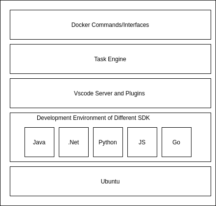

# ARCHITECTURE DIAGRAM

The core of the docker image is task engine, which contains four tasks: Init Task, Generate and Build Task, Mock Test Task. There is a configuration file in each sdk repository, and it defines which task should be executed. To serve different users/pipeline, we provide different docker commands.  Also, after the tasks are executed, there are some outputs, such as generated codes, task execution result, which can be used by following steps in pipeline or service team.

# TASK ENGINE
There are mainly four tasks defined in task engine: Init Task, Generate and Build Task, Mock Test Task, Live Test Task. Task engine executes these tasks based on a configuration file in sdk repository and you can find [the schema of configuration file here](../task-engine/schema/CodegenToSdkConfigSchema.json).

The schema of configuration is similar to the one of [sdk automation pipeline](https://github.com/Azure/azure-rest-api-specs/blob/main/documentation/sdkautomation/SwaggerToSdkConfigSchema.json), but there are some differences:
1. There are more tasks defined in latest configuration file, such as mock test, live test.
2. The configuration schema of sdk automation pipeline is mainly focused on serving sdk automation pipeline triggered by swagger PR. So, there are many configurations which is not needed by latest configuration file, such as “createSdkPullRequest”, “closeIntegrationPR”, and so on.
3. The definition of log parser is different. As the docker image mainly focuses on generating codes and running test, and it doesn’t care about the log stream in stdout/stderr. So the latest configuration file removes these configurations, and add a new configuration “logfilter”, which will be used by next steps of pipeline to filter necessary logs.

As the docker image will be used in different scenarios, we hope to extract the most common part into the docker image, and the specific parts will be removed.

About the schemas of input/output of each task, please refer to [schemas](../task-engine/schema).

# DOCKER IMAGE LAYERS
The docker image will be based on Ubuntu, and it also contains all the development environment for different languages of sdk. So the overall structure of layers is the following:

**hint:**
1. Vscode Server and Plugins are not ready in the docker image now.
2. Go is not install in docker image now, which will coming in the future.