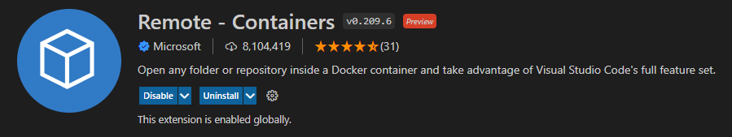

# Use Vscode to Connect Docker Container
It's not easy to develop within docker container. However, vscode provides us a way to connect to docker container, and you can use it to write codes easily.

## Prerequisites
- Install vscode in your computer.
- Install extension **Remote - Containers**.
  

## Steps
Please follow the following steps to connect your vscode to docker container.
1. Press `F1` and select `Remote-Containers: Attach to Running Container`.
2. Select your running docker image, and attach to it.
3. After vscode connects to docker container, open folder `/sdk-repos`.

Then you can write your codes in vscode.
