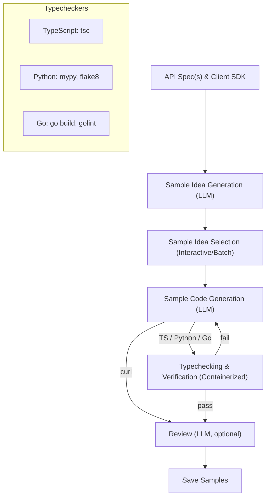

# SDK Sample Generator

Generate high-quality, typechecked code samples for SDKs and REST APIs in multiple languages using LLMs and automated verification.

---

## Overview

This project automates the generation of code samples for SDKs and REST APIs. It leverages LLMs to propose sample ideas, generate code, and verify correctness using language-specific typecheckers in isolated containers. The system supports TypeScript, Python, Go, and curl, and can be extended to other languages.

---

## Features

- **Sample Idea Generation:** Uses LLMs to propose realistic customer scenarios based on API specs.
- **Multi-language Support:** Generates samples in TypeScript, Python, Go, and curl.
- **Automated Typechecking:** Runs typecheckers (e.g., `mypy`, `tsc`, `golint`) in containers to ensure code correctness.
- **Interactive & Batch Modes:** Select sample ideas interactively or generate in batch.
- **Caching:** Avoids redundant LLM calls by caching sample ideas based on API spec hashes.
- **Extensible:** Easily add support for new languages or SDKs.

---

## Architecture



---

## Prerequisites

- **Node.js** (v18+ recommended)
- **Docker** (for containerized typechecking)
- **git** (for cloning SDK and spec repos)
- **Azure OpenAI** or **OpenAI** account (for LLM access)
- **Azure CLI** (recommended for authentication)

---

## Environment Configuration

This project requires access to LLM services for code generation. You can use either Azure OpenAI or OpenAI directly.

### Azure OpenAI (Recommended)
1. Create an Azure OpenAI resource in the Azure portal
2. Note your endpoint URL and ensure you have access to GPT models
3. Install and configure Azure CLI: `az login`

### OpenAI Alternative
1. Create an OpenAI account and generate an API key
2. Ensure you have access to GPT models

### GitHub Integration (Optional)
- Generate a GitHub Personal Access Token if you need GitHub API access
- Useful for repository analysis and GitHub-specific features

---

## Installation

1. **Clone the repository:**
   ```sh
   git clone https://github.com/Azure/azure-sdk-tools
   cd tools/sample-generator
   ```

2. **Install dependencies:**
   ```sh
   npm install
   ```

3. **Set up environment variables:**
   
   Copy the existing `.env` file and configure it with your credentials:
   ```sh
   cp .env .env.local  # Optional: create a local copy
   ```
   
   Configure the following environment variables in your `.env` file:

   **Azure OpenAI Configuration (Required):**
   ```env
   # Azure OpenAI endpoint URL
   AZURE_OPENAI_API_ENDPOINT="https://your-resource-name.openai.azure.com"
   
   # Authentication method - use "cli" for Azure CLI authentication
   AZURE_OPENAI_API_CREDENTIALS=cli
   
   # Optional: Direct API key (alternative to CLI auth)
   # AZURE_OPENAI_API_KEY=your_api_key_here
   
   # Optional: API version (uses default if not specified)
   # AZURE_OPENAI_API_VERSION=2025-03-01-preview
   ```

   **OpenAI Configuration (Alternative to Azure OpenAI):**
   ```env
   # OpenAI API key (alternative to Azure OpenAI)
   # OPENAI_API_KEY=sk-your_openai_api_key_here
   ```

   **Authentication Setup:**
   
   If using `AZURE_OPENAI_API_CREDENTIALS=cli`, ensure you're logged in to Azure CLI:
   ```sh
   az login
   ```

4. **Clone required SDK/spec repos:**
   ```sh
   npm run clone:rest
   npm run clone:ts
   npm run clone:py
   npm run clone:go
   ```

---

## Usage

### Generate Samples (TypeScript example)

```sh
npx genaiscript run generate --apply-edits --vars \
  rest-api=.artifacts/azure-rest-api-specs/specification/cognitiveservices/Language.AnalyzeText \
  client-api=.artifacts/azure-sdk-for-js/sdk/cognitivelanguage/ai-language-text/review \
  client-dist=.artifacts/azure-sdk-for-js/sdk/cognitivelanguage/ai-language-text/azure-ai-language-text-1.1.0.tgz \ client-dist-name=@azure/ai-language-text language=TypeScript \
  language=TypeScript \
  samples-count=5 \
  ideas-model=azure:gpt-4.1-nano \
  coding-model=azure:gpt-4.1-mini \
  reviewing-model=azure:gpt-4.1-mini \
  skip-review=true \
  out=.artifacts/generated-samples \
  interactive=true \
  use-ideas-cache=true
```

This will:
- Clone REST and TypeScript SDK specs (if not already cloned)
- Generate sample ideas and code
- Typecheck and review samples
- Save outputs to your specified output folder or to the cache folder

### Interactive Mode

```sh
npx genaiscript run generate --apply-edits --vars --interactive=true
```
Select sample ideas interactively before code generation.

### Custom Generation

You can customize the generation by passing any combination of the following parameters:

- `--rest-api=<path>`: Path to REST API spec
- `--client-api=<path>`: Path to client API spec
- `--language=<TypeScript|Python|Go|curl>`
- `--samples-count=<number>`
- `--ideas-model=<model>`
- `--coding-model=<model>`
- `--reviewing-model=<model>`
- `--skip-review=<true|false>`
- `--out=<output-folder>`
- `--client-dist=<path-to-client-dist>`
- `--client-dist-name=<name>`
- `--interactive=<true|false>`
- `--use-ideas-cache=<true|false>`
- `--extra-files=<comma-separated-list>`

---

## Adding Support for a New Language

1. Implement a typechecker in `genaisrc/src/<language>/typecheck.ts`.
2. Register the typechecker in `genaisrc/src/languages.ts`.
3. Add a system prompt in `genaisrc/system.<language>.genai.mts` and `genaisrc/system.<language>_typecheck.genai.mts`.
4. Update scripts and documentation as needed.

---

## Project Structure

- `genaisrc/` — Main source code
  - `generate.genai.mts` — Main script for sample generation
  - `src/` — Language-specific logic, typecheckers, utilities
  - `system.*.genai.mts` — System prompts for LLMs and typecheckers
- `.artifacts/` — Cloned SDKs, REST specs, and generated samples
- `package.json` — Scripts and dependencies