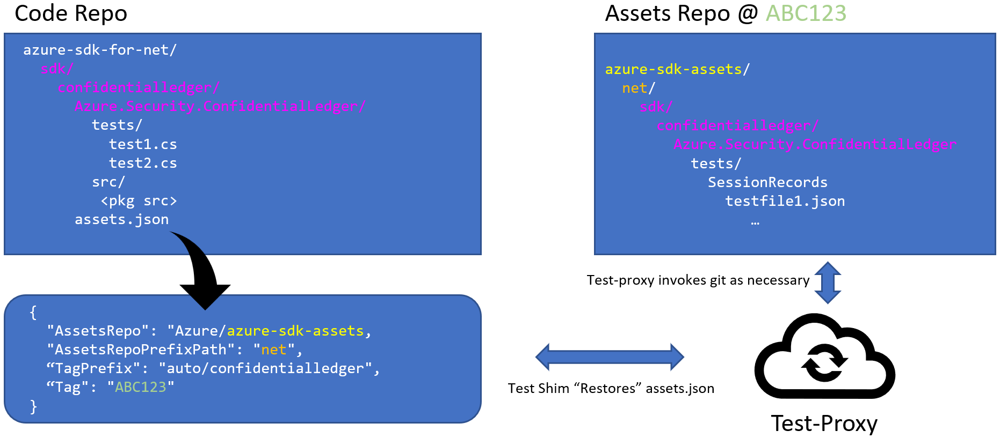
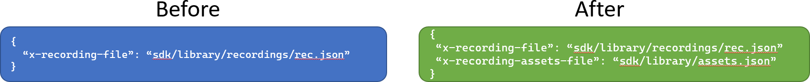

# Asset Sync (Retrieve External Test Recordings)

The `test-proxy` optionally offers integration with other git repositories for **storing** and **retrieving** recordings. This enables the proxy to work against repositories that do not emplace their test recordings directly alongside their test implementations.

Colloquially, any file that is stored externally using the `asset-sync` feature of the `test-proxy` is called an `asset`.



In the context of a `monorepo`, this means that we store FAR less data per feature. To update recordings, the only change alongside the source code is to update the targeted tag.

With the addition of asset-sync capabilities, the test-proxy now responds to a new key in the intial `Record/Start` or `/Playback/Start` POST request.

The header `x-recording-assets-file` will contain a value of where the `assets.json` is located within the language repo, expressed as a relative path. EG `sdk/tables/assets.json`.

The combination of the the `assets.json` context and the original test-path will allow the test-proxy to restore a set of recordings to a path, then _load_ the recording from that newly gathered data. The path to the recording file within the external assets repo can be _predictably_ calculated and retrieved given just the location of the `assets.json` within the code repo, the requested file name during playback or record start, and the properties within the assets.json itself. The diagram above has colors to show how the paths are used in context.

## The `assets.json` and how it enables external recordings

An `assets.json` contains _targeting_ information for use by the test-proxy when restoring (or updating) recordings "below" a specific path.

> For the `azure-sdk` team specifically, engineers are encouraged to place their `assets.json` files under a path of form `sdk/<service>/<package>/assets.json`

An `assets.json` takes the form:

```jsonc
{
  "AssetsRepo": "Azure/azure-sdk-assets-integration",
  "AssetsRepoPrefixPath": "python",
  "TagPrefix": "python/core",
  "Tag": "python/core_<10-character-commit-SHA>"
}
```

| Property | Description |
|---|---|
| AssetsRepo | The full name of the external github repo storing the data. EG: `Azure/azure-sdk-assets` |
| AssetsRepoPrefixPath | The assets repository may want to place the content under a specific path in the assets repo. The default should be the language that the assets belong to. EG: `python`, `net`, `java` etc. |
| TagPrefix | `<Language>/<ServiceDirectory>` or `<Language>/<ServiceDirectory>/<Library>` or deeper if things are nested in such a manner. |
| Tag | Initially empty until after the first push at which point the tag will be the `<TagPrefix><10-character-commit-SHA>` |

Comments within the assets.json are allowed and _maintained_ by the tooling. Feel free to leave notes to yourself. They will not be eliminated.

As one can see in the example image above, the test-proxy does the heavy lifting for push and pull of files to and from the assets repository.

The `Tag` "commit SHA" is literally the SHA of the tag being pushed. This allows us limited restore capabilities in the case of non-GC-ed accidentally-deleted tags.

### How does the test-proxy relate to the `assets.json`?

The `assets.json` contains _targeting_ information about WHERE to get recordings, but how do those recordings actually end up available on disk?

The `test-proxy` uses the information contained within the `assets.json` to `restore` files that are contained within the targeted tag. These files are downloaded to the user machine, under the `.assets` folder. A `restore` option is invoked in one of two possible ways:

1. The user explicitly calls `test-proxy restore <path-to-assets.json>`.
2. The user's test framework provides an additional key in the BODY of the `record/start` or `playback/start` request.

Only in the above two scenarios will assets be restored. Scenario #2 is discussed in [a section below.](#im-a-dev-who-uses-the-test-proxy-currently-how-do-i-externalize-my-recordings)

## Restore, push, reset when proxy is waiting for requests

Interactions with the external assets repository are accessible when the proxy is actively serving requests. These are available through routes:

| Route | Description |
|---|---|
| `/Playback/Restore` | Retrieve files from external git repo as targeted in the Tag from assets.json |
| `/Playback/Reset` | Discard pending changes and reset to the original Tag from targeted assets.json. |
| `/Record/Push` | Push pending changes to a new tag as targeted by `assets.json`. After the operation, the new recordings will be pushed and the target `assets.json` will be automatically updated with the new target tag. |

Each of these CLI Commands takes an `assets.json` argument that provides the _context_ that should be pushed to the external repository.

### A note about using on Windows + WSL

When using a Windows machine, it is technically possible to invoke tests from WSL against a windows clone. That path would appear under `/mnt/c/path/to/your/repo`. This is _not_ a supported scenario, as the `test-proxy` shells out to git for the push/restore actions. Running a `git push/pull` from _linux_ against a repo that was cloned down using a _windows_ git client can have unexpected results. Better to avoid the situation entirely and use an entirely separate clone for work on WSL.

## test-proxy CLI (asset) commands

The test-proxy also offers interactions with the external assets repository as a CLI. Invoking `test-proxy --help` will show the available list of commands. `test-proxy <command> --help` will show the help and options for an individual command. The options for a given command are all `--<option>`, for example, `--assets-json-path`, but each option has an abbreviation shown in the help, those are a single dash. For example the abbreviation for `--assets-json-path` is `-a`.

Please note that all test-proxy asset commands should be invoked **in the context of the language repository itself**.

### The following CLI commands are available for manipulation of assets

#### Restore

A restore operation is merely a test-proxy-encapsulated `clone or pull` operation. A given `asets.json` provides the target `Tag` and `AssetsRepo`.

```bash
test-proxy restore --assets-json-path <assetsJsonPath>
```

#### Reset

Reset discards local changes to a targeted assets.json files and resets the local copy of the files back to the version targeted by the given assets.json Tag.  Reset would be used if the assets were already restored, modified (maybe re-recorded while library development was done), and then needed to be reset back to their original files. If there are pending changes, the user will be prompted to overwrite. If there are no pending changes, then reset is no-op, otherwise, the following prompt will be displayed.
`There are pending git changes, are you sure you want to reset? [Y|N]`

- Selecting `N` will leave things as they are.
- Selecting `Y` will discard pending changes and reset the locally cloned assets to the Tag within the targeted `assets.json`.

```bash
test-proxy reset --assets-json-path <assetsJsonPath>
```

#### Push

After assets have been restored and then modified (re-recorded etc.) a push will update the assets in the AssetsRepo. After the push completes, the `Tag` within the targeted assets.json will be updated with the new Tag. The updated asset.json will need to be committed into the language repository along with the code changes.

```bash
test-proxy push --assets-json-path <assetsJsonPath>
```

#### Config Commands

When a client provides the additional body key `x-recording-assets-file` to `/Record/Start` or `/Playback/Start`, the test-proxy will invoke that test using **external assets**.

It's great that recordings are externalized, but this adds some complexity as these recordings don't live directly next to their test code anymore. The test-proxy provides the `config` verb to offer easy insight into interactions with the `assets.json` to assist with these complexities.

Currently there are two sub-verbs for `test-proxy config`:

- `locate`
- `show`

`locate`: Dumps which folder under the `.assets` folder contains your recordings. [See `config` usage in layout section below.](#layout-within-a-language-repo)
`show`: Dumps the contents of the targeted assets.json.

```bash
# from C:/repo/azure-sdk-for-python, the root of the python language repository
test-proxy config locate --assets-json-file sdk/keyvault/azure-keyvault-keys/assets.json
```

```bash
# from C:/repo/azure-sdk-for-js, the root of the js language repository
test-proxy config show -a sdk/tables/data-tables/assets.json
```

## Using `asset-sync` for azure sdk development

### Where are my files?

Test-Proxy maintains a _separate clone_ for each assets.json. This means that for _every_ assets.json that the test-proxy has interacted with. By default, this will be located _just_ under your repo root under the `.assets` folder.

```text
+-------------------------------+
|  azure-sdk-for-python/        |
|    sdk/                       |
|      storage/                 |
| +------assets.json            |
| |    appconfiguration/        |
| | +----assets.json            |
| | |  keyvault/                |
| | |    azure-keyvault-secrets |
| | |      assets.json-------+  |
| | |    azure-keyvault-keys |  |
| | |      assets.json---+   |  |
| | |                    |   |  |
| | |.assets/            |   |  |
| | +--AuN9me8zrT/       |   |  |
| |      <sparse clone>  |   |  |
| +----5hgHKwvMaN/       |   |  |
|        <sparse clone>  |   |  |
|      AuN9me8zrT--------+   |  |
|        <sparse clone>      |  |
|      BSdGcyN2XL------------+  |
|        <sparse clone>         |
+-------------------------------+
```

As you run tests in `recording` or `playback` mode, the `test-proxy` automatically checks out the appropriate tag in each local assets repo. After running docs in `record` mode, the newly updated recordings will be sitting within the appropriate assets repository.

To view the changes before pushing, use one of the one-liners defined below [below](#attempt-to-manually-resolve).

### My tests don't use the test-proxy at all currently, how do I externalize my recordings?

You don't. Your first step is to integrate your test framework with the `test-proxy`.

Refer to:

- [Test-Proxy Readme](https://github.com/Azure/azure-sdk-tools/blob/main/tools/test-proxy/Azure.Sdk.Tools.TestProxy/README.md)
- [Test-Proxy Sample Recording Clients](https://github.com/Azure/azure-sdk-tools/tree/main/tools/test-proxy/sample-clients)

### I'm a dev who uses the test-proxy currently, how do I externalize my recordings?

First, ensure that your language-specific "shim" supports the automatic addition of the `x-recording-assets-file` key to the test-proxy `Record|Playback/Start/` endpoints.

- [PR Enabling in .NET](https://github.com/Azure/azure-sdk-for-net/pull/31157)
- [PR Enabling in Python](https://github.com/Azure/azure-sdk-for-python/pull/26078)
- [PR Enabling in JS](https://github.com/Azure/azure-sdk-for-js/pull/23405)
- [PR Enabling in Go](https://github.com/Azure/azure-sdk-for-go/pull/19322)

Use [the transition script](https://github.com/Azure/azure-sdk-tools/blob/main/eng/common/testproxy/onboarding/generate-assets-json.ps1) and follow the [readme](https://github.com/Azure/azure-sdk-tools/blob/main/eng/common/testproxy/transition-scripts/README.md)!

In summary, once an assets.json is present, the shim _must_ be updated to **actually send** a reference to that assets.json inside the `record/start` or `playback/start` requests!



### What does this look like in practice?

#### Layout within a language repo

Once a package or service has an assets.json and a targeted tag, each language-repo test framework will automatically provide this assets.json alongside the recording file path. This will allow the test-proxy to automatically restore recordings as necessary.

In practice, this is what a code repo will look like after running `playback`-mode for a couple packages. Specifically, this is for the python repo.


One can see the automatically restored assets repos within the `.assets` folder. Each of the top-level folders within the `.assets` folder contains a single slice of the assets repo.

The below diagram illustrates how an individual assets.json, language repo, and assets repo relate to each other.


A user can use the `config` verb to access this the location of their assets on disk! Using assets diagram directly as a reference. we can work an example:

```powershell
# from the root of the azure-sdk-for-net repo, run:
test-proxy config locate -a "sdk/confidentialledger/Azure.Security.ConfidentialLedger/assets.json"
# returns -> path/to/azure-sdk-for-net/.assets/2Km0Z8755m/net/"
```

The `config` verb offers various interactions with an input assets.json path, with `locate` just being one of them! In all cases, all interactions with the `config` verb should be made in the context of the **language repository**, where the source for a given package resides.

#### A few details about context directory

The `test-proxy` starts in a "storage context". EG, where it starts looking for recordings or assets.json files. Any recording/assets.json paths that be relative in a way that makes sense for the arguments being sent.

```text
C:/repo/sdk-for-python/>test-proxy push -a sdk/tables/assets.json
```

`test-proxy` was not given a "context" argument. It'll use `CWD` as the "context" directory. When passed a relative path to an assets.json, it attempts to find that assets.json by joining the current context-directory with the relative path. CI implementations simply pass the additional argument of `--storage-location=<repo root>` to ensure that current directory doesn't matter.

So with the above invocation, the _actual_ location of the assets.json would be: `C:/repo/sdk-for-python/sdk/tables/assets.json`.

When calling the tool (not `docker` unfortunately , due to `mount` constraints), _absolute_ paths are also supported. In that case, context directory does not matter at all.

```text
test-proxy push -a C:/repo/sdk-for-python/sdk/tables/assets.json
```

Fortunately, the `test-proxy` takes care of `restore` operations automatically (both record and playback mode). This means that users only really need to understand the storage context when `push`-ing new recordings.

#### Pushing new recordings

After running tests in `record` mode.

1. Confirm lack of secrets (as always with recordings).
2. `test-proxy push <path-to-assets-json>`

> **Important Note** When using `docker` mode with test-proxy push, one will need to invoke the docker container with a couple additional environment variable settings.

Example Docker Push Call

```powershell
docker run --rm -v "<repo-root>:/srv/testproxy" -e "GIT_TOKEN=<git token>" -e "GIT_COMMIT_OWNER=<git commit owner>" -e "GIT_COMMIT_EMAIL=<git commit email>" azsdkengsys.azurecr.io/engsys/test-proxy:latest test-proxy <proxy-args>
```

Please note that any proxy arguments that include _paths_ will need to be **relative** when calling the docker container to do the work for you. This is due to the fact that the running container stores its files under an **internal** path representation. The repo root will be mounted under the default context-directory of `/srv/testproxy/` _always_ for the running container, so all paths must be expressed relatively from that root to actually resolve.

```powershell
# absolute path to assets json
C:/repo/sdk-for-python/sdk/tables/assets.json

# docker container is run, mounting repo root C:/repo/sdk-for-python/ to /srv/testproxy/. The whole path will no longer align
# but the relative path from the root of the repo WILL.
/srv/testproxy/sdk/tables/assets.json
```

So to make a push work for the above scenario, all one must do is only include the path from the root of the repo.

```powershell
docker run --rm -v "C:/repo/sdk-for-python:/srv/testproxy"  -e "GIT_TOKEN=myveryrealtoken" -e "GIT_COMMIT_OWNER=scbedd" -e  "GIT_COMMIT_EMAIL=scbedd@microsoft.com" azsdkengsys.azurecr.io/engsys/test-proxy:latest test-proxy push -a sdk/tables/assets.json
```

#### An additional note about using `test-proxy push` in codespaces

The `test-proxy` can (and is) used to run tests in github codespaces. However, there is a wrinkle when **pushing** from a default codespaces configuration to the assets repository.

A dev (@timovv) on the azure-sdk-for-js team succinctly states the problem:

> GitHub grants minimal permissions to a Codespace when it is created through creating a personal access token (PAT). By default, this PAT only grants write access to the repo that the Codespace was created from. This causes permissions issues when pushing assets to the Azure/azure-sdk-assets repo since the PAT does not grant write permission to that repo. Fortunately, we can request additional permissions through the devcontainer.json, which will give the Codespace write access to the Azure/azure-sdk-assets repo.

[CodeSpaces reference about this topic](https://docs.github.com/codespaces/managing-your-codespaces/managing-repository-access-for-your-codespaces).

The `azure-sdk` team has chosen to address this difficulty by [applying the following customization](https://github.com/Azure/azure-sdk-for-js/pull/24963/files) to `devcontainer.json` for each language repo. This means that codespaces created off of the upstream repo will automagically have the correct permissions to push to `azure-sdk-assets`.

> **Note** Codespaces created on **forks** do not magically gain write permissions to `azure-sdk-assets`.

To push from a codespace on a fork, devs will need to set `GIT_TOKEN` themselves to a PAT that has write access to `azure-sdk-assets`. Effectively the same route as if they wanted to use docker.

### I am getting weird errors out of my test-proxy operations

If you think that the `test-proxy` has somehow gotten itself into a weird "in-between" state that it can't automatically dig itself out of, you have a couple options.

#### Reset it

The first, most foolproof, and most destructive of options.

```powershell
test-proxy reset --assets-json-path <assetsJsonPath>
```

This will _force_ the locally cloned assets to align with the assets.json that has been targeted.

#### Attempt to manually resolve

A **new tag** is pushed with each `test-proxy push` invocation. There should be _no such thing_ as `merge conflicts` when automatically pushing up a new tag. However, if you wish to manually resolve instead of discarding current state, `cd` into the assets repo using the `config locate` command discussed above.

Once there, use standard `git` operations to resolve your issue.

For help with this external to Microsoft, file an issue against this repo with the `question` label. Within Microsoft, please ping the [test-proxy teams channel](https://teams.microsoft.com/l/channel/19%3ab7c3eda7e0864d059721517174502bdb%40thread.skype/Test-Proxy%2520-%2520Questions%252C%2520Help%252C%2520and%2520Discussion?groupId=3e17dcb0-4257-4a30-b843-77f47f1d4121&tenantId=72f988bf-86f1-41af-91ab-2d7cd011db47) for additional context and assistance.
