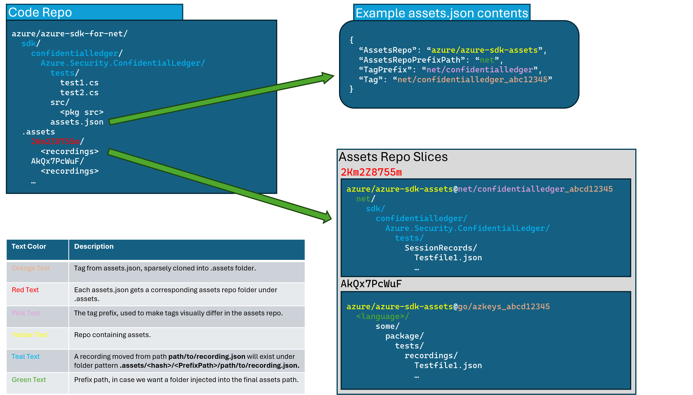

# Asset Sync (Retrieve External Test Recordings)

The `test-proxy` optionally offers integration with other git repositories for **storing** and **retrieving** recordings. This enables the proxy to work against repositories that do not emplace their test recordings directly alongside their test implementations.


In the context of a `monorepo`, this means that we store FAR less data per feature. To update recordings, the only change alongside the source code is to update the targeted tag.

With the addition of asset-sync capabilities, the test-proxy now responds to a new key in the intial `Record/Start` or `/Playback/Start` POST request.

The header `x-recording-assets-file` will contain a value of where the `assets.json` is located within the language repo, expressed as a relative path. EG `sdk/tables/assets.json`.

The combination of the the `assets.json` context and the original test-path will allow the test-proxy to restore a set of recordings to a path, then _load_ the recording from that newly gathered data. The path to the recording file within the external assets repo can be _predictably_ calculated and retrieved given just the location of the `assets.json` within the code repo, the requested file name during playback or record start, and the properties within the assets.json itself. The diagram above has colors to show how the paths are used in context.

## The `assets.json` and how it enables external recordings

An `assets.json` contains _targeting_ information for use by the test-proxy when restoring (or updating) recordings "below" a specific path.

> For the `azure-sdk` team specifically, engineers are encouraged to place their `assets.json` files under a path of form `sdk/<service>/assets.json`

An `assets.json` takes the form:

```jsonc
{
  "AssetsRepo": "Azure/azure-sdk-assets-integration",
  "AssetsRepoPrefixPath": "python",
  "TagPrefix": "python/core",
  "Tag": "python/core_<10-character-commit-SHA>"
}
```

| Property | Description |
|---|---|
| AssetsRepo | The full name of the external github repo storing the data. EG: `Azure/azure-sdk-assets` |
| AssetsRepoPrefixPath | The assets repository may want to place the content under a specific path in the assets repo. The default should be the language that the assets belong to. EG: `python`, `net`, `java` etc. |
| TagPrefix | `<Language>/<ServiceDirectory>` or `<Language>/<ServiceDirectory>/<Library>` or deeper if things are nested in such a manner. |
| Tag | Initially empty until after the first push at which point the tag will be the `<TagPrefix><10-character-commit-SHA>` |

Comments within the assets.json are allowed and _maintained_ by the tooling. Feel free to leave notes to yourself. They will not be eliminated.

As one can see in the example image above, the test-proxy does the heavy lifting for push and pull of files to and from the assets repository.

The `Tag` "commit SHA" is literally the SHA of the tag being pushed. This allows us limited restore capabilities in the case of non-GC-ed accidentally-deleted tags.

## Restore, push, reset when proxy is waiting for requests

Interactions with the external assets repository are accessible when the proxy is actively serving requests. These are available through routes:

| Route | Description |
|---|---|
| `/Playback/Restore` | Retrieve files from external git repo as targeted in the Tag from assets.json |
| `/Playback/Reset` | Discard pending changes and reset to the original Tag from targeted assets.json. |
| `/Record/Push` | Push pending changes to a new tag as targeted ny assets.json. After the operation, the new recordings will be pushed and the target `assets.json` will be automatically updated with the new target tag. |

Each of these CLI Commands takes an `assets.json` argument that provides the _context_ that should be pushed to the external repository.

## test-proxy CLI commands

The test-proxy also offers interactions with the external assets repository as a CLI. Invoking `test-proxy --help` will show the available list of commands. `test-proxy <command> --help` will show the help and options for an individual command. The options for a given command are all `--<option>`, for example, `--assets-json-path`, but each option has an abbreviation shown in the help, those are a single dash. For example the abbreviation for `--assets-json-path` is `-a`.

### The following CLI commands are available for manipulation of assets

#### Restore

A restore operation is merely a test-proxy-encapsulated `clone or pull` operation. A given `asets.json` provides the target `Tag` and `AssetsRepo`.

```bash
test-proxy restore --assets-json-path <assetsJsonPath>
```

#### Reset

Reset discards local changes to a targeted assets.json files and resets the local copy of the files back to the version targeted by the given assets.json Tag.  Reset would be used if the assets were already restored, modified (maybe re-recorded while library development was done), and then needed to be reset back to their original files. If there are pending changes, the user will be prompted to overwrite. If there are no pending changes, then reset is no-op, otherwise, the following prompt will be displayed.
`There are pending git changes, are you sure you want to reset? [Y|N]`

- Selecting `N` will leave things as they are.
- Selecting `Y` will discard pending changes and reset the locally cloned assets to the Tag within the targeted `assets.json`.

```bash
test-proxy reset --assets-json-path <assetsJsonPath>
```

#### Push

After assets have been restored and then modified (re-recorded etc.) a push will update the assets in the AssetsRepo. After the push completes, the `Tag` within the targeted assets.json will be updated with the new Tag. The updated asset.json will need to be committed into the language repository along with the code changes.

```bash
test-proxy restore --assets-json-path <assetsJsonPath>
```

## Using `asset-sync` for azure sdk development

### My tests don't use the test-proxy at all currently, how do I externalize my recordings?

You don't. Your first step is to integrate your test framework with the `test-proxy`.

Refer to:

- [Test-Proxy Readme](https://github.com/Azure/azure-sdk-tools/blob/main/tools/test-proxy/Azure.Sdk.Tools.TestProxy/README.md)
- [Test-Proxy Sample Recording Clients](https://github.com/Azure/azure-sdk-tools/tree/main/tools/test-proxy/sample-clients)

### I'm a dev who uses the test-proxy currently, how do I externalize my recordings?

First, ensure that your language-specific "shim" supports the automatic addition of the `x-recording-assets-file` key to the test-proxy `Record|Playback/Start/` endpoints.

- [Enabling in .NET](https://github.com/Azure/azure-sdk-for-net/pull/31157)
- [Enabling in Python](https://github.com/Azure/azure-sdk-for-python/pull/26078)
- [Enabling in JS](https://github.com/Azure/azure-sdk-for-js/pull/23405)
- [Enabling in Go(https://github.com/Azure/azure-sdk-for-go/pull/19322)

Use [the transition script](../../scripts/transition-scripts/generate-assets-json.ps1) and follow the [readme](../../scripts/transition-scripts/README.md)!

### I have existing recordings and I want to update them

TODO:

### I am getting weird errors out of my test-proxy operations

If you think that the `test-proxy` has somehow gotten itself into a weird "in-between" state that it can't automatically dig itself out of, you have a couple options.

#### Reset it

The first, most foolproof, and most destructive of options.

```powershell
test-proxy reset --assets-json-path <assetsJsonPath>
```

This will _force_ the locally cloned assets to align with the assets.json that has been targeted.

#### Attempt to manually resolve

A **new tag** is pushed with each `test-proxy push` invocation. There should be _no such thing_ as `merge conflicts` when automatically pushing up a new tag. However, if you wish to manually resolve instead of discarding current state, continue reading this section.

The below diagram illustrates how your assets.json, language repo, and assets repo relate to each other. Text that appears as a specific color can be traced to its source in the assets.json.



As you can see, one can use visual inspection of the `.breadcrumb` file to _find_ which folder contains the files for your assets.json.

Bash one-liner:

```bash
```

Pwsh one-liner:

```powershell
```

Manual resolution is up to the user. For help external to Microsoft, file an issue against this repo with `question` label. Within Microsoft, please reference the [test-proxy teams channel](https://teams.microsoft.com/l/channel/19%3ab7c3eda7e0864d059721517174502bdb%40thread.skype/Test-Proxy%2520-%2520Questions%252C%2520Help%252C%2520and%2520Discussion?groupId=3e17dcb0-4257-4a30-b843-77f47f1d4121&tenantId=72f988bf-86f1-41af-91ab-2d7cd011db47) for additional context and assistance.
