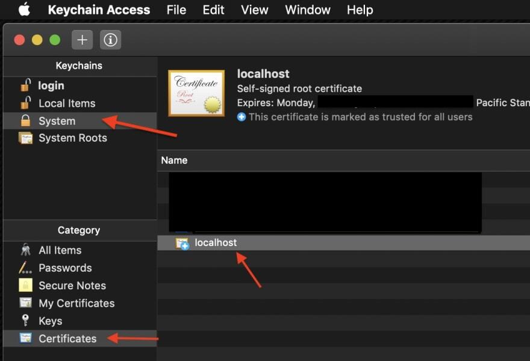
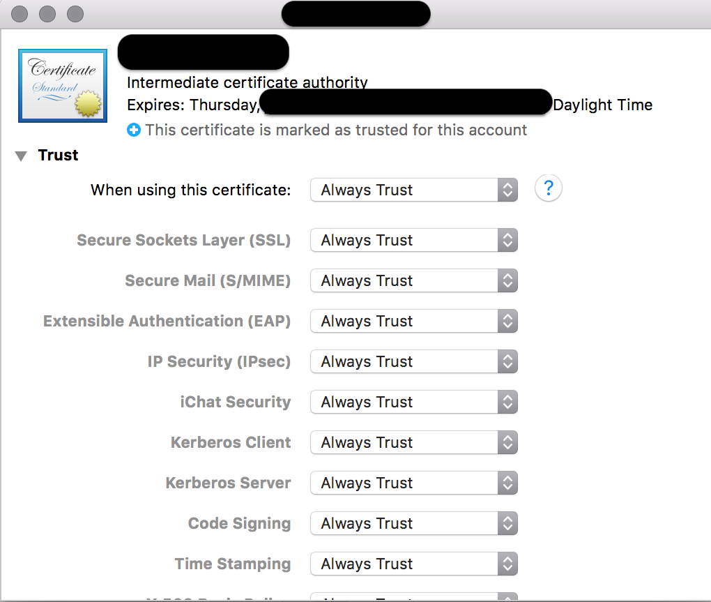

# How to trust the `dotnet-devcert.pfx` for your language

## What is a dev certificate?

HTTPS ([or SSL in general](https://stackoverflow.com/a/6093496) requires a certificate to properly secure the connection. A given certificate can only be associated with a single hostname, so a certificate issued for `www.example.com` cannot be used to secure connections to `www.example.org`.

A `dev certificate` is a SSL Cert that can be used to secure connections with `localhost`. This is essential to enable secure communication (still within your development machine) to the test-proxy.

## Generally

All necessary components for dev-certificate usage are present within the `eng/common/testproxy/` directory.

**Note that this certificate was generated with password "password"**

Within this folder are components of a **dev certificate** that has no usage outside of keeping your local usage of SSL happy. When running the container, you will need to trust `dotnet-devcert.pfx` if you want to connect to `https://localhost:5001` without cert validation failures. This certificate has no usage outside of your local box and is strictly associated with `CN=localhost`.

### On windows

```powershell
# ensure root access
> $pfxpass = ConvertTo-SecureString -String 'password' -AsPlainText -Force
> $rootCert = $(Import-PfxCertificate -FilePath eng/common/testproxy/dotnet-devcert.pfx -CertStoreLocation 'Cert:\LocalMachine\Root' -Password $pfxpass)
```

or via `dotnet`

```powershell
dotnet dev-certs https --clean --import eng/common/testproxy/dotnet-devcert.pfx --password="password"
dotnet dev-certs https --trust
```

### On linux

On unix systems (read `linux` and `mac`), the easiest way to ensure the `test-proxy` uses the test-proxy cert is to set the following environment variables before invoking the test proxy:

```bash
export ASPNETCORE_Kestrel__Certificates__Default__Path=/path/to/dotnet-devcert.pfx
export ASPNETCORE_Kestrel__Certificates__Default__Password=password
```

As an alternative, on a ubuntu-flavored distro of linux, feel free to re-use the import mechanism in the local file `eng/common/testproxy/apply-dev-cert.sh`. Prior to using locally, ensure $CERT_FOLDER environment variable is set to the local directory containing the script. Otherwise it won't be able to access necessary files!

### For Macs

On a Mac(OS X), it may not work properly due to permission problems. You can see the message after execution as follows.

```bash
 $ dotnet dev-certs https --clean --import eng/common/testproxy/dotnet-devcert.pfx --password="password"
Cleaning HTTPS development certificates from the machine. This operation might require elevated privileges. If that is the case, a prompt for credentials will be displayed.
HTTPS development certificates successfully removed from the machine.
The provided certificate file 'eng/common/testproxy/dotnet-devcert.pfx' is not a valid PFX file or the password is incorrect.
```

In this case, you can manually set it in 'Keychain Access' to work around the problem.
1. Click the `dotnet-devcert.pfx` file in 'Finder' to register the keychain directly. Enter the password as “password”
2. You can check the newly created `localhost` name in the keychain access “system” item
3. Double-click `localhost` and change Trust to "Always Trust"
4. Run `$ dotnet dev-certs https --trust` in the terminal, and you can see that the `localhost` checked above has changed from  to 




Also note that taken to trust this cert will _also apply to installing the dotnet tool directly_. The test-proxy tool will consume the certificate just the same as the docker container does.

On a Mac(OS X), If port 5000 is the problem, you need to check the 'AirPlay' sharing feature in settings or kill port process. [see here](https://github.com/Azure/azure-sdk-tools/pull/3739#issuecomment-1207217025)

Double-check your proxy settings like HTTP_PROXY, HTTPS_PROXY or any other settings may have network impact in .bashrc or .zshrc file, improper proxy settings may result in tests hanging forever when trying to connect to local proxy.

## Go

[Reference This Document](https://forfuncsake.github.io/post/2017/08/trust-extra-ca-cert-in-go-app/) for a walkthrough on how to add the certificate to the `trusted pool`.

## Python

As always, [stack overflow comes through](https://stackoverflow.com/a/39358282). Unlike `go`, there is nothing specific that needs to happen in the test code itself.

After doing any setup described in the [general section](#generally), run the
[trust_proxy_cert.py](https://github.com/Azure/azure-sdk-for-python/blob/main/scripts/devops_tasks/trust_proxy_cert.py) script:
```cmd
~/azure-sdk-for-python> python scripts\devops_tasks\trust_proxy_cert.py
```

This will copy the [test proxy certificate](https://github.com/Azure/azure-sdk-for-python/blob/main/eng/common/testproxy/dotnet-devcert.crt) and place the copy
under `azure-sdk-for-python/.certificate` as a `pem` file.

The only remaining step is to set two environment variables to point to this certificate. The script will output the environment variables and values that you'll
need to set once it finishes running. For example where `YOUR DIRECTORY` specifies where you've cloned the repo:
```cmd
Set the following certificate paths:
        SSL_CERT_DIR=C:\<YOUR DIRECTORY>\azure-sdk-for-python\.certificate
        REQUESTS_CA_BUNDLE=C:\<YOUR DIRECTORY>\azure-sdk-for-python\.certificate\dotnet-devcert.pem
```

Persistently set these environment variables. In a Windows Powershell command prompt as an administrator, use the `SETX` command (not the `SET` command) to set these variables.
Using the example above, you would run:
```cmd
SETX SSL_CERT_DIR "C:\<YOUR DIRECTORY>\azure-sdk-for-python\.certificate"
SETX REQUESTS_CA_BUNDLE "C:\<YOUR DIRECTORY>\azure-sdk-for-python\.certificate\dotnet-devcert.pem"
```

_Disclaimer:_ __A new terminal__ should be started up to make these variables available. 
To check if these variables are indeed in the environment,
```powershell
[Environment]::GetEnvironmentVariable('SSL_CERT_DIR')
[Environment]::GetEnvironmentVariable('REQUESTS_CA_BUNDLE')
```
should output your SSL certificate directory and file location path in this new terminal.

In this and subsequent terminals, with the variables in place, running tests with the test proxy should now work with HTTPS requests.

## Java

A given certificate must be added to the `Java Certificate Store`.

1. Grab the `dotnet-devcert.crt` from the `eng/common/testproxy` directory of any azure-sdk language repo. Keep its location handy.
2. Find the Java install that you will be using to run your tests. EG: `C:\Program Files\Java\jre1.8.0_301`.
3. Open your preferred shell in `admin` mode.
4. Run `keytool.exe -cacerts -importcert -file <path-to-dotnet-devcert.crt> -alias DotNetDevCert`
   1. `keytool.exe` is part of the the `bin` folder within your Java install.
5. When prompted, the default password to the `Java Certificate Store` is `changeit`.
6. To clean up, run `keytool.exe -cacerts -delete -alias DotNetDevCert`.

## .NET

Use the `dotnet dev-certs` approach as recommended in [general section](#generally).

## JS

TODO:
